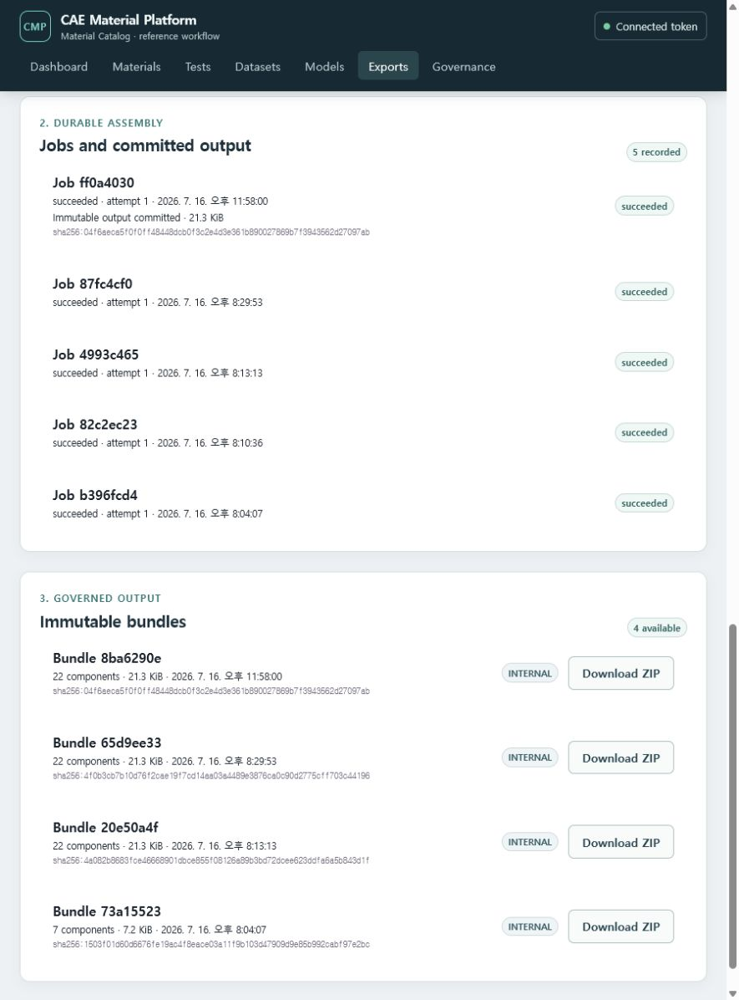

# 시험 데이터·중립 IR·Solver Card를 ZIP으로 받기

이 절차는 한 Material에 연결된 원본 시험 파일, Dataset, solver-neutral IR과 Solver Card를
정확한 revision 단위로 선택해 하나의 ZIP으로 받는 방법을 설명합니다. Bundle은 전달용 결과이며
승인된 Release가 아닙니다.

## 시작 조건

- Docker demo가 실행 중이고 **Connected token** 상태여야 합니다.
- 대상 Material에 하나 이상의 Raw Asset, governed Dataset, Material Model IR 또는 Solver Card가
  있어야 합니다.
- 필요한 파일의 classification을 읽고 export할 권한이 있어야 합니다.

Steel reference 흐름을 처음부터 수행하려면
[Steel 시험 데이터에서 탄소성 카드까지](02-steel-elastoplastic.md)와
[CSV/TSV/XLSX 시험 데이터 승인과 Dataset 생성](08-governed-tabular-import.md)을 먼저 완료하십시오.

## Bundle 만들기

1. 상단 **Exports**를 선택합니다.
2. **Select a Material**에서 대상 Material을 고릅니다.
3. representation을 확인하고 필요한 항목만 선택합니다. **Select all**은 화면에 보이는 exact
   revision 전체를 선택합니다.
4. 경로, classification, 크기와 종류를 확인합니다. 같은 stable identity라도 revision이 다르면
   서로 다른 입력입니다.
5. **Create immutable ZIP**을 선택합니다.
6. **Jobs and committed output**에서 작업 상태, 시도 횟수와 커밋된 출력의 SHA-256을 확인합니다.
   작은 작업은 요청 안에서 완료되고, 큰 작업은 `queued`로 접수된 뒤 worker가 디스크 기반으로
   조립합니다.
7. 완료 메시지와 **Immutable bundles** 목록에서 component 수, 크기와 SHA-256을 확인합니다.
8. **Download ZIP**을 선택합니다. 서버는 짧게 유효한 전송 권한을 발급한 뒤 ZIP을 전달합니다.

## ZIP에서 확인할 파일

| 파일/폴더 | 의미 |
| --- | --- |
| `README.md` | Bundle 사용 범위와 검증 방법 |
| `manifest.json` | Selection revision, classification, 각 component의 출처·경로·digest |
| `checksums.sha256` | 포함 파일별 SHA-256 |
| `raw/` | 원본 bytes를 바꾸지 않은 시험 파일 |
| `datasets/` | 요청한 canonical Parquet와 readable CSV |
| `models/` | solver-neutral IR JSON과 해당 schema |
| `cards/` | mapping report와 Abaqus/OpenRadioss native card |

`checksums.sha256`과 실제 파일 digest가 다르면 사용하지 마십시오. 같은 Selection revision과
같은 입력 bytes를 재실행하면 동일한 archive bytes가 재사용됩니다. 입력 revision이나 label 등
manifest 내용이 달라지면 새 digest가 생성됩니다.

## omission과 오류 처리

- required component가 없어졌거나 권한 밖이면 preflight가 실패하며 조용히 제외되지 않습니다.
- optional component를 포함하지 못한 경우 `manifest.json`의 omission에 이유가 기록됩니다.
- 한 Bundle은 하나의 organization/project에만 속하며 classification은 포함 항목 중 가장 높은
  등급보다 낮을 수 없습니다.
- 기본 inline assembly 상한은 64 MiB입니다. 이보다 큰 예상 작업은 `202 Accepted`와 `queued`
  Job으로 접수되며 worker가 API 메모리 밖의 임시 파일에 deterministic ZIP을 조립한 뒤 Artifact로
  커밋합니다. Docker demo는 이 경로를 쉽게 확인하도록 상한을 16 KiB로 낮춥니다.
- 외부 worker도 현재 component 하나당 64 MiB 상한을 적용합니다. 전체 도메인 상한은 1,000개 또는
  5 GiB지만, 10,000 Material 검색과 2 GiB object streaming/soak/fault는 production-scale 검증 전입니다.
- Artifact 커밋 뒤 Bundle projection 단계가 실패하면 Job은 `reconciliation_required`로 남습니다.
  커밋된 SHA-256과 크기는 화면에서 숨기지 않으며 다음 worker 실행이 기존 출력을 재조립하지 않고
  Bundle에 연결합니다. `running` 작업의 hard-kill lease 회수와 운영 token 자동 회전은 후속 운영
  보강 범위입니다.

## Release와 구분

Bundle은 엔지니어가 고정한 데이터 전달 단위입니다. Review/Approval/Release 상태를 만들거나
바꾸지 않습니다. 대외 배포나 승인된 설계 입력이 필요하면 별도의 Governance review와 Release를
완료하고, mapping report의 `approximated`, `ignored`, `unsupported` 상태를 다시 검토하십시오.
