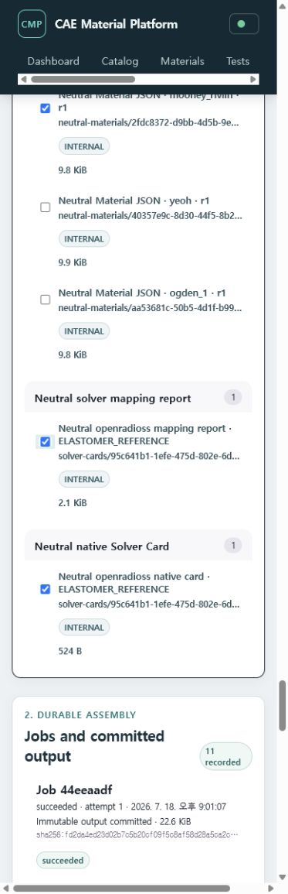

# 시험 JSON·Recipe·Neutral JSON·Solver Card를 ZIP으로 받기

Bulk Export Center는 사용자가 고른 **정확한 revision**을 하나의 검증 가능한 ZIP으로
전달합니다. 이 Bundle은 데이터 전달 결과이며 승인된 Release를 대신하지 않습니다.

## 현재 포함할 수 있는 자료

- 원본 시험 파일
- governed Dataset의 Parquet 및 읽기용 CSV
- canonical Test Data JSON
- Mapping Profile JSON
- Processing Recipe JSON
- solver-neutral Material Model IR 및 schema
- canonical Neutral Material JSON
- Abaqus/OpenRadioss mapping report JSON
- solver-native `.inp` 또는 `.rad` ASCII card

각 항목은 stable identity의 `latest` 별칭이 아니라 선택 시점의 exact revision ID와
SHA-256을 고정합니다. 같은 이름의 새 revision이 생겨도 이미 만든 Bundle은 바뀌지 않습니다.

## Canonical package 만들기

1. Docker demo를 실행하고 상단에 **Demo workspace**가 표시되는지 확인합니다.
2. 상단 메뉴에서 **Exports**를 엽니다.
3. **Select a Material**에서 작업할 Material을 고릅니다.
4. 필요한 항목만 체크합니다. 재사용 가능한 Mapping Profile과 Recipe는 현재
   organization/project 범위에서 보이는 exact revision을 함께 표시합니다.
5. Neutral 기반 카드라면 서로 대응하는 **Neutral Material JSON**, **Neutral solver mapping
   report**, **Neutral native Solver Card**를 함께 고릅니다.
6. 선택 개수와 예상 크기를 확인한 뒤 **Create immutable ZIP**을 누릅니다.
7. 작은 Bundle은 즉시 완료되고, 큰 Bundle은 worker가 durable job으로 조립합니다.
8. **Immutable bundles**의 component 수와 archive SHA-256을 확인한 뒤 **Download ZIP**을
   누릅니다.



## ZIP 구조

```text
README.txt
manifest.json
checksums.sha256
test-data/<identity>/<revision>/test-data.json
mapping-profiles/<identity>/<revision>/mapping-profile.json
processing-recipes/<identity>/<revision>/processing-recipe.json
neutral-materials/<identity>/<revision>/neutral-material.json
solver-cards/<identity>/<revision>/mapping-report.json
solver-cards/<identity>/<revision>/<material-name>.inp|.rad
```

기존 raw/Dataset/Material Model 경로를 선택하면 `raw/`, `datasets/`, `models/`도 함께
생깁니다. `manifest.json`에는 각 파일의 source kind, exact identity/revision, classification,
원본 digest, archive path와 omission이 기록됩니다.

## 무결성 확인

ZIP을 사용하기 전에 `checksums.sha256`의 모든 줄을 검증합니다.

```bash
sha256sum -c checksums.sha256
```

Windows PowerShell에서는 다음처럼 확인할 수 있습니다.

```powershell
Get-Content checksums.sha256 | ForEach-Object {
  $hash, $path = $_ -split "  ", 2
  if ((Get-FileHash -Algorithm SHA256 -LiteralPath $path).Hash.ToLower() -ne $hash) {
    throw "Checksum mismatch: $path"
  }
}
```

검증이 실패하면 해당 ZIP을 사용하지 않습니다. 서버는 선택 revision의 bytes나 metadata가
조립 전에 달라지면 Bundle 생성을 실패시키며, optional 항목도 조용히 빼지 않고 omission으로
기록합니다.

## 결정성과 revision 의미

동일한 Export Selection revision을 worker가 재시도하면 ZIP ordering, timestamp, permission,
내용과 SHA-256이 동일합니다. 사용자가 화면에서 새 Selection을 만들면 새로운 selection ID와
revision ID가 manifest에 기록되므로, 구성요소가 같더라도 별도의 provenance를 가진 새 Bundle로
취급합니다.

## 범위와 제한

- 한 Bundle은 하나의 organization/project 범위만 포함합니다.
- Bundle classification은 포함 항목 중 가장 제한적인 등급과 같아야 합니다.
- 기본 한도는 1,000개 component 또는 5 GiB입니다.
- 실제 Abaqus/OpenRadioss 실행 검증은 Bundle 생성 범위에 포함되지 않습니다.
- Mapping Profile과 Recipe가 현재 Material 전용 링크를 갖지 않는 경우 workspace 재사용
  후보로 표시되므로, 사용자가 필요한 exact revision을 직접 선택해야 합니다.
