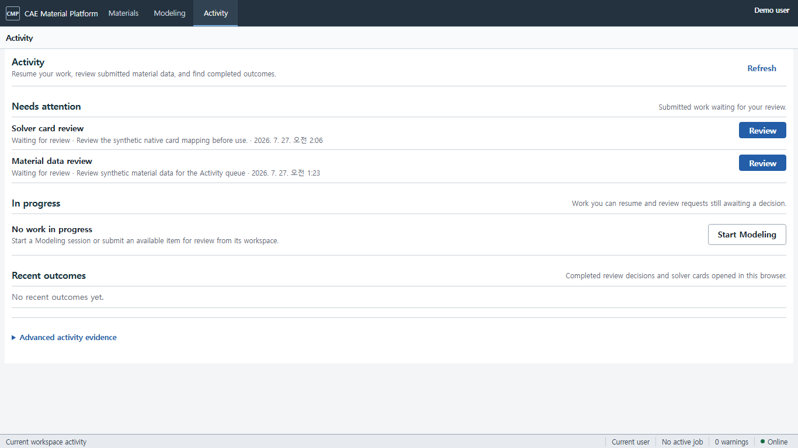
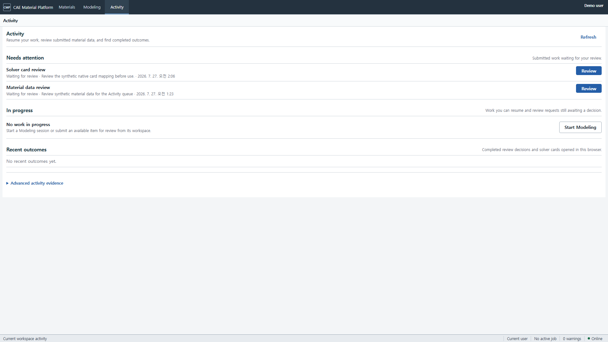

# 메뉴와 Material 작업공간 사용법

상단 메뉴는 데이터를 서로 다른 제품으로 나누지 않습니다. 모든 업무는 같은 Material과
Material State의 exact revision 문맥을 공유합니다.

| 상단 메뉴 | 주 작업 |
| --- | --- |
| **Materials** | 검색·필터·비교, Browse Tree, 5-tab datasheet와 직접 solver card download |
| **Modeling** | Data, Process, Fit, Export와 Advanced Recipe/Batch/JSON |
| **Activity** | 재개할 Modeling, 검토 대기 항목, 최근 검토·solver card 결과 |

**Administration**은 우측 workspace menu의 role-gated 항목입니다. Table/Attribute/Layout/Subset/
Link Type과 사용자 기능 권한을 관리합니다. `/database`, `/catalog/*`, `/datasets/*`의 기존 deep
link는 보존하지만 일반 사용자의 전역 메뉴에는 나타나지 않습니다.

## 권장 이동 순서

1. **Materials**에서 이름/grade를 검색하거나 **Browse Tree**의 Database → Profile → Table →
   Folder → Record를 탐색합니다.
2. Material 상세의 `Overview | Properties | Curves | CAE Cards | Evidence`를 검토합니다.
3. 카드가 있으면 Header 또는 CAE Cards에서 native preview/download를 실행합니다.
4. 카드가 없을 때 **Modeling → Data**에서 JSON/CSV/XLSX와 channel/unit을 고정합니다.
5. Process와 Fit의 같은 graph에서 처리·후보·residual·extrapolation을 검토하고 Export로 이동합니다.
6. 검토 요청은 **Activity**에서 상태와 요청 사유를 확인합니다. Reviewer와 Administrator는
   행의 **Review**에서 사유를 남기고 승인하거나 변경을 요청합니다. 일반 사용자는 자신의
   요청이 결정되기 전까지 **In progress**에서 확인합니다.
7. provenance/full ID는 Evidence, Recipe/Batch/JSON은 Advanced, batch/job/package는 Activity의
   Advanced에서 확인합니다.

1366×768과 1920×1080에서도 같은 행 우선 구조를 유지합니다.

## 운영 상태

**Activity**는 `Needs attention | In progress | Recent outcomes`의 짧은 작업 큐입니다. 같은
review 요청을 여러 번 만들지 않으며, 승인·변경 요청 결과는 서버가 돌려준 해당 immutable 요청으로
갱신됩니다. 현재 review API는 제출 항목과 사람의 표시 이름을 제공하지 않으므로, 일반 화면에는
업무 종류와 요청 사유만 보이고 정확한 식별자는 Advanced evidence에 남습니다. 사용자가 새 자료
또는 solver card 검토를 요청하는 진입점은 각각 Material 상세와 Native Card Preview에 있습니다.
두 화면은 이미 열어 둔 정확한 revision을 사용하므로 사용자가 식별자나 hash를 직접 입력할 필요가
없습니다.

기존 `/jobs-reviews` 링크는 같은 Activity 큐를 엽니다. 이 경로에서는 Aggregate type/ID, revision
ID, manifest hash를 직접 입력하거나 독립적으로 결정을 기록하지 않습니다. 요청은 Material 또는
Solver Card의 현재 화면에서 만들고, 기존 요청의 역할별 결정은 Activity에서 처리합니다. `/governance`
는 일반 검토 진입점이 아니며 Operations, Release, Governance Evidence의 고급 운영 화면을 유지합니다.

API process의 metric, trace와 복구 절차는 일반 사용자 전역 메뉴가 아니라 운영 배포의 observability
도구와 [운영 가이드](11-operations-and-recovery.md)에서 확인합니다.

## 자주 생기는 문제

### 오류에 `Support reference`가 표시됨

입력 수정 방법을 설명하는 오류 본문과 함께 `CMP-...` problem code와 trace ID가 표시됩니다.
본문에 따라 revision을 다시 선택하거나 입력을 수정한 뒤 재시도하십시오. 문제가 반복되면 token,
시험 원본 또는 회사 데이터를 복사하지 말고 **Support reference 전체 문자열만** 운영 담당자에게
전달하십시오. 이 값으로 API/worker trace를 찾을 수 있습니다.

### `Sign in to continue`가 표시됨

Docker Desktop과 demo 서비스가 실행 중인지 확인한 뒤 **Try again**을 누릅니다. 일반 배포라면
관리자가 제공한 로그인 화면에서 로그인합니다. 사용자에게 별도 연결 문자열 입력을 요구하지 않습니다.

### 메뉴에는 Material이 있지만 탭이 비어 있음

Material 아래에 State가 없거나, 해당 State에 필요한 Property Set/Test Run/Dataset이 없을 수
있습니다. **Overview**에서 State와 기본 물성을 먼저 만들고 앞 단계 탭부터 진행하십시오.

### Steel/Polymer/Elastomer 기능이 보이지 않음

이름으로 모델을 추론하지 않습니다. Material revision의 class가 각각 `metal`, `polymer`,
`elastomer`인지 확인하고, 기존 State가 이전 Material revision을 고정했다면 Overview의
명시적 rebase 동작으로 새 State revision을 추가하십시오.

### card 생성이 막힘

mapping report에서 `unsupported` 항목을 확인하십시오. `approximated`는 조용한 성공이 아니라
검토가 필요한 결과입니다. preflight 이후 source IR revision이 바뀌었다면 새 report를
만들어야 합니다.

### ZIP 다운로드가 안 됨

Bundle 목록을 새로 읽은 뒤 다시 시도하십시오. 다운로드 권한은 짧게 유효하며 Bundle과 원본
revision을 바꾸지 않습니다. required source가 권한 밖이거나 사라진 경우 새 Selection preflight가
실패합니다.
