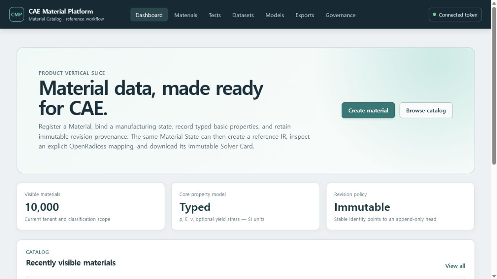

# 운영 상태 확인과 격리 복구 드릴

이 문서는 Docker demo의 관측성과 복구 기능을 확인하는 운영자용 절차입니다. 재료시험 원본이나
발행 revision을 직접 수정하지 않으며, 복구 드릴은 실행 중인 `cmp` 데이터베이스를 교체하지 않습니다.

## API와 worker 상태 확인

1. 서비스를 실행하고 `http://127.0.0.1:5173`에서 local demo identity로 연결합니다.
2. 상단 **Governance**를 엽니다.
3. **API observability**에서 전체 request/5xx/active 수와 route-template별 요청 수, 평균 latency,
   p95 bucket 상한을 확인합니다.
4. 새 상태가 필요하면 **Refresh snapshot**을 누릅니다.

이 패널은 `audit.read`가 있어야 열립니다. URL, query, header, request body, 원본 시험값, credential과
tenant 식별자는 API 응답이나 application log에 넣지 않습니다. 여러 API/worker를 합친 장기 추세는
OTLP backend가 권위 있는 출처이며 이 화면은 한 API process의 bounded snapshot입니다.


Collector가 받은 trace/metric과 Prometheus 형식 metric은 다음으로 확인합니다.

```powershell
docker compose -f deploy/compose/docker-compose.demo.yml logs otel-collector
Invoke-WebRequest http://127.0.0.1:8889/metrics
```

## 운영 규모 성능 게이트

일반 demo의 2 MiB 검사는 빠른 회귀용입니다. 10,000 Material과 2 GiB object 검사는 별도 isolated
PostgreSQL/object volume에서만 실행하십시오. 기존 원본이나 revision을 삭제하지 않고 deterministic
synthetic Material revision과 실제 multipart Ingestion Event를 추가하므로 실행 전 명시적
acknowledgement가 필요합니다. 전체 명령과 안전장치는
[`deploy/performance/README.md`](../../deploy/performance/README.md)에 있습니다.

성공 시 Dashboard의 **Visible materials**가 현재 권한 범위의 전체 개수를 표시하고, canonical
report의 `production_scale_accepted`가 `true`여야 합니다. 2026-07-16 기준 검증값은 10,000개
Material, Catalog p95 182.128 ms, 2 GiB/32-part upload 22.999 MiB/s, peak Python allocation
67,164,359 bytes입니다. report SHA-256은
`96d75ca787695ad5848b0b65562554a93f8aa63dd204b82d92e159f723cef481`입니다.



이 결과는 장시간 soak, API/worker/PostgreSQL/object-storage 중단·복구, object lock/KMS/retention을
대체하지 않습니다. 장애 주입 중에도 이미 발행되거나 커밋된 revision과 object digest가 바뀌지
않는지를 별도 gate에서 확인해야 합니다.

## 격리 복구 드릴

다음 명령은 PostgreSQL custom dump를 만들고 무작위 이름의 임시 DB에 복원합니다. immutable object는
별도 snapshot 폴더에 복사해 크기와 SHA-256을 검사합니다.

```powershell
docker compose -f deploy/compose/docker-compose.demo.yml --profile operations run --rm restore-drill
```

성공 보고서는 `.cache/restore-drill/<drill-id>/report.json`에 남습니다. 다음 필드를 확인하십시오.

- `status: passed`, `counts_match: true`
- `raw_assets_sampled == raw_assets_verified`
- `objects_sampled == objects_verified`
- `dangling_lineage_edges: 0`
- Release가 있으면 `release_artifacts_mismatched: 0`; 없으면
  `release_sample_status: not_present_in_source`
- `duration_seconds`가 승인된 RTO 안에 있는지

명령은 생성한 임시 DB만 삭제합니다. 운영 acceptance에는 versioned object storage, object lock,
KMS/retention 권한, scheduled backup과 실제 승인 Release를 포함한 별도 드릴이 필요합니다.
