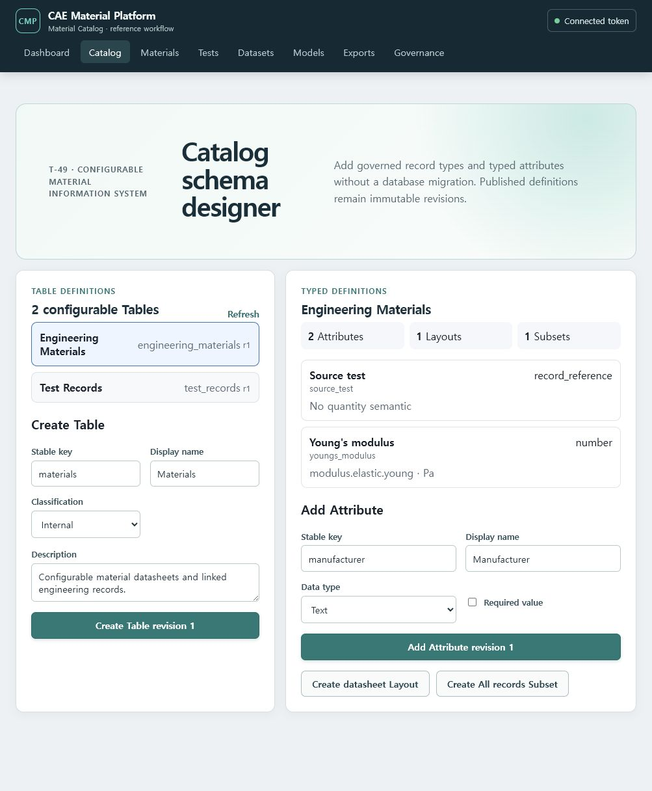
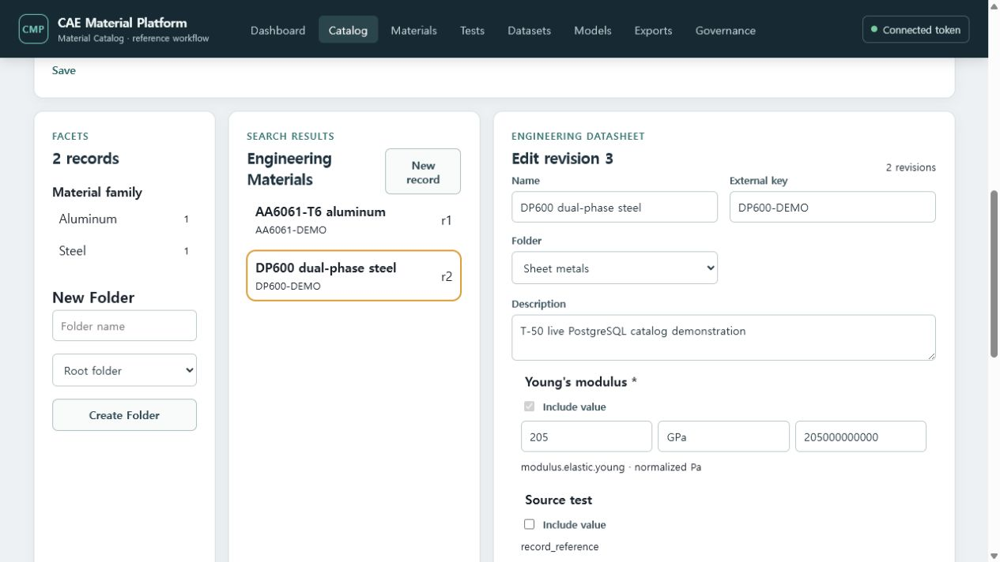
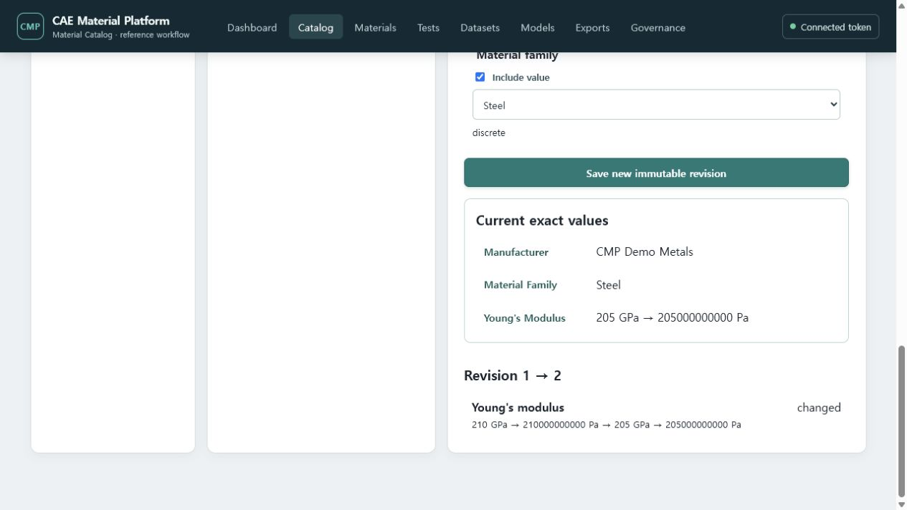
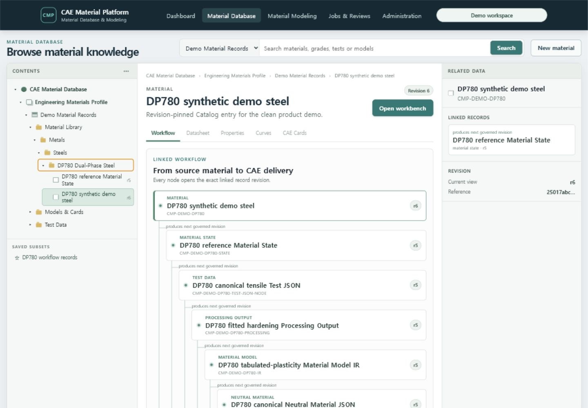
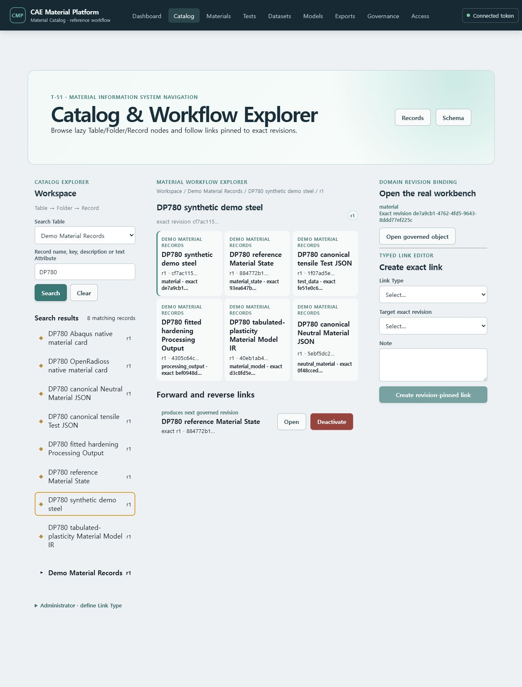
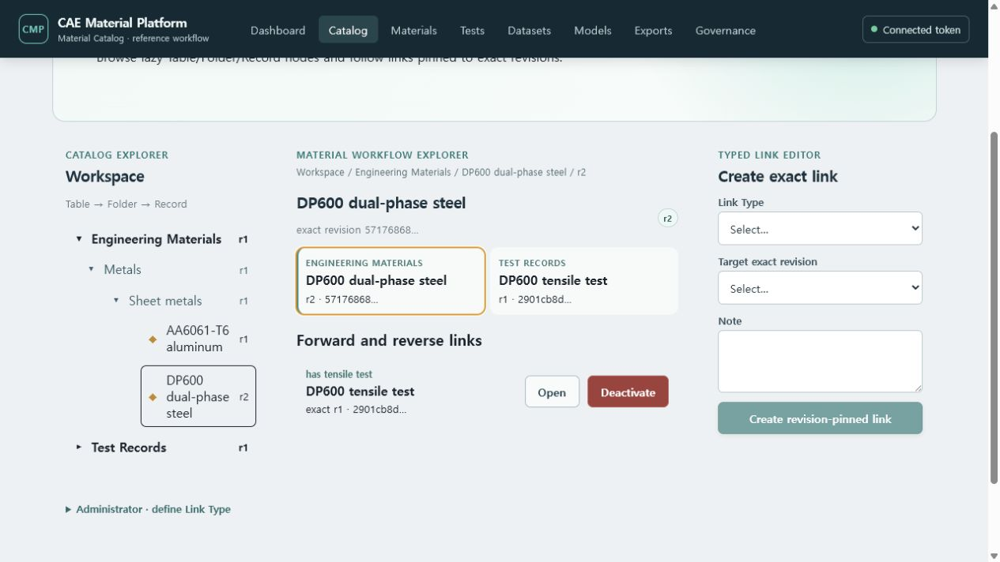
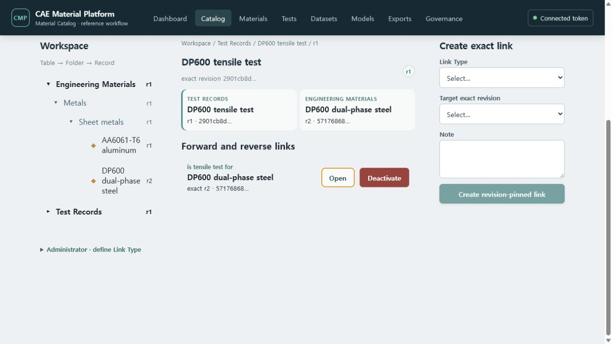
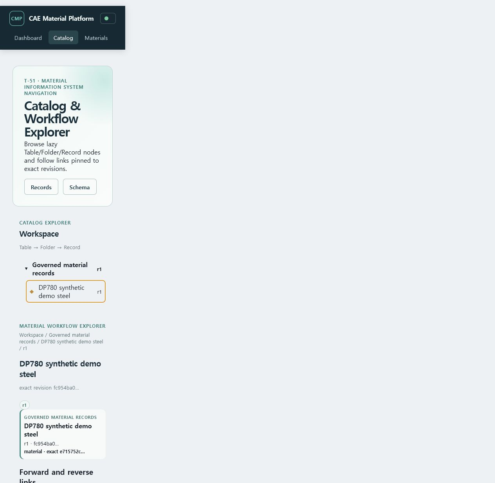
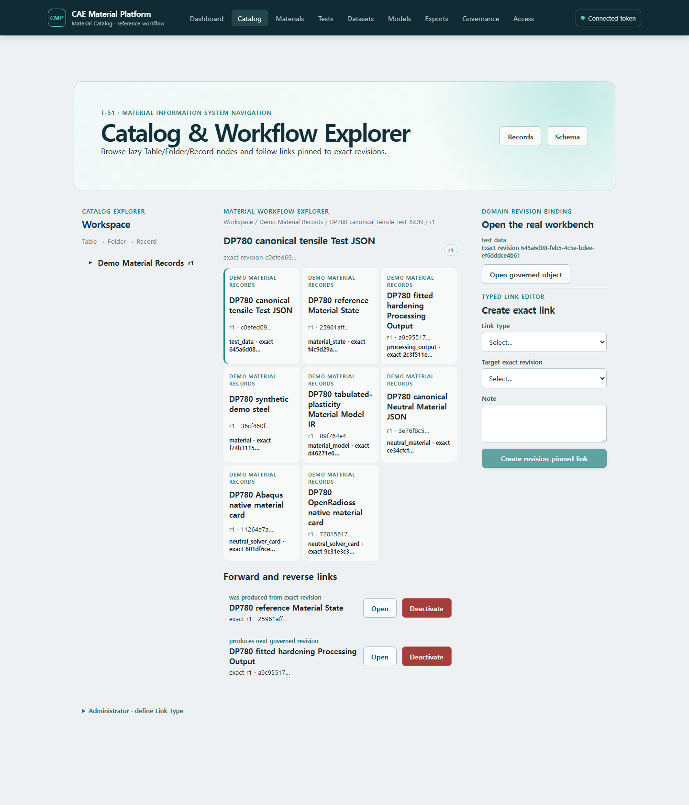

# Configurable Catalog와 Material Modeling 사용자 흐름

이 문서는 T-49~T-60의 통합 사용자 흐름을 추적한다. T-49/T-50의 관리형 schema designer,
typed Record datasheet/search/compare와 기존 fixed-schema reference modeling 흐름은 실제 실행할 수 있다. 이후 단계는 각
Task 구현 시 실제 UI, 입력 fixture와 스크린샷으로 교체하며 미구현 기능을 완료로 표시하지 않는다.

## 지금 사용할 수 있는 Catalog schema designer

1. 상단 **Catalog** 또는 `/catalog/schema`를 연다.
2. Table stable key와 표시명을 입력하고 **Create Table revision 1**을 선택한다.
3. 선택한 Table에 typed Attribute를 추가한다. 수치 Attribute는 quantity semantics와 normalized
   unit을 함께 입력하고, Record reference는 대상 Table을 고정한다.
4. **Create datasheet Layout**으로 현재 Attribute revision 순서를 저장한다.
5. **Create All records Subset**으로 record 검색의 시작 Subset을 만든다.

Table/Attribute/Layout/Subset은 stable identity와 immutable revision으로 저장되며 API 수정은
current ETag를 요구한다.

## Catalog Record 등록·검색·비교

1. 상단 **Catalog** 또는 `/catalog/records`를 열고 Table과 datasheet Layout을 선택한다.
2. 필요하면 왼쪽 **New Folder**에서 root 또는 parent Folder를 만든다. cycle은 거부된다.
3. **New record**를 누르고 이름, 외부 key, Folder와 Layout 순서의 Attribute 값을 입력한다.
4. 수치값은 원본 값·원본 단위 문자열·정규화 값이 모두 보이도록 입력한다. normalized unit과
   quantity semantics는 Attribute revision에서 가져오며 숨겨서 바꾸지 않는다.
5. **Create Record revision 1**을 선택한다. 수정할 때는 검색 결과를 열고 **Save new immutable
   revision**을 선택한다. 기존 revision은 덮어쓰지 않는다.
6. 이름·설명·text Attribute, Folder, discrete facet 또는 normalized 수치 범위로 검색한다.
7. 현재 검색을 이름과 함께 Subset revision으로 저장하고, 저장된 chip으로 다시 적용한다.
8. 두 revision 이상인 Record를 열면 revision 1과 current 사이의 Attribute 차이를 확인한다.

아래 화면은 실제 Docker API와 PostgreSQL에 저장한 DP600 및 AA6061-T6 Record를 조회한 결과다.
왼쪽 facet은 재료군별 건수를 집계하고, 가운데 검색 결과는 각 Record의 current revision을 표시하며,
오른쪽 datasheet는 Layout에 고정된 typed Attribute를 편집한다.

DP600의 Young's modulus를 210 GPa에서 205 GPa로 바꾸면 기존 값을 덮어쓰지 않고 revision 2를
생성한다. 아래 비교는 원본 단위 문자열과 정규화된 Pa 값을 함께 보존한 결과다.

file/curve 값은 이미 업로드된 Artifact UUID와 SHA-256을, record-reference 값은 대상 Record와
정확한 revision UUID를 함께 입력한다. 사용자 친화적 Artifact picker와 link editor는 T-51에서
Explorer와 함께 확장한다.

## Material Database와 exact Record Link 사용

1. 전역 **Material Database** 또는 `/database`를 연다. `/catalog/explorer`는 기존 관리·호환
   화면으로 남아 있지만 일반 탐색의 시작점이 아니다.
2. 왼쪽 **Contents Tree**에서 CAE Material Database → Engineering Materials Profile → Table →
   Folder → Record를 펼친다. Folder 하위 노드는 펼칠 때 실제 PostgreSQL에서 지연 로딩된다.
3. 이름·external key·설명·text Attribute로 검색하거나 **Saved Subsets**의 revisioned 검색 조건을
   적용한다. 검색 결과는 exact current Record revision이며 선택하면 같은 가운데 workspace가 열린다.
4. Record를 선택하면 가운데 **Workflow Tree**가 Material → State → Test Data → Processing →
   Material Model IR → Neutral Material → Solver Card 경로를 계층으로 표시한다. 주소에는
   `/database/records/{record_id}/revisions/{revision_id}`가 남는다.
5. Workflow 노드를 누르면 대상 exact governed revision의 workbench로 이동한다. 브라우저에서
   돌아오면 기존 Contents Tree 문맥을 이어 탐색할 수 있다. 오른쪽 **Related Data**는 현재 선택한
   exact revision에 직접 연결된 관계만 표시한다.
6. 새 링크는 오른쪽에서 Link Type과 대상 Record의 현재 exact revision을 확인한 후 만든다.
   endpoint를 전진시키려면 기존 링크를 덮어쓰지 않고 같은 stable Link의 새 revision을 만든다.
7. **Deactivate**는 링크를 삭제하거나 덮어쓰지 않고 `active=false`인 새 Record Link revision을
   추가한다.

현재 T-76 화면의 중심 탭은 Workflow다. Layout 기반 Datasheet, Properties/Curves/CAE Cards 탭,
AMDC 계열 검색 facet과 비교 overlay를 같은 persistent workspace에 넣는 작업은 T-77 범위이며,
비활성 탭을 완료 기능으로 해석하지 않는다.

### Open a governed object from the Workflow Explorer

An administrator or catalog editor can bind the selected configurable Record revision to one exact
governed domain revision. In **Domain revision binding**, choose the object type and paste the stable
object UUID plus its exact revision UUID. The server rejects a missing, cross-project, differently
classified, or already-bound target. A binding cannot be edited or deleted; create a new Record
revision when the catalog representation must point at a newer governed revision.

After binding, the node shows the domain type and shortened exact revision. Selecting that node opens
the existing Materials, Tests, Datasets, Models, Exports, or Governance workbench while retaining the
exact object and revision in the URL. Unbound nodes continue to open their configurable datasheet.

### Return to the Workflow Explorer from governed data

Material, imported Test Data JSON, committed Processing Output and Neutral/Card screens show an
**Exact linked data** panel when that exact revision has a configurable Catalog binding. Select
**Open Workflow Explorer** to return to the bound Record revision. The center graph loads five hops,
so the clean metal journey shows Material, State, Test JSON, Processing Output, Material Model IR,
Neutral JSON and both native cards together. Selecting another node opens its pinned domain workbench.

The **Forward and reverse links** list is intentionally narrower than the graph: it shows only edges
directly incident to the currently selected Record revision. This prevents a downstream edge from
being presented as though it directly connected to the selected Test or Material.

## 목표 따라하기

1. Catalog Explorer 또는 검색에서 Material record를 찾는다.
2. 관련 Test/Specimen/Dataset revision link를 열거나 Test Data JSON/CSV를 등록한다.
3. channel과 자유 Attribute를 calculation quantity에 연결하고 Mapping Profile을 저장한다.
4. Processing Workbench에서 crop, smoothing, resampling, 통계와 family-specific method를 구성한다.
5. 설정을 Processing Recipe revision으로 저장하고 다른 Dataset 또는 선택 집합에 batch 실행한다.
6. processed/fitted/extrapolated curve와 residual/candidate를 비교한다.
7. 선택 결과를 Neutral Material JSON/IR revision으로 승격한다.
8. Abaqus 또는 OpenRadioss mapping report를 확인한다.
9. native card를 preview/download하거나 관련 JSON과 함께 Bundle을 내려받는다.

## 데이터 형식

- 시험 교환: `cmp.test-data` JSON; CSV/TSV/XLSX는 같은 구조로 변환
- 처리 설정: Mapping Profile JSON과 Processing Recipe JSON
- 중립 모델 교환: `cmp.neutral-material` JSON
- 대용량/복수 전달: deterministic JSON+ZIP와 `checksums.sha256`
- solver output: `.inp`, `.rad` 등 native ASCII

## 현재 사용 가능 여부

정확한 상태와 다음 Task는 [제품 capability map](../00-research/product-capability-map.md)을
따른다. GUI 변경 PR은 이 문서와 `screenshot-manifest.yaml`을 함께 갱신해야 한다.
