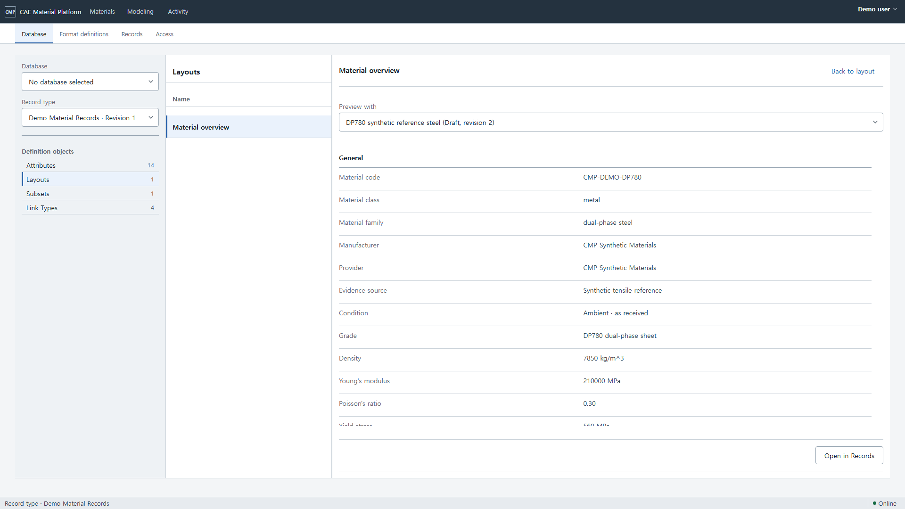
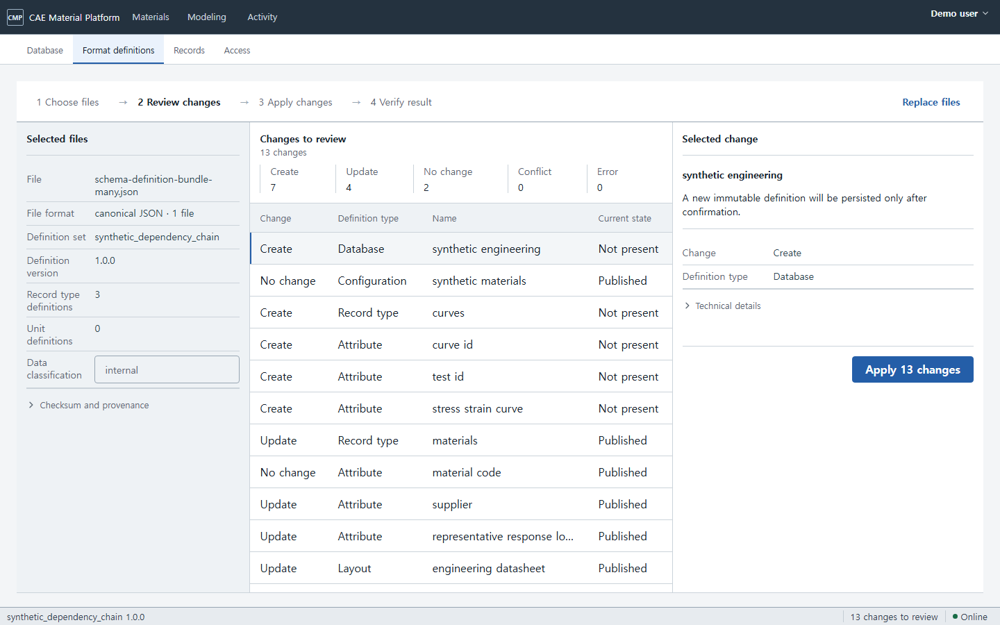
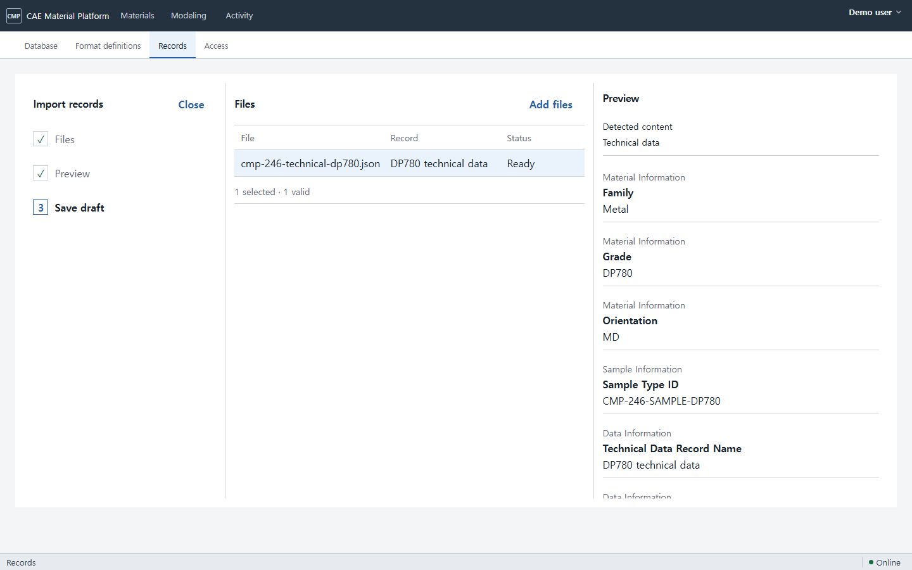
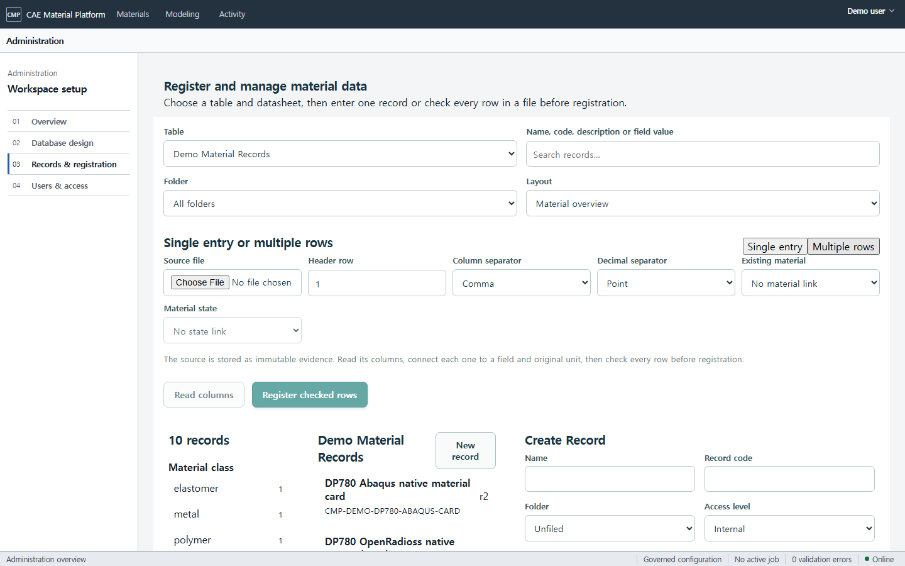
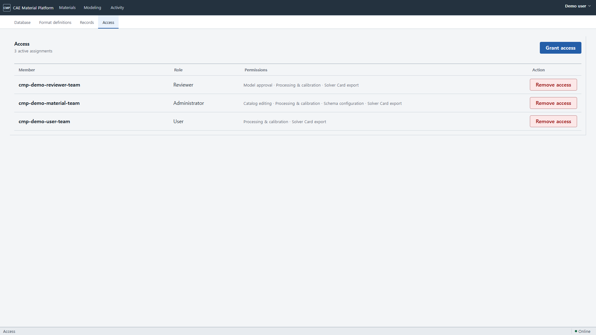

# Configurable Catalog와 Material Modeling 사용자 흐름

이 문서는 물성 데이터의 구조를 만들고 값을 등록·검색하는 사용자 흐름을 설명한다. Administration에서
Database와 Record type을 만들고, 필요한 경우 선택적 Configuration으로 Record type 배치를 묶는다.
Attribute, Layout, Subset과 Link Type은 Record type을 기준으로 정의한다.

## 지금 사용할 수 있는 Catalog schema designer

1. **Administration → Database**를 연다. Database, Format definitions, Records, Access는 같은
   Administration taskbar에서 이동하며, `/catalog/schema`는 Database로 연결되는 호환 주소다.
2. 왼쪽에서 **Record type**을 고른 뒤
   **Definition objects**에서 Attribute, Layout, Subset 또는 Link Type을 연다. 일반 정의는 가운데 목록의
   Revision과 선택한 정의의 lifecycle을 확인하고, Layout 목록은 **Version**을 한 번만 표시한다.
3. Database를 고르지 않으면 `No database selected`가 표시되고 Record type은 독립적으로 선택할 수 있다.
   **Database**를 고르면 그 Database에 속한 선택적 Configuration이 나타나며, 하나뿐이면 자동 선택된다.
   **Record type**을 바꾸면
   Attribute, Layout, Subset과 Record 미리보기가 해당 Table 기준으로 바뀐다.
4. **Create Database**, **Create Configuration**, **Create Record type** 또는 **Create Attribute**를 누른 뒤,
   표시명·참조 key·사용자에게 필요한 입력 안내만
   작성한다. 수치 Attribute는 무엇을 뜻하는 수치인지와 표준 단위를 함께 입력하고, Record reference는
   연결할 Table을 고정한다.
5. **New layout**은 서버를 변경하지 않고 이름, 선택적 설명과 현재 Record type의 **Datasheet fields**를
   편집기에 연다. 필드 선택과 순서를 검토한 뒤 **Save**를 눌러야 선택한 Attribute exact revision과 함께
   새 Layout이 저장된다. 체크박스는 현재 datasheet Layout에 필드를 포함하거나 제외할 뿐 Attribute 자체를
   비활성화하지 않는다. **Preview**는 저장 전 form 또는 선택한 Layout을 서버의 실제 Record에 적용하며
   값이나 section을 임의로 만들지 않는다.
6. Link Type에서는 출발/도착 Table, 양방향으로 읽을 문구와 한 항목당 연결 수를 정한다. 저장할 때
   두 Table의 현재 정의 revision이 함께 고정된다.
7. Layout의 **More → Duplicate layout**은 저장 전 복사 편집기를 열고, **Delete layout**은 확인 후
   eligible draft만 영구 삭제한다. 다른 정의의 duplicate/delete 계약은 그대로 유지된다. 삭제는 게시 이력이 없는 Revision 1이고 Record,
   Link, 참조 또는 다른 의존성이 전혀 없을 때만 성공한다. 서버가 사용 중인 항목을 찾으면 현재 선택과
   원본을 그대로 두고, 무엇을 먼저 정리해야 하는지 오류로 알려 준다.

Administration에서는 한 작업 묶음의 다음 주요 동작 하나만 파란색으로 강조한다. 기존 정의를
편집할 때 지원되는 **Validate draft**와 **Save new … revision**을 구분한다. Layout에는 현재 승인된
publication transition이 없어 별도 validation/publication control을 노출하지 않는다. 여러 Record 등록에서는 검사가 끝나기
전 **Import validated records**가 비활성화되며, 모든 행이 유효해진 뒤에만 실행할
수 있다. 녹색은 저장 성공 같은 상태 표시에만 사용한다.

Database shell과 정의 목록은 viewport를 활용하고, scope navigator와 속성 form은 읽기 좋은
폭을 유지한다. 미리보기를 열면 오른쪽 편집기를 실제 datasheet 결과로 바꾸고 작업 영역의 지배적인 폭을
할당하며 **Back to layout**으로 편집기로 돌아간다. 선택한 Database/Configuration/Record type과 정의의 내부 stable ID·exact revision ID는 주소에
고정되며, Record 미리보기에는 exact Record revision도 함께 고정된다. 주소를 새로고침해도 같은
정의와 Record를 다시 읽고, 식별자가 없거나 맞지 않으면 다른 항목을 대신 열지 않고 오류를 표시한다.
같은 화면을
[2560×1440](images/current/administration-database-2560x1440.png)과
[3840×2160](images/current/administration-database-3840x2160.png)에서도 확인할 수 있다.

실제 Record 미리보기는
[1366×768](images/current/administration-database-preview-1366x768.png),
[1440×900](images/current/administration-database-preview-1440x900.png),
[2560×1440](images/current/administration-database-preview-2560x1440.png),
[3840×2160](images/current/administration-database-preview-3840x2160.png)에서도 같은 exact Table·Layout·Attribute
revision을 유지한다.

Table/Attribute/Layout/Subset은 stable identity와 immutable revision으로 저장되며, 새 정의는 기존
Record나 과거 revision을 바꾸지 않는다.

### Format definitions에서 형식 정의 파일 검토·적용하기

여러 record schema를 한 번에 준비하는 Administrator는 **Administration → Format definitions**에서
다음 입력 중 하나를 선택한다.

- canonical bundle JSON 한 개
- source-v2 manifest와 이 manifest가 가리키는 JSON 파일들
- 이미 만든 source-set envelope JSON
- 같은 파일 구성을 담은 ZIP 한 개

여러 파일을 고르면 화면이 경로를 정렬하고 각 파일의 SHA-256을 포함한 하나의 결정론적 source-set
envelope를 만든다. 화면은 MIME, 1 byte–64 MiB 크기, 안전한 상대 경로와 JSON 구조를 먼저 확인한 뒤
그 exact bytes를 immutable Artifact로 올린다. 선택 영역에는 File format, Definition set/version,
Record type definitions, Unit definitions와 Data classification이 보인다. 내부 Artifact ID와 checksum은 **Checksum and
provenance**에서 확인한다. 이 source adapter는 입력 형식을 canonical Catalog 계약으로 바꾸는 경계이며
Material Model IR이나 selected model을 만들지 않는다.

서버는 현재 Catalog와 비교한 `Create`, `Update`, `No change`, `Conflict`, `Error` 계획을 보여 준다.
같은 source set 안에서 선언하고 checksum을 검증한 파일과 record `$id`만 참조할 수 있다. 지원하지
않는 schema 표현이나 단위는 진단으로 남고, 임의 필드나 단위로 바뀌지 않는다.
공통 단위 계약 `1.1.0`은 source-v2의 `mm/min`과 `tonne/mm3`를 원문 그대로 받아 각각 명시된
`speed`와 `mass_per_volume` 안에서만 정규화한다. 기존 DMA `Hz`는 공통 단위로 새로 추론하지 않고
이미 승인된 explicit-legacy channel 규칙을 재사용한다.

작업 단계는 `1 Choose files → 2 Review changes → 3 Apply changes → 4 Verify result`다.
**Preview changes (no write)**는 현재 정의와의 차이만 계산하고 적용하지 않는다. 중앙 표의
`Change | Definition type | Name | Current state`와 Create/Update/No change/Conflict/Error 요약을 확인한다.
선택한 변경의 실제 결과는 오른쪽에 한 번만 보이고 내부 reason code와 source 위치는 **Technical details**에서만 연다.
conflict, error 또는 기존 Record migration이 필요한 비교는 적용할 수 없다. 유효한 비교는 **Apply N changes**로
confirmation을 연 뒤 Definition set/version과 변경 개수를 다시 대조하고 **Apply confirmed changes**로 명시적으로 적용한다. 서버는 현재 상태를 다시 계획하여 전체
revision·publication과 추적 증거를 한 번에 저장하고, bundle에 없는 객체는 삭제하지 않는다.

성공 후 **Verified immutable result**는 immutable application을 다시 읽고 checksum과 provenance를
검증한 **Download applied definition files**만 내려받게
한다. `application_id`가 포함된 주소를 새로고침하면 그 exact application을 다시 읽으며 파일 내용이나
token은 저장하지 않는다. Stale plan이면 기존 Apply를 반복하지 말고 **Plan again**으로 새 계획을
확인한다. API 경계와 운영 복구 절차는
[관리자 가이드](../admin-guide/index.md#3-format-definitions-선택검토적용검증)를 참고한다.

## Catalog Record 등록·검색·비교

1. 일반 탐색은 **Materials → Browse Tree**를 사용한다. 새 Folder/Record를 관리하는 작업은
   **Administration → Records**를 열고 Record type과 **Display layout**을 선택한다. `/catalog/records`는
   같은 화면으로 연결되는 호환 주소다.
2. 필요하면 왼쪽 **New Folder**에서 root 또는 parent Folder를 만든다. cycle은 거부된다.
3. **Create record**를 눌러 실제 데이터 입력 화면을 열고 이름, Record code, Folder와 Layout 순서의
   Attribute 값을 입력한다. 이 작업은 Table의 필드를 추가하지 않는다.
4. 수치값은 원본 값·원본 단위 문자열·정규화 값이 모두 보이도록 입력한다. normalized unit과
   quantity semantics는 Attribute revision에서 가져오며 숨겨서 바꾸지 않는다.
5. **Save new record**로 Revision 1을 저장한다. 수정할 때는 검색 결과나 Database의 **Open in Records**에서
   exact Record revision을 연다. 제목 아래의 `Draft · Revision N`을 한 번 확인하고
   **Save new revision**을 선택하며 기존 revision은 덮어쓰지 않는다.
6. 이름·설명·text Attribute, Folder, discrete facet 또는 normalized 수치 범위로 검색한다.
7. 현재 검색을 이름과 함께 Subset revision으로 저장하고, 저장된 chip으로 다시 적용한다.
8. 두 revision 이상인 Record를 열면 revision 1과 current 사이의 Attribute 차이를 확인한다.
9. **Single entry**에서 검색 결과의 Record를 열면 current revision의 **Request review** action이
   같은 화면에 나타난다. 사유를 입력했다가 취소하거나 전송하면 Activity에서 해당 exact revision의
   상태를 이어서 확인한다.
10. 여러 건은 **Import records**를 선택해 CSV/TSV/XLSX 내용을 확인하고 원본 열, Attribute, 값 형식,
   원본 단위와 재료 상태를 매핑한다. **Read file columns → Validate records**에서 행별 오류를 고친 뒤
   모든 행이 유효할 때만 **Import validated records**를 누른다. 이미 데이터가 연결된 재료 상태는 검색 결과에서 기존 Record를
   열어 수정한다. 등록 과정에서 기존 재료나 상태를 자동으로 만들거나 덮어쓰지 않는다.

### JSON 파일로 실제 Record 등록하기

**Administration → Records → Import records**를 열고 **Add files**에서 JSON, CSV, TSV 또는 XLSX를
고른다. 파일 형식은 파일을 고르는 창에서 정하며, import 작업면에서 Record type이나 format revision을
다시 선택하지 않는다. JSON의 정확한 형식은 서버가 설치된 정의와 일치시키고 저장 결과에 고정한다.

1. 같은 종류의 JSON 파일을 한 개 이상 선택한다. 한 파일은 한 Record가 되며 원본 파일명과 bytes를 보존한다.
2. **Preview**에서 파일별 상태를 확인한다. 잘못된 파일은 파일명, JSON 위치, 원인과 고치는 방법을 함께
   표시한다. 하나라도 유효하지 않으면 전체 묶음을 저장할 수 없다.
3. 연결 대상이 모호하거나 정확한 revision을 찾을 수 없으면 저장하지 않고 복구 방법을 표시한다. 화면이
   임의로 최신 revision이나 첫 항목을 대신 고르지 않는다.
4. 모든 파일이 유효하면 **Reason for change**를 입력하고 **Save**를 누른다. **Save draft** 단계에서 전체
   묶음을 한 번에 draft로 저장하므로 일부 파일만 남지 않는다. 검토와 공개는 이 화면 밖의 후속 단계다.
5. 저장 뒤 exact Record에서 **source JSON**과 **source CSV**를 내려받을 수 있다. JSON은 원본 구조와
   파일명을 보존하고, CSV는 사람이 읽을 수 있는 열과 단위·curve 순서를 유지한다.

같은 Import records 작업면은 [1366×768](images/current/administration-records-import-json-1366x768.png),
[1920×1080](images/current/administration-records-import-json-1920x1080.png),
[2560×1440](images/current/administration-records-import-json-2560x1440.png),
[3840×2160](images/current/administration-records-import-json-3840x2160.png)에서도 파일 목록과 Preview가
함께 보이고, 큰 화면의 추가 폭은 두 작업 영역에 배정된다.

같은 검색 결과 화면은 [1366×768](images/current/administration-records-1366x768.png),
[1920×1080](images/current/administration-records-1920x1080.png),
[2560×1440](images/current/administration-records-2560x1440.png),
[3840×2160](images/current/administration-records-3840x2160.png)에서도 확인할 수 있다. shell은 전체
viewport를 사용하고 검색 결과가 남는 영역을 차지한다. Record 입력 form은 **Create record** 또는 결과 행을
선택할 때만 열리고 읽기 좋은 폭에 머문다. 좁은 viewport에서 편집기가 열려도 결과 툴바의 **Display layout**,
**Import records**, **Create record**는 유지된다. 검색·facet·Record 목록은 같은 server-scoped query를 공유하며
이름, 계약의 대표 field(예: Material code), Revision, Status를 별도 열로 표시한다. 주소에는 exact Table·Folder·Record identity와 revision이
고정되며 새로고침 후에도 같은 revision을 다시 읽는다. 존재하지 않는 좌표에서는 current, 첫 항목 또는
다른 session의 Record로 대체하지 않는다. **Import records**를 열면 원본 파일과 행 검사 명령이 같은
작업 영역에 나타난다.

아래 화면은 실제 Docker API와 PostgreSQL에 저장한 DP600 및 AA6061-T6 Record를 조회한 결과다.
왼쪽 facet은 재료군별 건수를 집계하고, 가운데 검색 결과는 각 Record의 current revision을 표시하며,
오른쪽 datasheet는 Layout에 고정된 typed Attribute를 편집한다.

DP600의 Young's modulus를 210 GPa에서 205 GPa로 바꾸면 기존 값을 덮어쓰지 않고 revision 2를
생성한다. 아래 비교는 원본 단위 문자열과 정규화된 Pa 값을 함께 보존한 결과다.

file/curve 값과 다른 레코드 연결의 상세 식별자는 **Source & history** 또는 **Advanced**에서 확인한다.
일반 입력 화면에는 내부 식별자가 표시되지 않는다.

### Access assignment 관리

**Administration → Access**는 active assignment를 먼저 표시한다. 각 행에서 **Member**, Role,
server-derived **Permissions**와 Action을 함께 확인하고 현재 접근만 **Remove access**할 수 있다. 제거
이력은 서버에 보존되지만 정상 표면을 차지하지 않는다.
**Grant access**를 선택할 때만 compact 입력 영역이 열리며, Member type에서 Team 또는 User ID와 실제
Role을 고른 뒤 접근을 부여한다. Reviewer, Administrator, User의 Permissions는 backend가 반환한
role consequence를 그대로 사용하며 개별 기능을
임의로 조합하지 않는다.
사용자·팀 directory 검색과 선택, overlap과 pagination은 #327 범위이며 현재 화면에서 제공하지 않는다.

## Materials 검색·Browse와 exact Record Link 사용

1. 일반 사용자는 `/materials`에서 **Search** 또는 **Browse**로 시작한다. Browse의 `Technical Data`,
   `Test Data`, `Simulation Data`, `Solver Cards`는 서로 같은 수준의 네 범주이며 저장 위치나 처리 순서를
   강제하는 계층이 아니다.
2. Search 결과의 **Material**과 Browse 결과의 **Name**에는 사람이 읽는 이름만 표시하고, 각 결과의
   **Material code**에는 Catalog external key를 표시한다.
   Material code가 없으면 em dash를 표시하며 grade로 해석하지 않는다. 이름·Material code·설명·text Attribute 검색과
   facet 결과, 전체 건수는 같은 서버 범위의 query에서 읽는다.
3. `Technical Data`는 Material, Material State와 적용 가능한 물성을, `Test Data`는 Specimen, Test Run과
   exact canonical 측정 데이터/곡선을 뜻한다. `Simulation Data`는 Processing Output, selected Material
   Model, Neutral Material처럼 구체적인 유형을 표시하고, `Solver Cards`는 solver-ready target artifact를
   뜻한다. 항목을 누르면 같은 가운데 Materials workspace에서 exact revision datasheet를 연다. Simulation
   Data 항목의 구체 유형과 해당 계약에 맞는 내용을 확인한다. Processing Output은 Catalog 요약값이 아니라 연결된
   exact Output revision을 검증해 읽고, 실제 선택 결과 곡선을 중심으로 선택 모델, fitted parameter와 bounds,
   저장된 선택 결정의 fit metric, convergence/identifiability, 주요 scalar·workup 결정을 표시한다. 처리 단계,
   UUID, hash와 candidate별 상대 RMSE를 포함한 전체 진단은 접힌 **Revision history and technical details**에서
   확인한다. Solver Card는 target, format, unit system, release, exact revision과 review
   상태·다운로드를 native preview 위에 표시하고, preview는 펼치거나 접은 뒤 자체 스크롤로 읽는다. Exact
   source와 provenance 값은 접힌 **Exact source and technical details**에서 확인한다.
4. Material Overview의 **Key properties**는 단위가 포함된 label/value 쌍으로 읽는다. **Applicable
   conditions and material states**에는 Temperature, Strain rate, State, Manufacturing route가 각각
   표시된다. 대표 응답은 저장된 curve contract가 축 quantity와 단위를 확정할 수 있을 때만 나타난다.
5. **Related data**는 현재 exact revision에 직접 연결된 항목만 `Technical Data`, `Test Data`,
   `Simulation Data`, `Solver Cards`로 묶는다. Test Data에는 exact Technical Data 연결이 필요하고,
   Simulation Data와 Solver Card는 저장되어 검토된 exact link가 있을 때만 보인다. 서로 다른 constitutive
   family나 FLD를 downstream 항목에 자동 연결하지 않는다.
6. Test Data detail에서는 pinned canonical JSON의 원본 channel 배열로 그린 실제 측정 곡선과 point 값을 먼저
   확인한다. 그래프와 값 표는 channel/axis quantity와 원본 단위를 유지하며, **Download exact Test Data JSON**은
   같은 exact revision artifact를 내려받는다. 아래의 scalar Layout은 보조 요약이며 CSV action은
   **Download summary CSV**로 구분한다. Material·State·Test Data revision provenance가
   모두 확정된 Test Data만 **Open in Modeling**을 제공하며 legacy 또는 미확정 곡선은 view-only다.
7. Simulation Data는 **Processing Output**, **Selected Material Model**, **Neutral Material**을 구분하고
   각 binding의 실제 계약만 표시하며, 직접 연결된 Test Data 또는 Processing Output 관계를 표시한다.
   Processing Output의 **Linked records**는 relation, record code, type, exact revision만 간결하게 표시한다.
   Solver Card detail은 solver, version,
   unit system, release state와 현재 가능한 preview/download/create action을 표시한다. 지원되지 않는 mapping은
   가짜 create/download 대신 block reason을 보여 준다.
8. **Back**, **Forward**, **Reload**, **Results**를 사용해도 이전 query, filter, sort, Browse 위치, 선택한
   exact item과 tab이 유지된다. Modeling으로 이동할 수 있는 항목은 이미 알려진 Material, State/condition,
   Test Data revision context를 전달하므로 다시 선택하지 않는다.
9. `Technical Data → tensile Test Data → selected elastoplastic model → Solver Card`와
   `Technical Data → DMA Test Data → selected linear viscoelastic model → Solver Card`는 서로 독립적인
   링크 흐름으로 탐색한다. Fit run/candidate는 Modeling 또는 Activity, selected model은 Simulation Data,
   Material Model IR은 Advanced/Source & history, 생성된 카드는 Solver Cards에서 확인한다.
10. Table → Folder → Record 저장 위치, 데이터 형식 또는 Link Type을 관리해야 하면 **Administration**을
    연다. **Source & history**의 **Linked records**는 relation, target record, type, exact revision으로
    직접 연결된 Record Link만 표시한다. 여러 hop의 provenance는 접힌 **Full lineage**에서 확인한다.
11. 새 링크는 Administration에서 Link Type과 대상 Record의 현재 exact revision을 확인한 후 만든다.
    endpoint를 전진시키려면 기존 링크를 덮어쓰지 않고 같은 stable Link의 새 revision을 만든다.
12. **Deactivate**는 링크를 삭제하거나 덮어쓰지 않고 `active=false`인 새 Record Link revision을
    추가한다.

13. **Datasheet** 탭을 열면 관리자가 정의한 Layout section과 순서로 typed Attribute가 표시된다.
   number 값은 원본 값/단위와 normalized 값/단위, quantity semantics를 함께 표시한다. 여러 Layout이
   있으면 우측 Layout 선택기로 datasheet 구성을 바꾼다.
14. 상단 검색에서 Table과 검색어를 선택한다. 오른쪽에서 discrete facet 또는 normalized numeric
   range를 적용할 수 있다. 두 결과의 **Compare**를 체크한 뒤 **Compare 2**를 누르면 선택한 Layout
   순서로 exact current Record revision을 나란히 비교한다.
15. **Curves**에서 **Available curves** 목록의 현재 Record revision 곡선을 선택하면 선택 identity에서 같은
    화면의 큰 그래프로 이어지는 구성으로 채널 이름,
    축 역할, 표시 단위와 기록된 통계 band 의미를 확인할 수 있다. 원본/정규화·표시 단위와 **Curve source
    and technical details**는 접힌 영역에서 exact Record/Artifact revision과 digest, source와 calculation
    chain과 함께 확인한다. 정확히 연결된
    Test Data 곡선만 **Open in Modeling**으로 전달된다. 저장 key `observed_tensile_curve`는
    **Measured tensile curve**, `replicate_statistics_curve`는 **Repeated-test average and variation**으로
    표시하고, 아래 source 표의 exact Test Data 입력은 **Measured test input**으로 표시하지만 저장된
    key, binding kind, exact revision 계약은 바꾸지 않는다. 통계 envelope와 provenance가 없는 legacy
    곡선은 view-only이며 Fit 입력으로 추정하지 않는다.

## 시험 curve를 그래프 중심 Workbench에서 처리

1. 전역 **Modeling**을 선택한다. 상단의 `Data | Process | Fit | Export`가 일반 작업 경로다.
2. Data에서 Canonical JSON, CSV 또는 XLSX를 선택하고 **Test Data revision**과 channel/unit
   Mapping Profile을 확인한다. Materials에서 연 exact Test Data도 같은 channel definition SHA와
   표시 adapter를 사용한다. Library에서는 행 위치나 전체 개수 대신 화면에 표시된 정확한 Test Data
   이름과 revision을 확인해 선택한다. 원시 JSON은 Advanced mapping definition에서만 연다.
3. Process에서 왼쪽 `Curves`의 실제 test method 그룹과 specimen/revision 행, `Process`의 일반 문자열
   행을 선택한다. 각 curve 행의 원형 색 키는 그래프 선을 구분할 뿐이며, inclusion checkbox와 눈 아이콘은
   각각 계산 포함 여부와 브라우저 로컬 plot visibility를 독립적으로 바꾼다. `Add method`로 ordered
   step을 추가하고 current-step settings ribbon에서 crop/smoothing/resample/statistics option을
   바꾼다. 1366 px에서는 `Show settings`로 ribbon을 연다.
4. **Preview changes**를 누른다. 오른쪽에 별도 inspector 열을 만들지 않고, 같은 큰 graph가 실제
   서버 계산 raw/mapped/processed stage를 유지한다. 그래프 tooltip은 pointer와 Arrow key로 같은
   point를 탐색하며 축 label/unit, 값, 기록된 band method·coverage와 pointwise `n`을 표시한다.
5. Fit에서 candidate response, residual, tangent와 extrapolation을 비교한다. 현재 curve/step과
   settings는 같은 surface에 연결된다.
6. Recipe와 Batch는 ribbon의 **Advanced · Recipe and Batch**, ordered JSON은 **Advanced Recipe
   JSON**에서 확인한다. 원본과 released artifact는 수정되지 않는다.
7. Export에서 reviewed Processing Output/Material Model IR, Neutral Material, mapping 상태와 native
   card preview/download를 실행한다.

### 재료군별 Modeling track 사용

상단에서 **Metal**, **Polymer**, **Elastomer** 중 하나를 선택한다. 재료군을 바꾸면 이전 재료군의
Test Data 선택은 해제되므로, 새 quantity 계약에 맞는 exact revision을 다시 선택해야 한다. 이렇게
해야 금속 인장 curve가 폴리머 relaxation 또는 엘라스토머 다중 시험 입력으로 조용히 재사용되지 않는다.

- **Metal · Elastoplastic:** E/proof/necking, true-plastic 변환, Voce/Swift/
  Hockett--Sherby/Ghosh 후보와 제한 외삽을 처리한다.
- **Polymer · Viscoelastic:** time/modulus 매핑, log-time resampling, Prony 후보를 처리하고 exact
  Processing Output에서 generalized-Maxwell IR과 Neutral/Card 단계로 이동한다.
- **Elastomer · Hyper-viscoelastic:** 공통 Test JSON 처리가 선택 사항이며, 아래 family panel에서
  uniaxial/planar/biaxial governed Dataset과 holdout, saved Calibration Plan을 선택한다.

그래프 위의 **Current-step settings** ribbon에서 method option을 바꾼다. **Advanced · Recipe and
Batch**를 펼치면 Recipe revision을 저장·게시하거나 exact Dataset batch를 preflight·실행·재시도할 수 있다.
각 track 아래의 Material context는 해당 분류의 Material, State, Property revision을 실제 API에서
불러오며 **Open full datasheet**로 원본 Material record에 돌아간다.

엘라스토머 데모는 저장된 exact Plan revision을 불러와 단축·평면·이축 calibration curve와 holdout을
함께 실행한다. 실행 후 네 model family, 여덟 multistart candidate, fitted/residual plot, rank와
uncertainty를 비교한 뒤에만 Candidate 선택 또는 Neutral 승격으로 진행한다.

### Interim reviewed-delivery controls

> 이 절은 Export 안에 보존된 T-81 engine-connected delivery contract를 설명한다. 외형은
> Data/Process/Fit/Export shell로 바뀌었지만 exact Neutral/card 계약은 변경하지 않았다.

After a metal, polymer or elastomer result is promoted, the same **Final step · reviewed delivery**
panel appears inside Material Modeling. Do not create a second Neutral revision when the panel says
`Exact Neutral JSON rN restored`; the exact immutable result has already been found for the selected
Material and Processing/Candidate evidence.

1. Check **Evidence reviewed** for the selected model family, selection reason, exact model or
   Processing Output revision, input revision count, preserved curve stages and applicability.
2. Select **Download exact Neutral JSON** when the solver-neutral exchange document is required.
3. Choose Abaqus or OpenRadioss and select **Run mapping preflight**.
4. Read every `exact`, `transformed`, `approximated`, `ignored`, `unsupported` and
   `not_applicable` row. The card remains blocked when the report is not exportable.
5. When an approximation or ignored field exists, check the explicit review acknowledgement.
6. Select **Create solver card**, inspect the native ASCII preview, then download the card and
   mapping report. **Add exact files to a bulk package** opens the package builder with the same
   Material context; **Return to Material datasheet** returns without copying an ID.

### Open a governed object from the Workflow Explorer

An administrator or catalog editor can bind the selected configurable Record revision to one exact
governed domain revision. In **Domain revision binding**, choose the object type and paste the stable
object UUID plus its exact revision UUID. The server rejects a missing, cross-project, differently
classified, or already-bound target. A binding cannot be edited or deleted; create a new Record
revision when the catalog representation must point at a newer governed revision.

After binding, the node shows the domain type and shortened exact revision. Selecting that node opens
the existing Materials, Tests, Datasets, Models, Exports, or Governance workbench while retaining the
exact object and revision in the URL. Unbound nodes continue to open their configurable datasheet.

### Return to the Workflow Explorer from governed data

Material, imported Test Data JSON, committed Processing Output and Neutral/Card screens show an
**Exact linked data** panel when that exact revision has a configurable Catalog binding. Select
**Open Workflow Explorer** to return to the bound Record revision. The center graph loads five hops,
so the clean metal journey shows Material, State, Test JSON, Processing Output, Material Model IR,
Neutral JSON and both native cards together. Selecting another node opens its pinned domain workbench.

The **Forward and reverse links** list is intentionally narrower than the graph: it shows only edges
directly incident to the currently selected Record revision. This prevents a downstream edge from
being presented as though it directly connected to the selected Test or Material.

## 목표 따라하기

1. Catalog Explorer 또는 검색에서 Material record를 찾는다.
2. 관련 Test/Specimen/Dataset revision link를 열거나 Test Data JSON/CSV를 등록한다.
3. channel과 자유 Attribute를 calculation quantity에 연결하고 Mapping Profile을 저장한다.
4. Processing Workbench에서 crop, smoothing, resampling, 통계와 family-specific method를 구성한다.
5. 설정을 Processing Recipe revision으로 저장하고 다른 Dataset 또는 선택 집합에 batch 실행한다.
6. processed/fitted/extrapolated curve와 residual/candidate를 비교한다.
7. 선택 결과를 Neutral Material JSON/IR revision으로 승격한다.
8. Abaqus 또는 OpenRadioss mapping report를 확인한다.
9. native card를 preview/download하거나 관련 JSON과 함께 Bundle을 내려받는다.

## 데이터 형식

- 시험 교환: `cmp.test-data` JSON; CSV/TSV/XLSX는 같은 구조로 변환
- 처리 설정: Mapping Profile JSON과 Processing Recipe JSON
- 중립 모델 교환: `cmp.neutral-material` JSON
- 대용량/복수 전달: deterministic JSON+ZIP와 `checksums.sha256`
- solver output: `.inp`, `.rad` 등 native ASCII

## 현재 사용 가능 여부

정확한 상태와 다음 Task는 [제품 capability map](../00-research/product-capability-map.md)을
따른다. GUI 변경 PR은 이 문서와 `screenshot-manifest.yaml`을 함께 갱신해야 한다.
