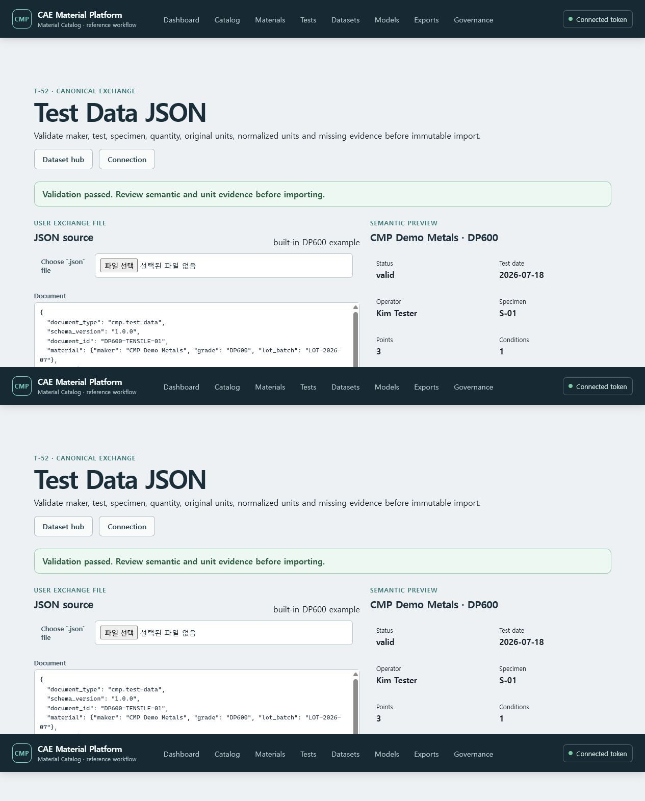

# 시험 데이터를 Canonical Test Data JSON으로 등록하기

이 화면은 시험 방법이나 재료모델에 종속되지 않은 `cmp.test-data` JSON을 검증하고 저장합니다.
원본 단위와 정규화 단위, quantity semantics, 결측 사유를 저장 전에 확인할 수 있습니다.

## 등록 절차

1. 서비스를 실행한 뒤 `Datasets` → `Test Data JSON`을 엽니다.
2. `.json` 파일을 선택하거나 화면의 예제를 편집합니다. 단일 문서는 25 MiB 이하만 허용됩니다.
3. **Validate with server**를 눌러 maker, grade, 시험일, 작업자, 시편, 채널과 단위를 확인합니다.
4. Classification과 변경 사유를 입력합니다.
5. **Import immutable revision**을 누릅니다.
6. 아래 `Imported Test Data` 목록에서 stable identity와 revision 번호, canonical digest를 확인합니다.
7. **Download exact JSON**을 누르면 선택된 정확한 revision의 JSON을 다시 받습니다.

## 저장되는 증거

- stable Test Data identity와 immutable revision
- maker, grade, lot/batch, 시험일, 작업자, 실험실, 시험 방법과 시편
- typed 시험 조건
- 채널별 quantity semantics, original unit, normalized unit, 변환 scale/offset와 결측 수
- canonical JSON Artifact UUID/SHA-256
- 계산용 normalized Parquet Artifact UUID/SHA-256

같은 `document_id`를 다시 검증하면 화면은 현재 ETag를 사용해 새 immutable revision을
추가합니다. 기존 revision과 Artifact는 덮어쓰지 않습니다. 다른 stable identity의 최초 등록과
revision 추가는 서버에서 구분됩니다. 후속 T-52 increment는 CSV/XLSX adapter와 JSON+ZIP
package를 제공합니다.
