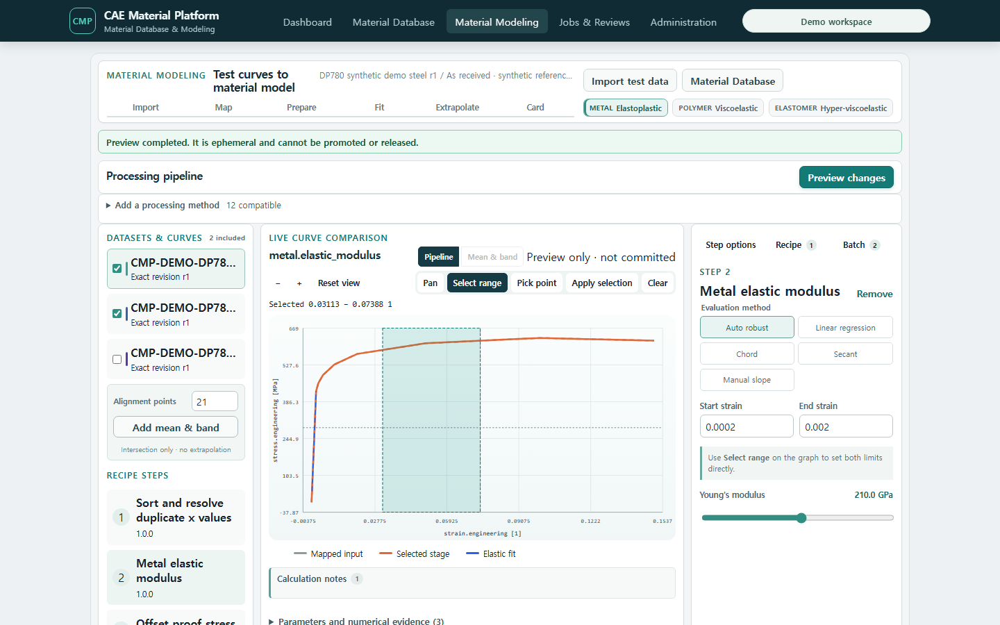
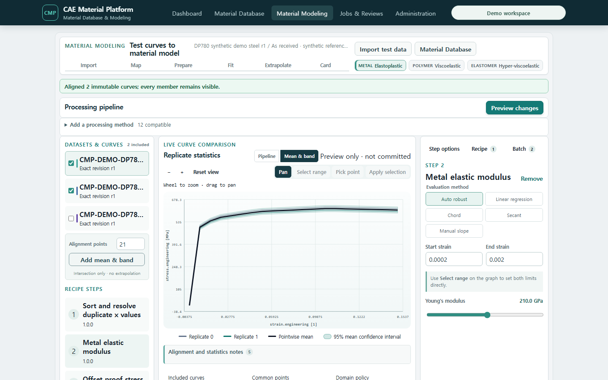
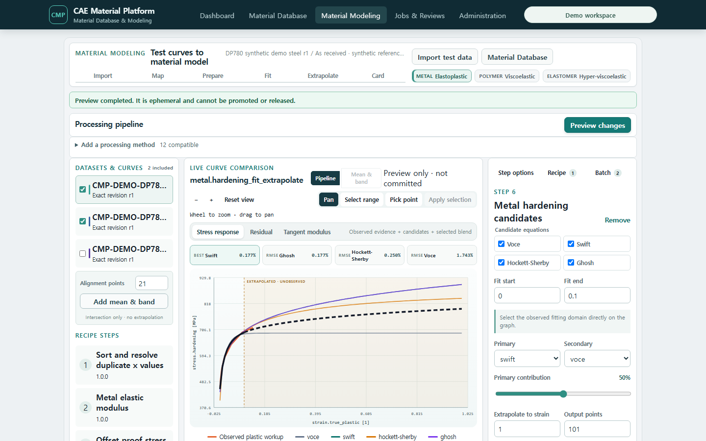
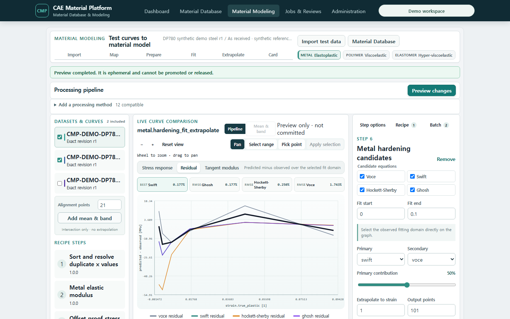
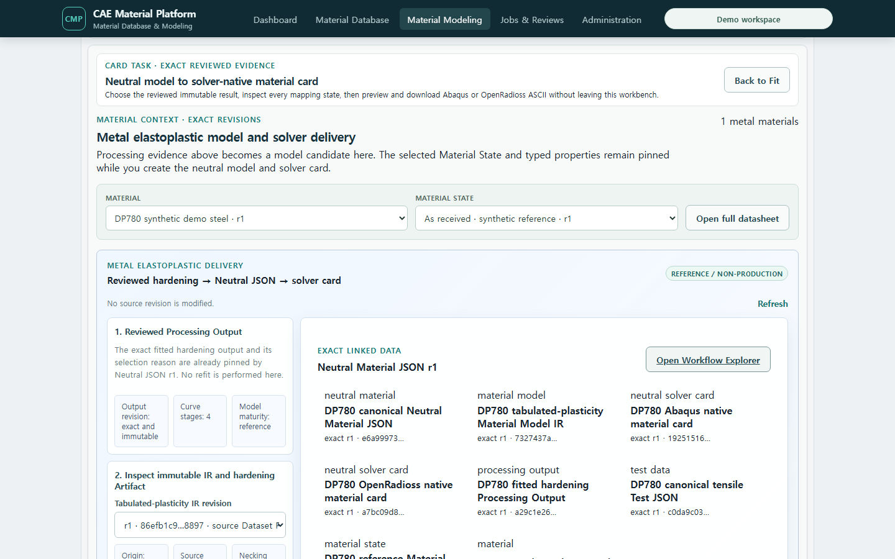
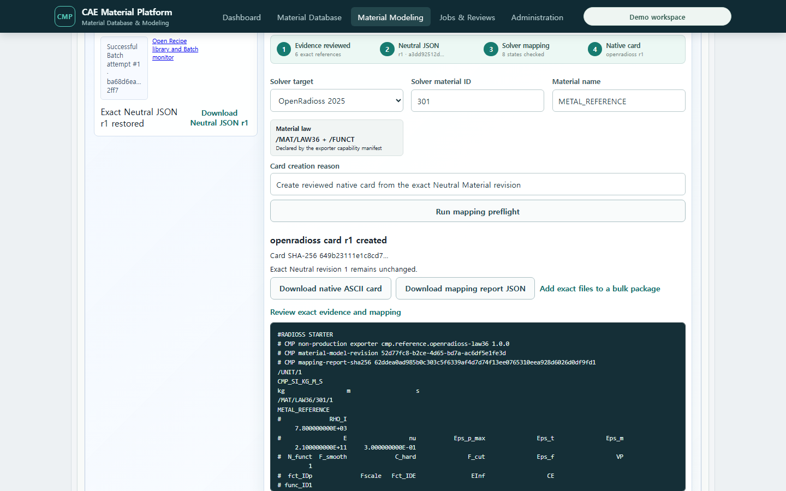

# Mapping Profile과 공통 Processing Workbench 사용하기

이 화면은 특정 시험·재료모델·solver에 종속되지 않은 채널 매핑과 커브 전처리를 제공합니다.
입력은 저장된 `cmp.test-data`의 정확한 revision이며, 브라우저에서 계산한 임시 값이 아니라
서버가 반환한 각 처리 단계의 수치와 진단을 비교합니다.

일반 사용자는 전역 **Material Modeling**(`/modeling`)에서 이 엔진을 사용합니다. 이 화면은
공통 curve graph 옆에 **Step options / Recipe / Batch** inspector와 Metal/Polymer/Elastomer track을
제공합니다. `/datasets/processing`은 같은 엔진의 기술 호환 route로 유지됩니다. 재료군을 바꾸면
기존 Test Data 선택이 해제되므로 새 track과 호환되는 exact revision을 명시적으로 다시 고릅니다.

화면 왼쪽은 현재 재료군과 호환되는 시험 curve 및 Recipe 단계, 가운데는 실제 서버 계산 결과를
표시하는 engineering plot, 오른쪽은 선택 단계의 설정과 저장 동작입니다. 일반 작업에서는 API
주소나 토큰, tenant, UUID를 입력하지 않습니다. 범례를 눌러 series를 숨기거나 표시하고, plot을
드래그해 이동하며 wheel 또는 `Zoom in/out`으로 확대하고 `Reset`으로 전체 범위로 돌아갑니다.

그래프에서 처리 범위를 지정하려면 Recipe 단계(예: **Metal elastic modulus**)를 먼저 고르고
**Select range**를 누른 뒤 x-domain을 드래그합니다. necking처럼 한 점을 고르는 단계는
**Pick point**를 사용합니다. 선택 영역과 marker는 임시 상태이며 **Apply selection**을 눌러야
호환되는 Recipe step option으로 들어갑니다. 이때도 원본이나 저장된 Recipe revision은 바뀌지
않습니다. 오른쪽 **Recipe** 탭에서 새 revision으로 저장해야 선택을 재사용할 수 있습니다.
option 변경은 300 ms 동안 모아서 서버 preview를 다시 계산하며, 그 사이 더 최신 변경이 오면
이전 계산 요청은 취소됩니다.

Material Database의 Material 상세에서 State 아래 **Open in Material Modeling**을 누르면 해당
Material/State exact revision이 자동으로 선택됩니다. Test Data JSON 목록의 **Open in Material
Modeling**은 해당 Test Data exact revision을 같은 방식으로 전달합니다. 화면을 다시 열어도 최근
Material, State, Test Data, Mapping Profile과 Recipe exact revision을 복원하며, 저장된 revision이
현재 선택 가능한 head와 다르면 조용히 최신값으로 바꾸지 않고 검토 경고를 표시합니다.

금속 **Metal elastic modulus** 단계에서는 오른쪽 패널에서 Auto robust, Linear regression,
Chord, Secant, Manual slope를 직접 선택합니다. 그래프의 **Select range** 또는 Start/End strain으로
평가 구간을 정하고, Manual slope에서는 GPa slider로 기울기를 조정합니다. **Offset proof stress**는
offset과 검색 구간, **Engineering to true/plastic**은 necking boundary와 음의 plastic strain 정책을
설정합니다. **Metal hardening candidates**에서는 Voce/Swift/Hockett-Sherby/Ghosh, primary/secondary,
혼합비와 외삽 strain을 직접 바꿉니다. 모든 조작은 Recipe draft와 서버 preview에 반영됩니다.

왼쪽 곡선 목록의 checkbox는 반복시험 통계에 포함할 exact revision을 고릅니다. 두 개 이상을
선택하고 **Add mean & band**를 누르면 가운데 plot이 **Mean & band** 보기로 전환되어 개별 curve,
pointwise mean과 95% mean confidence band를 함께 표시합니다. 이 계산에는 `rows.*`와 `curve.*`
공통 전처리만 적용되며, hardening이나 Prony 같은 모델 fitting 단계는 반복 실행하지 않습니다.

## 처리 미리보기

1. `Datasets` → `Processing Workbench`를 엽니다.
2. **Exact Test Data input**에서 문서와 revision을 선택하고 **Load exact JSON**을 누릅니다.
3. 저장된 Mapping Profile을 선택하거나 JSON editor에서 다음 항목을 확인합니다.
   - `independent_quantity`
   - source `channel_key`와 계산용 `target_quantity`
   - 허용 normalized unit
   - required 여부와 명시적 scale/offset
   - `reject` 또는 `drop_any` missing-data 정책
4. 재사용할 매핑이면 **Create profile**을 누릅니다. 기존 profile을 변경할 때는 변경 사유를
   입력하고 **Append revision**을 눌러 새 revision을 만듭니다. 기존 revision은 덮어쓰지 않습니다.
5. **Ordered processing steps**에서 method ID, version과 option을 순서대로 편집합니다.
6. **Preview with server**를 누릅니다.
7. Stage 목록에서 `mapping` 또는 각 method를 선택해 동일한 축의 원본/처리 curve overlay와
   row 수, warning, SHA-256을 확인합니다.

현재 등록된 공통 method는 다음과 같습니다.

- 정렬과 duplicate 정책: `rows.sort_unique`
- 범위 선택: `curve.crop`
- 수치 변환: `curve.scale_shift`
- 선형 resampling: `curve.resample_linear`
- moving average: `curve.moving_average`
- Savitzky–Golay: `curve.savitzky_golay`
- smoothing spline: `curve.smoothing_spline`

금속 단축 인장 데이터에는 다음 family method도 같은 ordered pipeline에서 사용할 수 있습니다.

- 탄성계수: `metal.elastic_modulus` — `linear_regression`, `robust_huber`, `chord`, `secant`, `manual`
- offset proof stress: `metal.proof_stress`
- 자동 necking 후보: `metal.necking_candidate`
- engineering → true/true-plastic 변환: `metal.engineering_to_true_plastic`
- hardening 후보 비교·조합·제한 외삽: `metal.hardening_fit_extrapolate`

탄성계수, proof stress와 necking 위치는 선택한 stage의 **Scalar results**에 값과 단위로 나타납니다.
자동 necking 단계는 후보 index만 보고하며 curve를 자르거나 확정하지 않습니다. 변환 단계에서
`manual_index`를 명시해야 후보를 실제 경계로 사용합니다. `observed_full_domain`은 post-necking을
포함할 수 있다는 경고를 남깁니다. 금속 method는 normalized strain `1`, stress `Pa`만 받으며,
다른 단위를 Pa로 가장하거나 묵시적으로 변환하지 않습니다.

Hardening 단계는 Voce, Swift, Hockett–Sherby, Ghosh 중 2~4개를 같은 목적함수로 fitting합니다.
`fit_minimum_strain`, `fit_maximum_strain`은 관측값을 사용하는 구간이고
`extrapolation_maximum_strain`은 관측되지 않은 출력 한계입니다. `primary_family`,
`secondary_family`, `primary_weight`가 선택 조합을 완전히 정의합니다. 결과의 **Scalar results**에는
후보별 RMSE와 parameter lower/initial/fitted/upper가 표시되므로 숨은 초기값이나 경계가 없습니다.

**Stress response**에서 observed plastic workup과 네 candidate, 선택 blend를 비교합니다. **Residual**은
선택 fit domain에서 `predicted - observed`를, **Tangent modulus**는 후보별 수치 미분을 보여줍니다.
황색 배경과 점선의 `EXTRAPOLATED · UNOBSERVED` 영역은 시험 관측값이 아닙니다. 상단 RMSE strip에서
후보를 비교하고 오른쪽 **Fit evidence**에서 parameter와 lower/upper bound를 펼쳐 봅니다. 후보를
선택하고 blend ratio를 조정한 뒤 **Selection reason**을 작성해야 검토 근거가 Recipe에 남습니다.

## Neutral Material과 solver card로 전달

Fit/Extrapolate 검토가 끝나면 상단 **Card** task를 누릅니다. graph가 있던 작업 영역이 exact
Material/State → reviewed Processing Output/IR → Neutral Material JSON → mapping → native card 흐름으로
바뀝니다. 페이지 아래의 별도 exporter를 찾거나 UUID를 복사하지 않습니다. **Back to Fit**을 누르면
같은 session과 Recipe draft를 유지한 채 후보 비교로 돌아갑니다.

solver와 version을 고르면 지원되는 material law가 capability manifest에서 표시됩니다. preflight의
모든 field는 `exact`, `transformed`, `approximated`, `ignored`, `unsupported`, `not_applicable` 중 하나를
가져야 합니다. `approximated`는 acknowledgement 전에는 card 생성 버튼이 비활성이고,
`unsupported`는 생성할 수 없습니다. 생성 후 native ASCII preview와 `.inp`/`.rad`, mapping report
JSON download가 먼저 보이며 exact evidence는 필요할 때 다시 펼칩니다.

각 method의 option 계약은 서버의 versioned registry에서 읽습니다. 알 수 없는 option, 호환되지
않는 quantity/unit, 범위 밖 extrapolation, 비유한 수치, 허용되지 않은 결측값은 묵시적으로
보정하지 않고 실패시킵니다.

## 불변 Processing Output 저장

1. preview 결과와 저장된 Mapping Profile revision이 일치하는지 확인합니다.
2. Output label과 변경 사유를 입력합니다.
3. **Commit immutable output**을 누릅니다.
4. 서버는 화면의 preview 배열을 저장하지 않고 exact Test Data revision과 exact Mapping Profile
   revision을 다시 읽어 동일한 ordered steps를 재실행합니다.
5. 저장된 목록에서 revision 1, stage/point 수, Output SHA-256을 확인합니다.
6. **Download JSON**으로 `cmp.processing-output` Artifact의 정확한 바이트를 받습니다.

## 반복시험 정렬과 pointwise 통계

1. 동일 조건에서 얻은 각 반복시험을 별도 Test Data identity로 등록합니다. 한 문서의 평균값으로
   합치거나 원본 curve를 삭제하지 않습니다.
2. 왼쪽 **Datasets & curves**에서 비교할 exact revision을 checkbox로 두 개 이상 선택합니다.
3. 공통 grid point 수를 입력하고 **Add mean & band**를 누릅니다. 상세 통계 drawer에서는 같은
   계산을 **Align and calculate**로 다시 실행할 수 있습니다.
4. 서버는 각 문서에 같은 Mapping Profile과 ordered preprocessing steps를 적용합니다.
5. 모든 curve에서 실제로 관측된 x-domain의 교집합만 사용해 선형 보간합니다. 교집합 밖
   extrapolation은 허용하지 않습니다.
6. member curve, 평균, 95% 평균 신뢰구간을 함께 확인하고, 마지막 grid point의 표본 표준편차,
   MAD와 IQR을 검토합니다.

통계 계약은 표본 표준편차 `ddof=1`, unscaled MAD, linear q1/q3 quantile, normal-approximation
95% mean CI를 명시합니다. 이 결과는 T-53 preview이며, T-54에서 exact Selection과 versioned
Recipe/Batch 실행 결과로 저장됩니다.

## Processing Recipe 저장과 게시

1. 저장된 exact Mapping Profile을 선택하고 ordered step JSON을 검토합니다.
2. **Processing Recipe library**에서 Recipe key, label, 설명과 변경 사유를 입력합니다.
3. **Save new Recipe**를 눌러 stable identity와 draft revision 1을 만듭니다.
4. 옵션이나 순서를 변경할 때는 저장된 Recipe를 선택하고 **Append draft revision**을 누릅니다.
5. 검토가 끝난 draft는 **Publish reviewed revision**으로 게시합니다. published revision을 직접
   수정하지 않으며, 후속 변경은 새 draft revision으로 추가합니다.

Recipe는 Mapping Profile의 stable identity뿐 아니라 exact revision UUID와 SHA-256을 고정하고,
각 step의 method ID, version, options와 options digest를 순서대로 보존합니다. Batch preflight와
실행은 이 exact published Recipe revision을 입력으로 사용합니다.

## Batch preflight와 실행

1. **Saved Processing Recipe**에서 `published` revision을 선택합니다. draft Recipe는 실행할 수 없습니다.
2. **Batch Run Monitor**의 **Exact Test Data selection**에서 처리할 revision을 선택합니다. 화면의 각
   항목은 current head를 표시하지만 실행 요청과 저장된 Member는 그 시점의 exact revision UUID를 고정합니다.
3. **Run compatibility preflight**를 누릅니다. 모든 member의 채널 quantity, 단위, Mapping Profile과
   ordered step을 서버에서 실제 실행하여 `ready` 또는 `incompatible`로 표시합니다.
4. 모든 member가 `Compatible`일 때만 **Execute published Recipe**가 활성화됩니다.
5. 실행 후 Monitor에서 member별 Attempt 번호, 성공 Output revision 또는 오류 코드를 확인합니다.
6. 일부 member가 실패해도 성공한 Output은 유지됩니다. **Retry failed members only**는 실패 member에만
   다음 Attempt를 추가하며 이전 Attempt와 Output을 수정하지 않습니다.

## 현재 경계

화면의 stage overlay와 반복시험 통계는 명확히 preview로 표시됩니다. 별도의 single-curve commit은
서버 재계산 결과를 exact input/profile FK와 canonical JSON Artifact로 영속화합니다. Recipe
저장/게시와 exact-input batch 실행을 지원하며, reviewed 금속 Processing Output은 같은 Modeling
화면의 Card task에서 IR/Neutral Material JSON으로 승격할 수 있습니다. 폴리머와 엘라스토머의
동일한 graph/task 사용성은 T-89/T-90에서 계속 검증합니다.
