# 시험 데이터 처리와 모델 비교하기

이 화면은 시험 데이터를 선택하고 처리 결과와 모델 후보를 비교하는 작업을 제공합니다.
입력은 저장된 `cmp.test-data`의 정확한 revision이며, 브라우저에서 계산한 임시 값이 아니라
서버가 반환한 각 처리 단계의 수치와 진단을 비교합니다.

일반 사용자는 전역 **Modeling**(`/modeling`)에서 이 엔진을 사용합니다. 이 화면은
`Data | Process | Fit | Export`, compact curve/process tree, 얕은 current-step settings ribbon과
Metal/Polymer/Elastomer track을 제공합니다. `/datasets/processing`은 같은 통합 Modeling 화면으로
연결되는 기술 호환 route입니다. 재료군을 바꾸면
기존 Test Data 선택이 해제되므로 새 track과 호환되는 exact revision을 명시적으로 다시 고릅니다.

화면 왼쪽은 현재 재료군과 호환되는 시험 curve 및 Process 단계이고 나머지 폭은 실제 서버 계산
결과를 표시하는 engineering graph입니다. 선택 단계 설정은 graph 위 ribbon에 있고 영구적인
오른쪽 열은 없습니다. 1366 px에서도 설정은 한두 줄의 얕은 band 안에 있고 graph 축·눈금·범례가 첫 화면에
모두 보입니다. Process 범례는 x축 값과 제목을 가리지 않는 아래쪽 여백 위에 작게 놓입니다. 일반 작업에서는 내부 주소,
토큰 또는 식별자를 입력하지 않습니다. 범례를 눌러 series를 숨기거나 표시하고, plot을
드래그해 이동하며 wheel 또는 `Zoom in/out`으로 확대하고 `Reset`으로 전체 범위로 돌아갑니다.

왼쪽 Navigator의 divider를 끌어 폭을 바꾸고 **Collapse navigator**로 접을 수 있습니다. divider를
두 번 누르거나 **Reset navigator**를 실행하면 현재 표시 밀도의 공통 기본 폭으로 돌아갑니다. 이
배치는 같은 브라우저에서 route 이동과 reload 뒤에도 유지되며 표시 밀도 reset과는 별개입니다.
Data/Process/Fit graph는 Navigator, ribbon, candidate evidence pane 또는 표시 밀도가 바뀔 때 실제
container를 다시 측정해 frame, SVG viewBox, axis, legend, label과 pointer hit region을 함께 갱신합니다.

그래프에서 처리 범위를 지정하려면 Recipe 단계(예: **Metal elastic modulus**)를 먼저 고르고
**Select range**를 누른 뒤 x-domain을 드래그합니다. necking처럼 한 점을 고르는 단계는
**Pick point**를 사용합니다. 선택 영역과 marker는 임시 상태이며 **Apply selection**을 눌러야
호환되는 Recipe step option으로 들어갑니다. 이때도 원본이나 저장된 Recipe revision은 바뀌지
않습니다. **Advanced · Recipe and Batch**에서 새 revision으로 저장해야 선택을 재사용할 수 있습니다.
option 변경은 300 ms 동안 모아서 서버 preview를 다시 계산하며, 그 사이 더 최신 변경이 오면
이전 계산 요청은 취소됩니다.

Material Database의 Material 상세에서 State 아래 **Open in Material Modeling**을 누르면 해당
Material/State exact revision이 자동으로 선택됩니다. Test Data JSON 목록의 **Open in Material
Modeling**은 해당 Test Data exact revision을 같은 방식으로 전달합니다. 화면을 다시 열어도 최근
Material, State, Test Data, Mapping Profile과 Recipe exact revision을 복원하며, 저장된 revision이
현재 선택 가능한 head와 다르면 조용히 최신값으로 바꾸지 않고 검토 경고를 표시합니다.

금속 **Metal elastic modulus** 단계에서는 current-step settings ribbon의 native **Evaluation method**
select에서 Auto robust, Linear regression, Chord, Secant, Manual slope를 선택합니다. 내부 값은
`robust_huber`, `linear_regression`, `chord`, `secant`, `manual`로 유지되며 Start/End strain은 같은
Calculation group에 놓입니다. 그래프의 **Select range**로도 같은 구간을 정할 수 있습니다. Manual
slope의 값·unit·engineering reason은 두 번째 줄에 나타나며 키보드 순서는 value → unit → reason입니다.
GPa/MPa 입력은
canonical Pa로 변환해 실제 계산에 사용합니다. 선택한 necking point도 point index와 reason을 요구합니다.
두 수동 workup은 원값/원 단위·canonical 값/단위·사유를 `workup_overrides`로 Processing Output revision과
다운로드 Artifact에 함께 고정합니다. **Offset proof stress**는 선택한 offset/search range의 curve-derived
값만 사용합니다. 직접 manual yield 값은 production yield-definition contract가 승인되기 전까지 제공하지 않습니다.
**Engineering to true/plastic**은 necking boundary와 음의 plastic strain 정책을 설정합니다. 이 physical
workup은 Metal elastoplastic Process에만 보이며 Fit, Polymer, Elastomer에는 노출하지 않습니다. **Metal hardening candidates**에서는 Voce/Swift/Hockett-Sherby/Ghosh, primary/secondary,
혼합비와 외삽 strain을 직접 바꿉니다. 모든 조작은 Recipe draft와 서버 preview에 반영됩니다.

실제 Metal Fit은 저장된 Process-only Processing Output의 exact `id/rN`과 digest를 소스로
사용합니다. 서버는 true plastic strain(unit `1`)과 true stress(Pa)를 같은 normalized
least-squares objective로 네 law에 적용하고, 각 후보의 response·predicted-minus-observed
residual·analytical tangent, Lower/Initial/Fitted/Upper, RMSE, convergence/nfev, active bound,
Jacobian rank/condition, identifiability와 `uncertainty=not_provided`를 Fit evidence로 반환합니다.
Ghosh는 `k_pa`, `epsilon_0`, `delta_p_minus_n`만 저장하며 `plastic strain < epsilon_0`를 벗어나면
차단합니다. 추천은 선택과 별도이고, 저장에는 단일 law 또는 strict two-law blend와 사유·warning
acknowledgement가 모두 필요합니다. exact source/digest 또는 계산·저장이 실패해도 마지막 정상
graph와 입력을 유지하며 명시적인 Retry action만 재시도합니다.

Fit 상단 상태는 `Calculating`(previewBusy), `Saved current`(정확한 Fit Output 복원과 사용 가능한
preview가 모두 검증됨), `Preview not saved`(현재 preview만 사용 가능), `Saved result stale`(Fit
history는 있으나 현재 preview/pointer가 검증되지 않음), `Not calculated`(그 밖의 상태)로 고정됩니다.
복원 read 실패는 `Saved current`가 될 수 없고, 저장 실패는 현재 preview를 유지하되 `Preview not saved`로
남습니다. 정확한 saved Fit을 복원한 직후 자동 preview 조건이 다시 평가되더라도 복원된
`Saved current` graph와 pointer를 새 계산으로 덮어쓰지 않습니다. 사용자가 입력을 바꾸고
**Preview changes**를 실행한 경우에만 새 preview가 시작됩니다.

Data/Process/Fit 단계 왼쪽 **Curves** rail은 `N curves · N included` 요약 뒤 시험 방법 그룹과
specimen별 26 px tree 행을 표시합니다. 예를 들어 tensile 문서는 `Tensile tests` 아래에 놓입니다.
온도·변형률 속도 조건은 서버가 정확한 조건 메타데이터를 제공할 때만 하위 그룹으로 보이며 화면이
추정하지 않습니다. 시편 행은 들여쓰기로 계층을 표현하며 `└`/`ㄴ` 문자를 제목 앞에 붙이지 않습니다.
시험 방법 그룹은 실제로 접고 펼칠 수 있는 native disclosure이며 키보드로도 작동합니다. 각 행의 checkbox는 **Include in processing/fit**이고, 끝의 눈 아이콘은 **Show on plot**만
바꿉니다. 제목 오른쪽의 짧은 가로 색상 표본은 해당 curve의 plot 색상만 나타내며 제목 앞에 기호처럼 붙지 않습니다. 따라서 line을 숨겨도 fitting 포함 여부는 바뀌지 않습니다. 행에는 specimen 이름과 exact revision을
짧게 표시합니다. Data는 specimen과 exact revision을 두 줄로, Process는 `Specimen 0N · rN` 한 줄로
표시하므로 hover 없이도 현재 선택 identity를 확인할 수 있습니다. Fit은 기존 document label과
specimen/revision 보조 줄을 유지합니다. 이 rail은 Validate, Review와
Export에는 표시하지 않습니다. Process에서 호환되는 포함 curve가 두 개 이상일 때만 **Replicate analysis**를 열고 **Preview mean & band**를
누를 수 있습니다. 그러면 가운데 plot이 **Mean & band** 보기로 전환되어 개별 curve,
pointwise mean과 서버 metadata에 기록된 confidence band를 함께 표시합니다. 범례와 tooltip은
고정 문구 대신 method, confidence level, pointwise/simultaneous 여부와 source count를 읽습니다. 이 계산에는 `rows.*`와 `curve.*`
공통 전처리만 적용되며, hardening이나 Prony 같은 모델 fitting 단계는 반복 실행하지 않습니다.

Candidate parameters처럼 사용자가 명시적으로 펼친 보조 pane은 실제 graph 배정 폭이 1px 미만이
될 때만 bounded overlay로 전환됩니다. 화면 크기나 DPR을 보고 미리 overlay로 바꾸지 않습니다.
Overlay는 닫기 버튼과 `Escape`를 지원하고 닫은 뒤 원래 control로 focus를 돌려줍니다. Materials의
같은 공통 disclosure도 **Open datasheet**를 overlay 안에서 직접 실행할 수 있습니다.

## 처리 미리보기

1. `Modeling → Data`를 열고 Library, local CSV/TSV/XLSX 또는 Advanced canonical JSON 입력을 선택합니다.
2. local file은 **Raw source inspector**에서 sheet/header/decimal, sample table, Raw Asset checksum을 확인합니다.
3. **Axis and unit mapping decision table**에서 source column, axis/quantity semantics, raw unit, normalized unit과 상태를 확인합니다. 수동 해석은 변경 이유를 함께 기록합니다.
4. Test Run, specimen, 수행 시각과 편집 provenance를 확인하고 필요하면 secondary preview를 갱신합니다.
5. **Save dataset**으로 raw source와 mapping을 참조하는 새 Test Data revision을 만듭니다. 이는 review가 아닙니다.

저장 실패 시 file, sheet/header, mapping, provenance와 graph preview를 유지하므로 원인을 고치고
같은 입력으로 다시 시도할 수 있습니다. mapping 변경은 Process부터 Export까지의 current pointer를
stale/clear하며 이전 immutable revision은 history에 남습니다.

잘못된 channel mapping이 길어지면 setup 안의 실제 local scrollbar로 validation과 recovery action까지
이동할 수 있고 마지막 정상 graph는 유지됩니다.

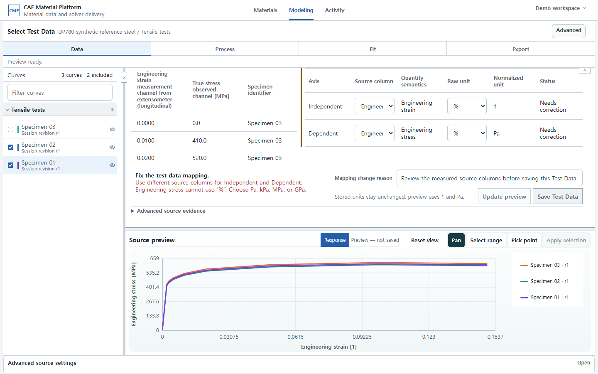

재사용할 처리 설정을 관리할 때만 **Advanced mapping definition**의 JSON에서 다음 항목을 확인합니다.
   - `independent_quantity`
   - source `channel_key`와 계산용 `target_quantity`
   - 허용 normalized unit
   - required 여부와 명시적 scale/offset
   - `reject` 또는 `drop_any` missing-data 정책
6. 재사용할 매핑이면 **Save new profile**을 누릅니다. 기존 profile을 변경할 때는 변경 사유를
   입력하고 **Append profile revision**을 눌러 새 revision을 만듭니다. 기존 revision은 덮어쓰지 않습니다.
7. Process/Fit의 **Add operation**, **Add fit method**와 얕은 settings band를 사용합니다. Optional
   smoothing 방법은 서버 registry/capability로 보존되며, 이 guide는 새 smoothing 단계나 별도
   discoverability를 추가로 요구하지 않습니다.
8. 처리 결과와 모델 후보는 같은 graph에서 비교합니다. 계산 식별자와 상세 수치 기록은 일반 graph를
   밀어내지 않고 Advanced/Evidence에서만 확인합니다.

## Validate와 Review

**Validate**는 Fit 점수의 별칭이 아닙니다. Metal synthetic reference 경로에서도 현재
selection ID와 server Material Model의 calibration-candidate evidence가 같고, session에 pin된 IR/Card의
ID와 revision이 정확히 일치할 때만 Template과 Dataset Selection을 골라
**Create pinned validation plan**을 누를 수 있습니다. 화면은 같은 Material State의 다른 model,
목록 첫 항목이나 `latest`를 대신 선택하지 않습니다. common Processing Output 후보처럼 현재
validation adapter가 없는 경우에는 `Not supported`를 표시합니다. 지원되는 exact reference chain에서는
**Submit validation job**, **Collect and evaluate result**를 실행하면 별도 Validation Run/Result,
holdout-independence, verdict가 나타납니다. plan만 있으면 `Not run`이며 원본 Fit metric은 계속
`fit evidence only`로 남습니다. 브라우저 session은 Plan과 Result의 exact ID를 서로 다른 pointer로
보존하고 다시 열 때 각각 조회하므로 Result가 Plan을 덮어쓰거나 `Not configured`로 되돌아가지 않습니다.

**Review**는 제출, 수정 요청, 승인 상태를 Fit 결과와 구분합니다. Validate와 Review는 일반
`Data | Process | Fit | Export` 단계가 아니라 Advanced의 governed contract입니다. Fit 또는
Validate 완료를 승인으로 표시하지 않습니다. Material과 Solver Card의 exact revision에서 요청한
review는 Activity에서 Reviewer가 별도로 승인하거나 변경을 요청합니다. failed job
복구와 server receipt projection은 아직 Activity에 연결되지 않았습니다.

현재 등록된 공통 method는 다음과 같습니다.

- 정렬과 duplicate 정책: `rows.sort_unique`
- 범위 선택: `curve.crop`
- 수치 변환: `curve.scale_shift`
- 선형 resampling: `curve.resample_linear`
- moving average: `curve.moving_average`
- Savitzky–Golay: `curve.savitzky_golay`
- smoothing spline: `curve.smoothing_spline`

금속 단축 인장 데이터에는 다음 family method도 같은 ordered pipeline에서 사용할 수 있습니다.

- 탄성계수: `metal.elastic_modulus` — `linear_regression`, `robust_huber`, `chord`, `secant`, `manual`
- offset proof stress: `metal.proof_stress`
- 자동 necking 후보: `metal.necking_candidate`
- engineering → true/true-plastic 변환: `metal.engineering_to_true_plastic`
- hardening 후보 비교·조합·제한 외삽: `metal.hardening_fit_extrapolate`

1366×768의 Manual slope 설정도 control 영역 안에서만 스크롤되며 graph와 **Save processed curves**는
직접 도달할 수 있습니다.

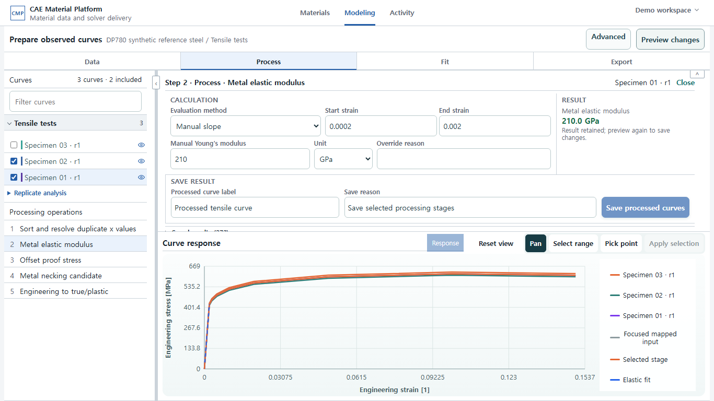

탄성계수, proof stress와 necking 위치는 선택한 stage의 **Scalar results**에 값과 단위로 나타납니다.
자동 necking 단계는 후보 index만 보고하며 curve를 자르거나 확정하지 않습니다. 변환 단계에서
`manual_index`를 명시해야 후보를 실제 경계로 사용합니다. `observed_full_domain`은 post-necking을
포함할 수 있다는 경고를 남깁니다. 금속 method는 normalized strain `1`, stress `Pa`만 받으며,
다른 단위를 Pa로 가장하거나 묵시적으로 변환하지 않습니다.

Hardening 단계는 Voce, Swift, Hockett–Sherby, Ghosh 중 2~4개를 같은 목적함수로 fitting합니다.
`fit_minimum_strain`, `fit_maximum_strain`은 관측값을 사용하는 구간이고
`extrapolation_maximum_strain`은 관측되지 않은 출력 한계입니다. `primary_family`,
`secondary_family`, `primary_weight`가 선택 조합을 완전히 정의합니다. 결과의 **Scalar results**에는
후보별 RMSE와 parameter lower/initial/fitted/upper가 표시되므로 숨은 초기값이나 경계가 없습니다.
Ghosh는 Altair Material Modeler 2025 식 계약을 따르며 `n`, `p` 대신 식별 가능한
`delta_p_minus_n = p - n`만 저장합니다. 해당 행에는 구조적 비식별성과
`plastic strain < epsilon_0` domain 경고가 항상 표시됩니다. 이 식 계약이 없는 과거 Recipe는
자동 변환하지 않으므로 새 revision으로 명시적으로 저장해야 합니다. 서버 Ghosh candidate의
`active_bound`에 정확히 `epsilon_0`가 포함되면 현재 선택과 무관하게 response/tangent의 표시
scale 계산에서 `fit_maximum_strain` 이후 tail을 제외합니다. 실제 response/residual/tangent
evidence 배열과 polyline은 그대로이며, 선택 preview/blend는 Ghosh를 포함할 때 같은 표시 규칙을
적용합니다.

**Hardening response**에서 observed plastic workup, single-law candidate와 현재 선택을 비교합니다.
**Residual**은
선택 fit domain에서 `predicted - observed`를, **Tangent modulus**는 후보별 수치 미분을 보여줍니다.
황색 배경과 점선의 `EXTRAPOLATED · UNOBSERVED` 영역은 시험 관측값이 아닙니다. 후보 비교 표와
파라미터는 **Candidate parameters**를 열어 확인합니다. 추천 표시는 계산 결과일 뿐
선택이 아닙니다. 반드시 candidate 행의 **Select candidate**를 누른 뒤 **Selection reason**을
작성하고, 해당 행에 경고가 있을 때만 acknowledgement를 선택합니다.
**Preview changes**가 새 계산에 성공하면 이전 행 선택과 reason은 자동으로 해제됩니다. 이미 저장한
Fit Output을 current로 가리키던 pointer도 새 행을 고르는 순간 해제되므로, 다시 선택·저장하기 전에는
이전 output이 Export fallback으로 사용되지 않습니다.
금속 blend는 candidate table의 **Calculated preview blend** 행에서만 명시적으로 선택합니다. preview 설정에서
두 law 또는 ratio를 바꿨다면 먼저 **Preview changes**로 다시 계산해야 하며, 선택 이후에는 두 law 이름,
ratio, 두 parameter set을 하나의 decision identity로 보존합니다. single-law 행을 선택하면 graph도 그 law를
`Selected`로 표시하며 계산된 blend를 선택으로 가장하지 않습니다.
폴리머는 요청한 term policy가 아니라 server가 실제 산출한 term-count 행만 선택할 수 있습니다.
**Save fit & continue**는 상단 action row에 한 번만 나타나며 이 decision을 immutable Processing
Output에 저장합니다. 저장 전에는
Material Model IR이나 Neutral Material로 승격할 수 없습니다.

Fit rail의 Curves는 Process에서 선택한 Test Data ref의 이름과 revision을 그대로 이어받습니다.
현재 head나 `latest`를 대신 바인딩하지 않으며, 상단에는 사람이 읽는 exact Process Output
label/revision과 Fit surface state가 표시됩니다. 전체 source digest, method key/version, run과
저장된 Fit Output revision은 **Candidate parameters → Source evidence**에서 확인합니다. Process Output이 없거나 stale이면 graph 중앙에
**Fit is blocked**와 **Back to Process**가 나타나고, 이 복구는 ref/history/pointer를 바꾸지 않는
탐색만 수행합니다. Fit 계산/저장 실패에서는 이전 유효 graph와 decision reason, warning acknowledgement를
유지하고, 저장된 Fit을 다시 읽지 못하면 **Saved Fit result unavailable**과 **Retry exact saved Fit**만
표시합니다. retry는 같은 saved Output revision의 content URL을 다시 읽으며 raw Test Data나 최신
Output을 fallback으로 사용하지 않습니다. 저장 후에도 현재 task는 Fit에 남고 Export는 별도 task로
시작하지 않습니다.

현재 Fit capture topology는 5개 viewport(1366×768, 1440×900, 1920×1080, 2560×1440,
3840×2160)와 Candidate parameters 두 개 1440×900 evidence state, 다섯 개 1920×1080
recovery/state입니다. `parameters-long`은 Candidate
parameters disclosure를, `evidence-scrolled`는 keyboard/PageDown·wheel·native scrollbar와
collapsed text selection을, `calculation-failed`/`save-failed`/`exact-source-blocked`/
`exact-read-failed`/`restored`는 각각 실패·차단·정확한 복구를 기록합니다. 2026-08-06 root
live capture와 qualitative visual acceptance가 완료되었고, 17개 Process/Fit 캡처를 모두
필수 viewport 원본 해상도로 열어 확인했습니다.

| Fit evidence | 화면 |
| --- | --- |
| 1366×768 |  |
| 1440×900 |  |
| 1920×1080 |  |
| Wide 2560×1440 | 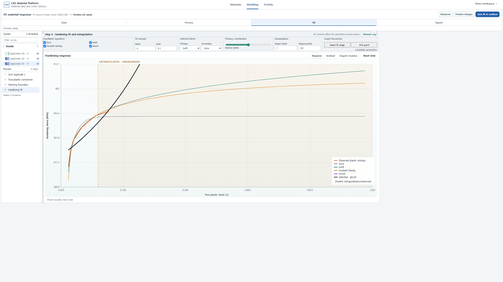 |
| Wide 3840×2160 | 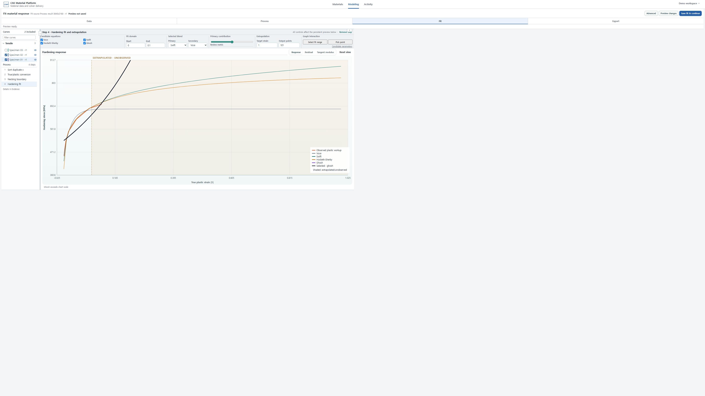 |
| Candidate parameters (long) | 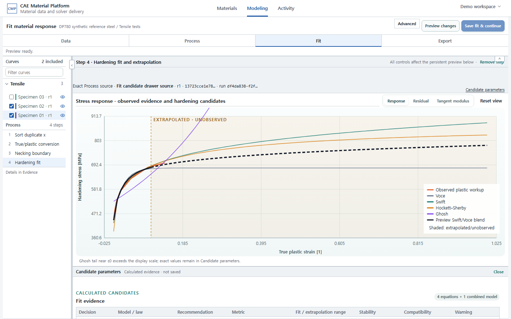 |
| Candidate evidence scrolled | 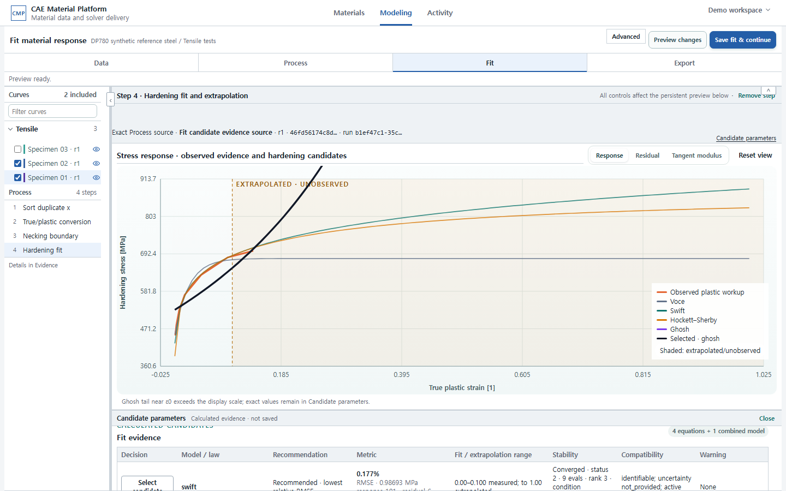 |
| Calculation failed | 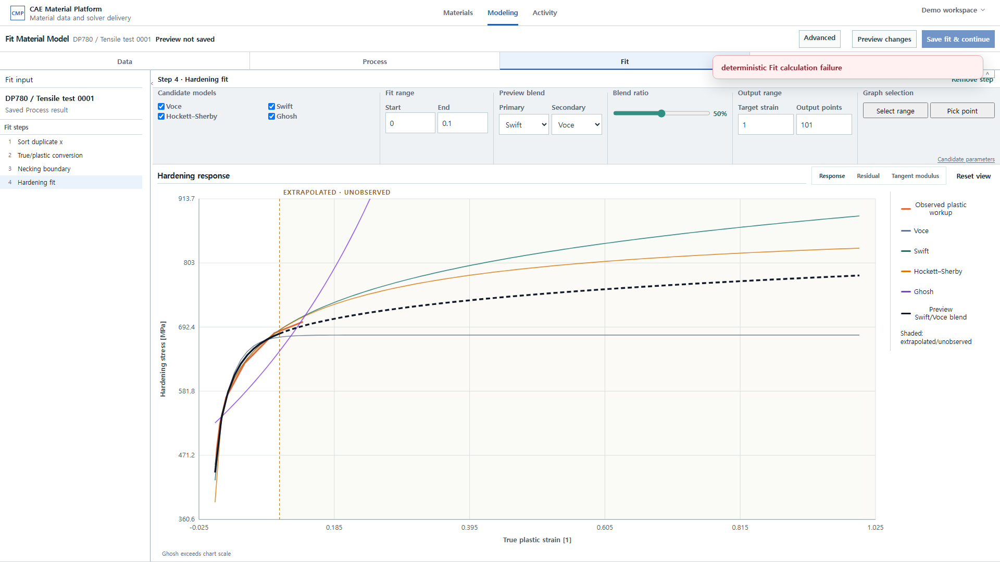 |
| Save failed | 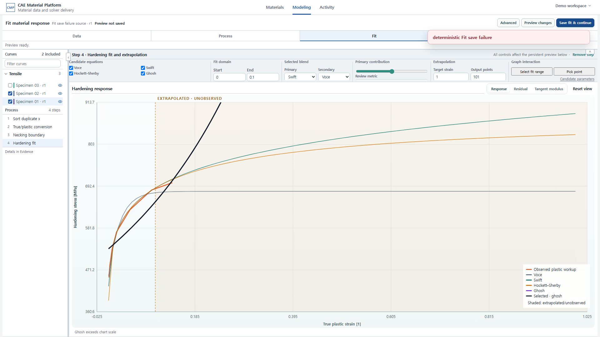 |
| Exact Process source blocked | 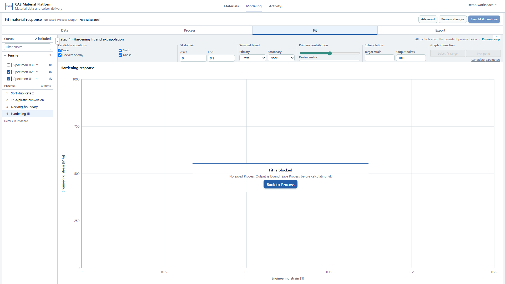 |
| Exact saved Fit read failed | 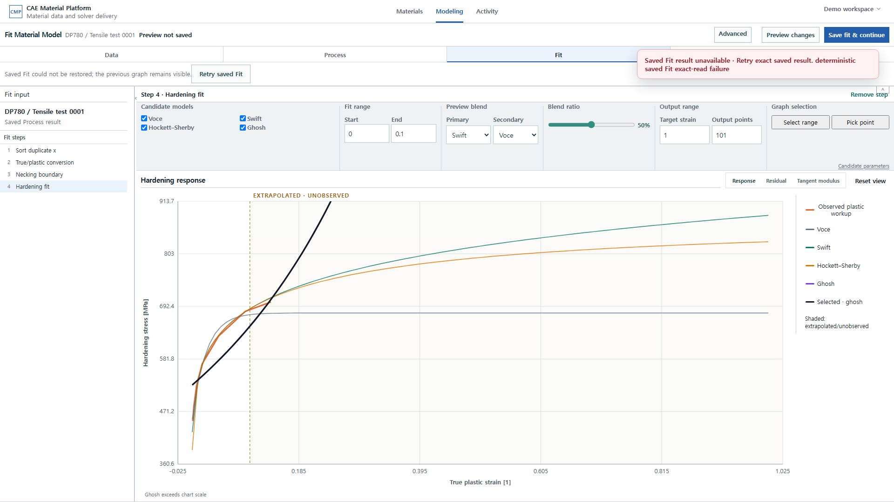 |
| Restored saved Fit | 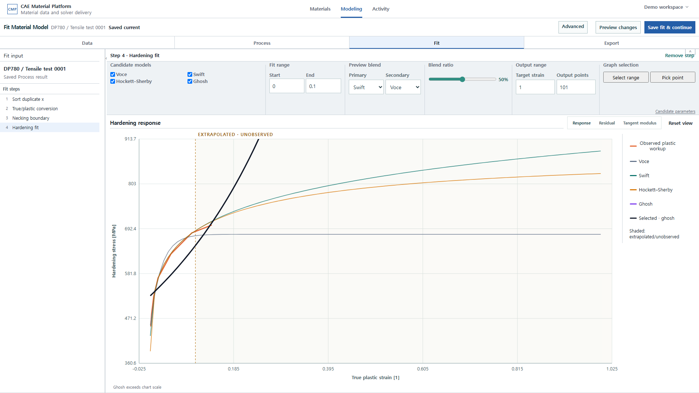 |

## Export의 현재 exact-source 경계

Fit 검토 뒤 상단 **Export** task를 열면 current Material, Material State, Test Data, Mapping Profile,
Processing Output pin과 `Processing Output → Material Model IR → Neutral → target preflight → native card`
lineage를 먼저 확인합니다. Export는 Setup(왼쪽), native preview(가운데), Mapping/Fit context(오른쪽)가
한 화면에 있는 전용 workspace이며 native preview가 가장 넓은 pane을 차지합니다. 선택 model graph의 축은
internal quantity key 대신 사람이 읽는 물성명과 unit(예: `True plastic strain [1]`, `Hardening stress [MPa]`)으로
표시됩니다. source가 없거나 다른 revision이면 Export check가 **Cannot create**가 되고 source 복구 안내만
표시됩니다. **Back to Fit**은 같은 session과 Recipe draft를 유지합니다.

Export는 모든 상태에서 같은 세 칸 작업 묶음(Setup 300–340 px, 넓은 native preview,
Mapping/Fit context 326–360 px)을 유지합니다. 1366×768, 1440×900, 1920×1080,
2560×1440, 3840×2160 정상 화면과 1440×900 source-blocked,
approximation-blocked, delivered 상태를 캡처 계약으로 관리합니다. Wide 화면에서는 Export shell과
native preview가 남는 폭을 사용하고 Setup·Mapping/Fit context만 읽기 좋은 pane 범위를 유지합니다.

| Export evidence | Capture |
| --- | --- |
| Wide 2560×1440 | [modeling-export-2560x1440.png](images/current/modeling-export-2560x1440.png) |
| Wide 3840×2160 | [modeling-export-3840x2160.png](images/current/modeling-export-3840x2160.png) |
| Source blocked · 1440×900 | [modeling-export-source-blocked-1440x900.png](images/current/modeling-export-source-blocked-1440x900.png) |
| Approximation blocked · 1440×900 | [modeling-export-approximation-blocked-1440x900.png](images/current/modeling-export-approximation-blocked-1440x900.png) |
| Delivered · 1440×900 | [modeling-export-delivered-1440x900.png](images/current/modeling-export-delivered-1440x900.png) |

Modeling의 **Local file** 경로에서 exact Test Run을 선택하고 저장한 새 Test Data revision은 서버가
`Test Run → Specimen → Material State → Material` exact revision 관계를 검증합니다. 이후 그 Test Data로
저장한 Processing Output은 `export_provenance`에 같은 Material/State/Test Run pin을 보존합니다. Export
체크리스트는 이 서버 proof와 현재 session의 exact Material/State/Test Data를 비교해 `current` 또는 `stale`을
표시합니다.

직접 등록한 Test Data JSON과 과거 revision은 이 proof가 없으므로 `Server provenance proof · missing`입니다.
현재 session의 이름이나 ID가 우연히 같아도 추론하거나 backfill하지 않습니다. Canonical Test Data JSON
Artifact 자체에는 proof가 추가되지 않으며, immutable revision content에만 저장됩니다. Omitted proof로 revise하면
새 revision은 unqualified 상태가 됩니다.

source proof와 current Material Model IR/Neutral pin이 모두 current일 때만 capability manifest가 선언한
solver/version/unit tuple을 선택해 stateless native preview를 생성할 수 있습니다. 현재 선택지는 synthetic
non-production Abaqus/OpenRadioss 2025 kg-m-s tuple뿐이며 production support를 뜻하지 않습니다. Output
unit select에는 capability가 선언한 `kg_m_s` 선택지와 함께 실제로 선택할 수 없는
`Other unit systems — unavailable (not declared by this exporter capability).` disabled option을 둡니다.
Export check의 상태는 **Ready to create**, **Review required**, **Cannot create** 중 하나이며 Mapping
normal row는 `quantity · source → target expression · consequence`로 표시합니다. raw
status/count/digest/ID는 Advanced evidence에만 둡니다. C1 preview가 없으면 primary **Run Export check**,
stale 또는 실패한 C1이면 **Retry Export check**, current C1이면 **Create solver card**만 primary로
노출합니다. approximation acknowledgement가 없으면 Create가 disabled입니다. target 또는 source를
바꾸면 preview와 delivery pointer는 사라지지만 exact upstream 입력은 재시도를 위해 남습니다.

금속에서 source proof는 current인데 Model IR/Neutral pin만 없으면 같은 Export checklist 아래의
**Prepare exact metal source**를 사용합니다. 이 action은 선택된 Processing Output revision, current
Material/State revision과 current Property Set revision만 서버로 보내며, bounded extrapolation acknowledgement와
promotion reason을 요구합니다. 서버가 반환한 upstream tabulated-plasticity model은 먼저 session에 pin되고,
이어 Neutral document를 생성합니다. Neutral 생성이 실패해도 model pin과 입력을 유지하므로 **Retry Neutral
promotion**은 model을 다시 만들지 않습니다. upstream model revision은 Validation에 쓰이는 session pointer이고,
Neutral document 안의 canonical IR revision과 같은 값으로 바꾸지 않습니다. target preview는 caller가 IR
revision을 추측해 보내지 않고 exact Neutral revision을 보내며 server가 embedded IR relation을 검증합니다.
Polymer와 Elastomer에는 이 recovery path가 아직 **Not configured**이며 다른 material family의 model을 대신
선택하지 않습니다.

Recovery가 끝나면 같은 workspace에서 capability가 선언한 solver/version/unit tuple을 고르고
`preview_only` native 결과를 확인합니다. C1 heading은 **Current preview · not created**이며 filename과
mapping consequence를 함께 검토합니다. Approximation이 있으면 exact acknowledgement를 먼저 기록하고,
그 뒤 별도의 **Create solver card**로 immutable card와 receipt를 만듭니다. Delivered 화면의 normal
surface에는 filename/status만 남기고 receipt를 inline으로 반복하지 않습니다. 대신 keyboard-reachable
**Delivery details** disclosure를 열어 `solver_card`, `preview`, `download`, `receipt` 네 typed API
resource link와 exact card/revision/receipt IDs 및 native/mapping digests를 확인합니다. source의 exact
IDs와 digests는 별도 **Advanced · exact source** disclosure에만 둡니다. Delivered의 primary는
**Open solver card**이며, source/target 변경이나 실패는 upstream revision을 바꾸지 않고 현재
preview/delivery pointer만 지웁니다.

이 preview는 card, Artifact, receipt, download, Activity, Material CAE Card link 또는 `exportArtifact`를 만들지
않습니다. 응답의 delivery status는 `preview_only`이며 approximation이 있으면 Evidence disclosure의
acknowledgement identity는 **UXC-06C2 delivery 입력**일 뿐 C1에서 승인·기록되지 않습니다.

**Create solver card**는 current preview와 정확히 같은 source/target/mapping identity를 다시 검증합니다.
경고 mapping이면 해당 acknowledgement identity를 명시적으로 확인해야 하며, exact mapping에는 acknowledgement를
제출할 수 없습니다. 성공하면 immutable Solver Card와 filename/checksum·exact revision chain·mapping digest·actor·timestamp를
포함한 immutable Exporting receipt/outbox event가 하나의 transaction에서 함께 기록됩니다. Materials CAE Cards는 기존
canonical card API로 delivered card를 재사용합니다. 같은 preview identity로 다시 요청하면 새 card를 만들지 않고 기존
receipt를 반환합니다. 성공 영역에는 `Solver Card created`와 filename/status만 표시하며, card/receipt 리소스는
**Delivery details** disclosure 안에서 확인합니다. receipt UUID, checksum, source chain과 mapping 상태는 receipt 또는
**Preview & mapping evidence**에서 확인하며,
구성되지 않은 Activity projection 같은 내부 구조 용어는 일반 경로에 노출하지 않습니다. 현재 Activity 연결이 없으므로
Activity에 Delivered 상태나 링크를 만들지 않습니다. source/target 변경, 실패 또는 재시도는 기존 immutable delivery를
수정하지 않고 current preview/delivery pointer만 지웁니다.

### 보호된 API의 Unit Profile 사용

현재 화면에는 Unit Profile 관리 기능이 없습니다. API 사용자는 `GET /api/v1/unit-system`에서
지원하는 dimension과 stable unit identifier를 확인하고, `POST /api/v1/unit-conversions`로
location·quantity semantics·원본 단위 문자열을 명시한 변환만 요청할 수 있습니다. 지원하지 않는
단위, dimension 불일치, strain과 일반 무차원 수치의 혼용, 절대온도와 온도차의 혼용은 추론하거나
대체하지 않고 location과 source/target dimension을 포함한 오류로 반환합니다.

Unit Profile은 `POST /api/v1/unit-profiles`로 stable identity를 만들고
`POST /api/v1/unit-profiles/{profile_id}/revisions`로 immutable revision을 추가합니다. 처리나 Export
요청에는 `profile_id`, `revision_id`, `content_sha256` 세 값을 모두 고정하며, 이름이나 `latest`만
전달하지 않습니다. Profile을 사용해 저장한 Processing Output, Fit, preview, Solver Card와 delivery
receipt는 같은 exact pin과 각 적용 위치의 unit application을 read-back합니다. 기존 profile 없는
결과와 13개 registration 변환은 그대로 읽히고, `kg_m_s`는 기존 solver-card 호환 tuple일 뿐 새
production 기본 Profile이 아닙니다.

각 method의 option 계약은 서버의 versioned registry에서 읽습니다. 알 수 없는 option, 호환되지
않는 quantity/unit, 범위 밖 extrapolation, 비유한 수치, 허용되지 않은 결측값은 묵시적으로
보정하지 않고 실패시킵니다.

## 불변 Processing Output 저장

### Process 상태와 저장 결과 비교

Process band는 선택한 exact Test Data revision과 Mapping Profile을 항상 함께 표시하고,
Calculation과 Result를 첫 줄에, Save result를 다음 전체 폭 줄에 둡니다. Evaluation method select의
다섯 선택지와 range input, processed-curve label, save reason과 Save 버튼은 같은 28px compact
control height를 사용합니다. Result에는 서버가 계산한 현재 step label과 modulus 값을 직접 표시합니다.
서버 preview가 성공한 동안에는 mapped input, 선택한 processed stage, server modulus fit을 하나의
engineering graph에 겹쳐 보여 주며, draft option을 바꾸거나 재계산에 실패해도 마지막 유효
server preview를 화면에 남깁니다. 실패한 응답은 저장 입력으로 승격되지 않습니다. exact source나
profile을 복구할 수 없으면 graph는 `blocked` 상태와 **Back to Data** recovery를 표시하며
`latest` revision으로 조용히 대체하지 않습니다. 선택한 exact ref 자체가 없는 경우에는
**No exact Test Data**와 **Back to Data**만 보입니다. exact ref는 있지만 content read가 실패한
경우에는 **Exact source unavailable · rN**으로 settled되고 자동 재시도하지 않습니다. 이전
document/preview/scalar나 newest/current-head를 fallback으로 사용하지 않으며, 직접 보이는
**Retry exact source** 또는 **Back to Data**로만 복구합니다. 같은 exact ref의 재시도는 한 번의
새 요청이고 실패하면 다시 settled blocked 상태로 남습니다.

**Saved results (N)** disclosure는 현재 exact source/profile에 맞는 Processing Output만
보여 주며, `Label | Method | Range | Result | Revision | State | Action` 일곱 열을 직접 제공합니다.
Method 열은 `robust_huber` 같은 내부 ID 대신 Auto robust, Linear regression, Chord, Secant, Manual
slope를 표시하고 Revision은 정확한 `r1` 형식으로 고정합니다. 각 row에 source 설명을 반복하지 않아
1366px에서도 열과 Retry/Use settings action을 바로 사용할 수 있습니다. Artifact를 읽지 못하거나
source, profile, output id, revision, ordered steps가 맞지 않으면 Result에 **Saved result unavailable**과
row-local **Retry**를 표시하고 fallback을 만들지 않습니다. 성공적으로 읽은 row만 **Use settings**를
제공하며, 같은 settings를 새 draft로 복사하므로 Preview 후 새 immutable output을 저장해야 합니다.
Save한 결과는 새 current가 되고 이전 결과는 history로 남습니다. 오래된 row에서 **Use settings**를
누르면 해당 history의 settings를 local draft로 복사하지만 새로 저장한 current result와 그 exact
identity는 그대로 유지됩니다. 복사된 draft는 Preview changes를 다시 실행해야 하며, 실제로 새
current가 되는 것은 **Save processed curves**를 눌렀을 때뿐입니다. Preview, rerender, reload와
stage 이동 중에도 saved history와 current pointer는 바뀌지 않습니다. Material/State/family,
Data selection 같은 일반 upstream draft 변경은 기존 invalidation 규칙을 따릅니다.

정상 화면에는 `Preview — not saved` 같은 반복 상태 문구를 두지 않습니다. 설정을 바꿔 재계산이
필요하거나 차단·실패한 경우에만 Result 옆의 한 줄 recovery 안내와 접근 가능한 live status를
보여 줍니다. Process의 live evidence는 linear-regression을 별도 settled method로 포함한 9개
출력(`modeling-process-linear-regression-1366x768.png` 포함)으로, 일반 viewport
(1366×768, 1440×900, 1920×1080)와 wide viewport
(2560×1440, 3840×2160), exact prerequisite blocked(1440×900), exact-read failed(1440×900), saved-result siblings(1440×900)
상태를 각각 확인합니다. 캡처가 `Loading Process controls…` fallback에서 settled panel로 전환되지
않았거나 graph/axis가 잘리면 기존 capture directory를 교체하지 않습니다.

| Process evidence | 화면 |
| --- | --- |
| Linear regression 1366×768 | 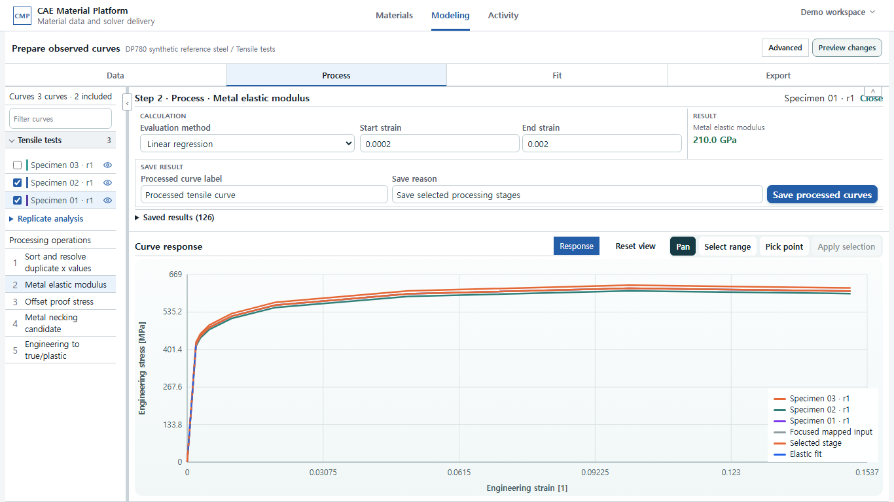 |
| Wide 2560×1440 | 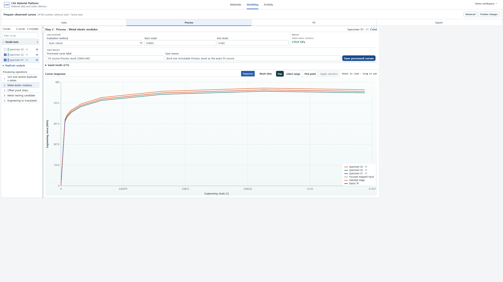 |
| Wide 3840×2160 | 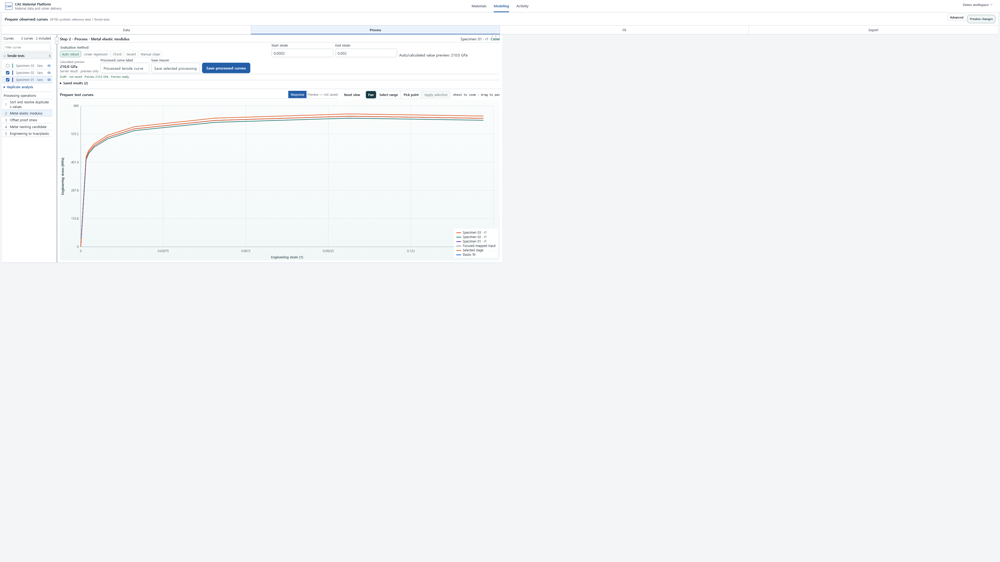 |
| Exact prerequisite blocked 1440×900 | 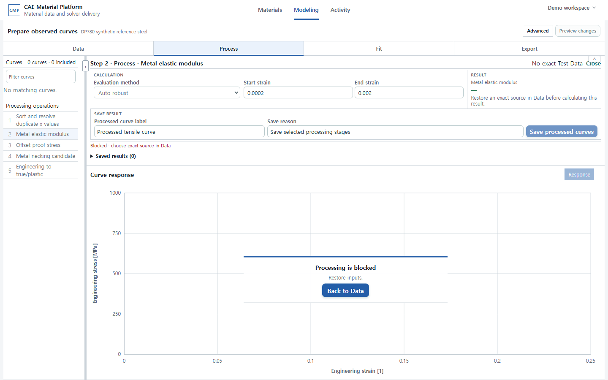 |
| Exact source read failed 1440×900 | 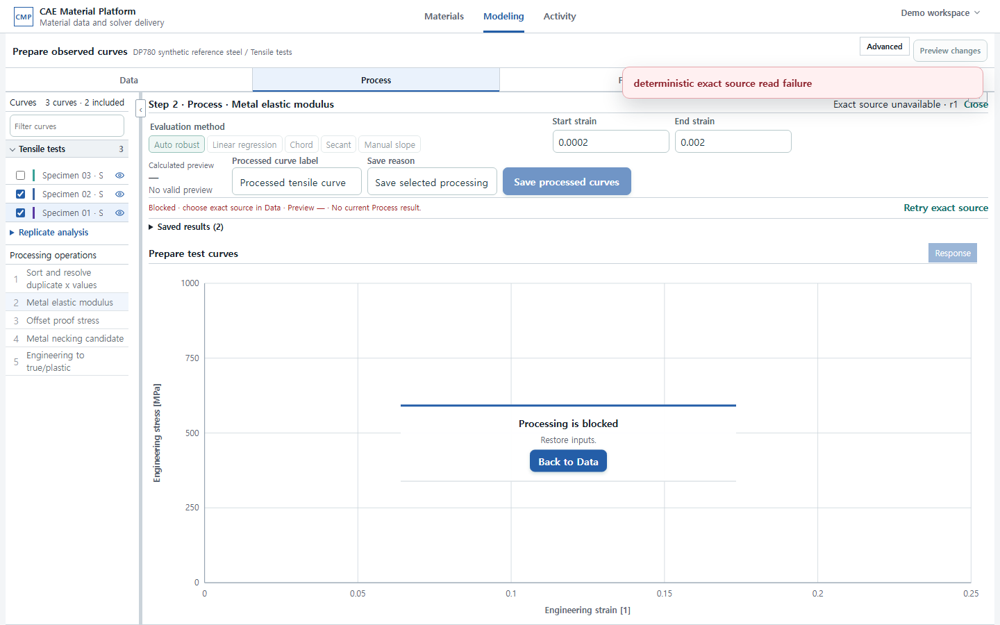 |
| Saved-result siblings 1440×900 | 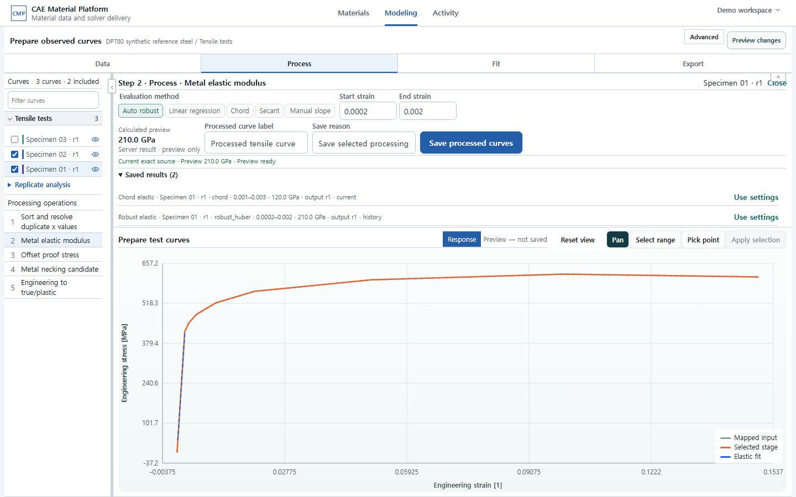 |

1. Process preview 결과와 저장된 Mapping Profile revision이 일치하는지 확인합니다.
2. current-step settings에서 Processed curve label과 저장 사유를 입력합니다. Result 이름 입력은
   1366px에서 최소 240px, 사유 입력은 최소 360px의 사용 가능한 폭을 유지합니다.
3. **Save processed curves**를 누릅니다. 이것이 Process의 유일한 primary action이고 preview는 secondary입니다.
4. 서버는 화면의 preview 배열을 저장하지 않고 exact Test Data revision과 exact Mapping Profile
   revision을 다시 읽어 동일한 ordered steps를 재실행합니다. 수동 modulus/necking workup이 있으면
   typed `workup_overrides`도 원값·정규값·사유와 함께 immutable output에 고정합니다.
5. 저장된 목록에서 revision 1, stage/point 수, Output SHA-256을 확인합니다.
6. **Download JSON**으로 `cmp.processing-output` Artifact의 정확한 바이트를 받습니다.

## 반복시험 정렬과 pointwise 통계

1. 동일 조건에서 얻은 각 반복시험을 별도 Test Data identity로 등록합니다. 한 문서의 평균값으로
   합치거나 원본 curve를 삭제하지 않습니다.
2. 왼쪽 **Curves**에서 비교할 revision을 checkbox로 두 개 이상 선택합니다.
3. **Replicate analysis**를 열어 공통 grid point 수를 입력하고 **Preview mean & band**를 누릅니다.
4. 서버는 각 문서에 같은 Mapping Profile과 ordered preprocessing steps를 적용합니다.
5. 모든 curve에서 실제로 관측된 x-domain의 교집합만 사용해 선형 보간합니다. 교집합 밖
   extrapolation은 허용하지 않습니다.
6. member curve, 평균과 metadata가 선언한 band를 함께 확인하고, 마지막 grid point의 표본 표준편차,
   MAD와 IQR을 검토합니다. Pointer 또는 graph focus 뒤 Arrow key로 point를 옮기면 축 label/unit,
   값, band kind·method·coverage와 `n`이 같은 tooltip/live text에 나타납니다. `Escape`는 탐색을
   끝내고 legend toggle은 현재 graph에서만 series visibility를 바꿉니다.

현재 Processing ensemble 통계 계약은 표본 표준편차 `ddof=1`, unscaled MAD, linear q1/q3
quantile, normal-approximation pointwise 95% mean CI를 명시합니다. 화면은 이 기존 method evidence를
그대로 표시하며 새 통계를 계산하거나 모든 band를 95% CI로 추정하지 않습니다. 이 결과는 T-53 preview이며, T-54에서 exact Selection과 versioned
Recipe/Batch 실행 결과로 저장됩니다.

### Peak stress 분포 후보 비교와 선택

`Modeling → Process`의 **Replicate analysis**에서 **Distribution candidates**를 열면 현재 Material
State에 저장된 processed replicate Selection을 기준으로 Normal, Lognormal, Weibull 후보를 비교할 수
있습니다. 이 dock은 Process graph 아래에 배정되며 별도 route나 세 번째 inspector를 만들지 않습니다.
**Close** 또는 `Escape`로 닫으면 **Distribution candidates** 버튼으로 focus가 돌아옵니다.

1. **Saved Selection**에서 exact processed Dataset revision 8개 이상을 가진 Selection을 고릅니다.
   정렬 전 source Selection이나 current head가 아닌 revision은 목록에 섞이지 않습니다. 새 Selection이
   필요하면 **Create from processed Dataset heads**에서 두 개 이상을 고정해 저장합니다.
2. 필요할 때 Advanced에서 replay seed와 exact Unit Profile ID/revision/SHA-256을 함께 지정합니다.
   Profile은 세 필드를 모두 입력하거나 모두 비워야 하며 계산 자체는 Pa에서 수행됩니다.
3. **Fit and save candidates**를 누르거나 이미 저장된 Plan/Run을 선택합니다. 같은 Selection revision,
   seed, bootstrap 수와 Unit Profile pin은 기존 immutable Plan을 재사용하고 새 committed Run/Result를
   만듭니다.
4. 표에서 candidate별 parameter, AICc, delta AICc, BIC, Anderson–Darling, 999회 bootstrap p-value와
   성공 refit 수를 비교합니다. n 8–19 경고, support 또는 수치 실패, missing/non-finite/censored,
   outlier assessment가 모두 보존됩니다. 관측을 숨기거나 자동 삭제하지 않습니다.
5. **Recommendation · AICc Δ ≤ 2**는 비교 근거일 뿐 선택이 아닙니다. **Successful candidate**를 직접
   고르고 **Selection reason**을 작성한 뒤 **Save selection**을 눌러 exact Result revision과 candidate
   digest에 고정합니다. 저장한 selected model과 이유는 전체 새로고침 뒤에도 복원됩니다.

기존 mean, sample SD, median, MAD, IQR, min/max가 있는 descriptive Statistical Result는 후보 비교로
덮어쓰지 않습니다. source observation, Selection, Plan, Run, Result와 Artifact의 전체 exact identity와
library/RNG manifest는 **Evidence and replay manifest**에서 확인합니다.

| Distribution evidence | 화면 |
| --- | --- |
| 1366×768 | 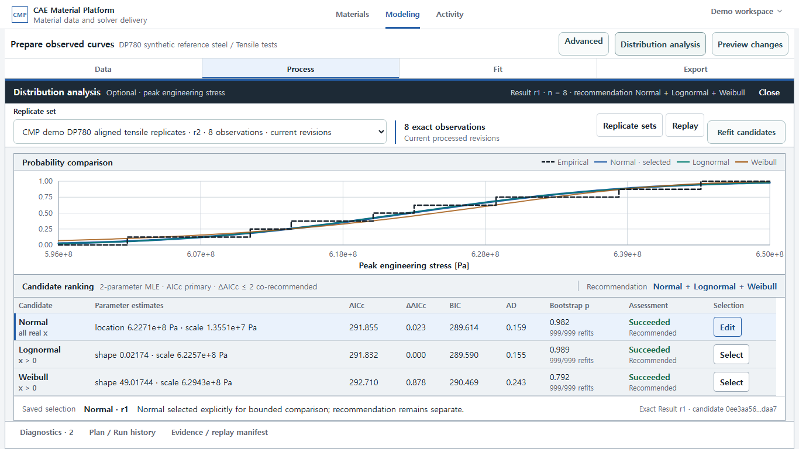 |
| 1440×900 | 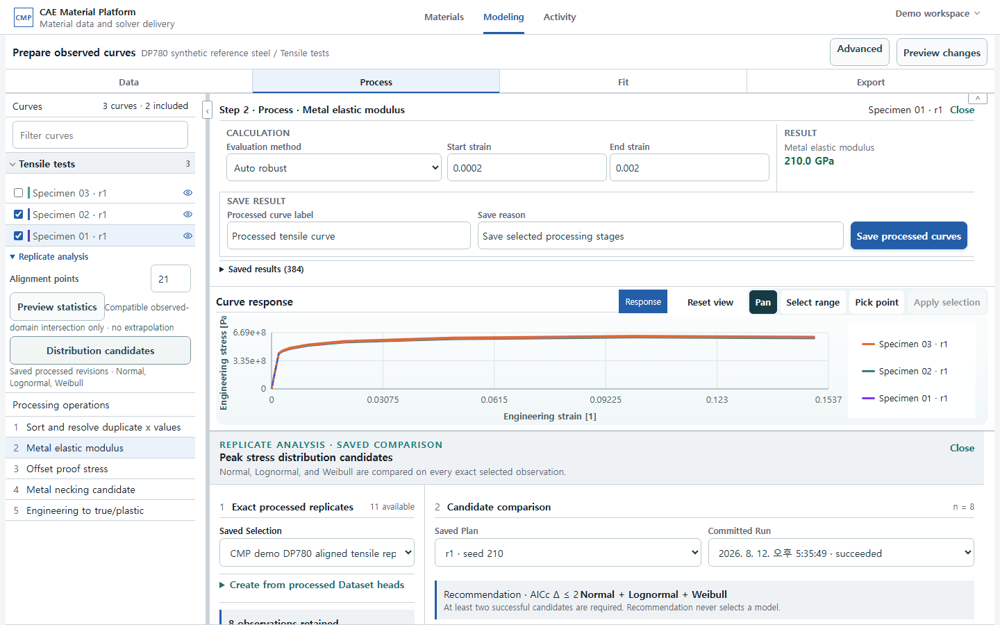 |
| 1920×1080 | 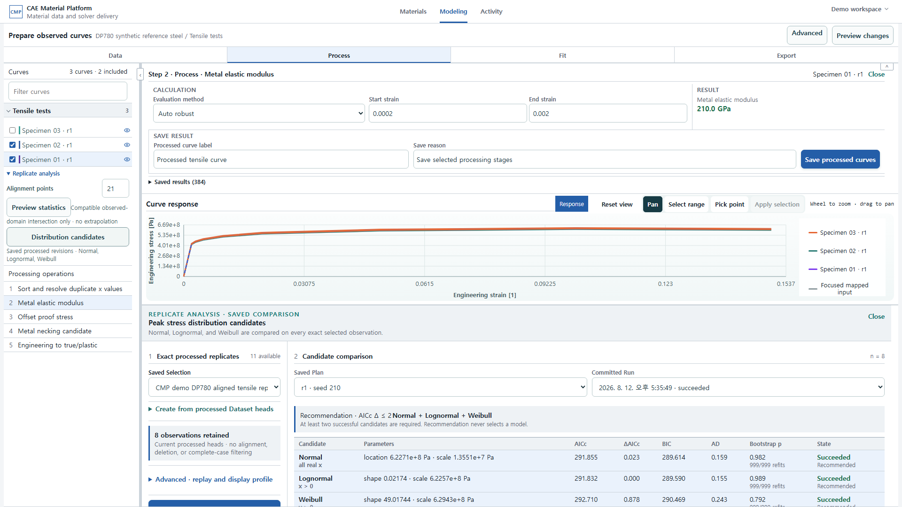 |
| Wide 2560×1440 | 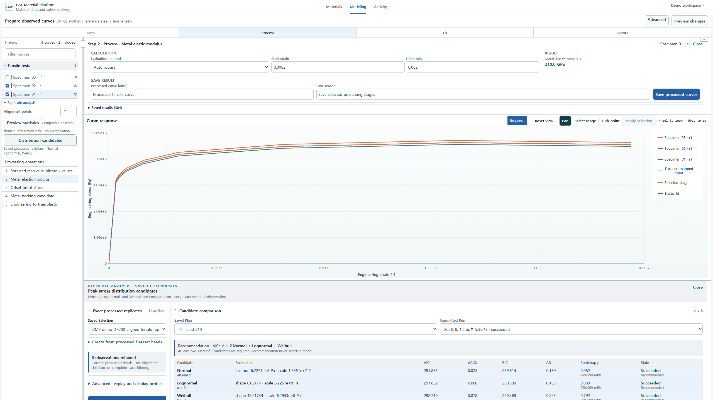 |
| Wide 3840×2160 | 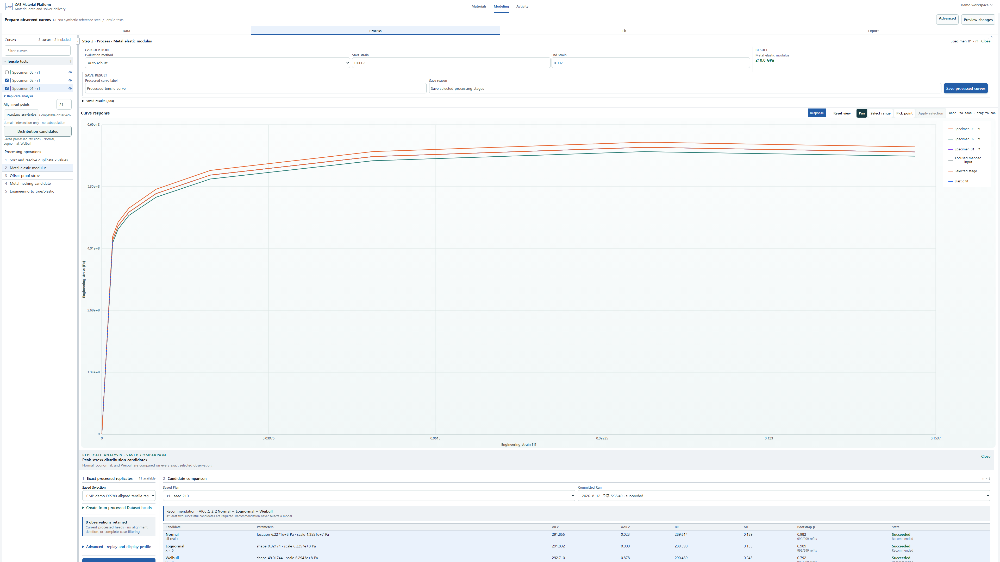 |

## Processing Recipe 저장과 게시

1. 저장된 exact Mapping Profile을 선택하고 ordered step을 검토합니다. 현재 재료군에 맞는 게시
   Recipe가 있으면 가장 최근 exact revision이 자동 선택됩니다.
2. **Recipe Library**에서 lifecycle과 exact revision을 확인합니다. 기존 설정에서 독립 Recipe를
   만들려면 **Clone as new**를 누르고 Recipe key, label, 설명과 변경 사유를 수정합니다.
3. **Save new Recipe**를 눌러 stable identity와 draft revision 1을 만듭니다.
4. 옵션이나 순서를 변경할 때는 저장된 Recipe를 선택하고 **Append draft revision**을 누릅니다.
5. 검토가 끝난 draft는 **Publish reviewed revision**으로 게시합니다. published revision을 직접
   수정하지 않으며, 후속 변경은 새 draft revision으로 추가합니다.

Recipe는 Mapping Profile의 stable identity뿐 아니라 exact revision UUID와 SHA-256을 고정하고,
각 step의 method ID, version, options와 options digest를 순서대로 보존합니다. Batch preflight와
실행은 이 exact published Recipe revision을 입력으로 사용합니다.

## Batch preflight와 실행

1. **Saved Processing Recipe**에서 자동 복원된 `published` revision을 확인합니다. draft Recipe는 실행할 수 없습니다.
2. **Batch Monitor**의 **Test Data selection**에서 처리할 revision을 선택합니다. 화면의 각
   항목은 current head를 표시하지만 실행 요청과 저장된 Member는 그 시점의 exact revision UUID를 고정합니다.
3. **Compatibility preflight**를 누릅니다. 모든 member의 채널 quantity, 단위, Mapping Profile과
   ordered step을 서버에서 실제 실행하여 예상 output point 또는 차단 diagnostic을 표시합니다.
4. 모든 member가 `Ready to run`일 때만 **Execute published Recipe**가 활성화됩니다.
5. 실행 후 Monitor에서 member별 Attempt 번호, 성공 Output revision 또는 오류 코드를 확인합니다.
6. 일부 member가 실패해도 성공한 Output은 유지됩니다. **Retry failed members only**는 실패 member에만
   다음 Attempt를 추가하며 이전 Attempt와 Output을 수정하지 않습니다.

## 현재 경계

화면의 stage overlay와 반복시험 통계는 명확히 preview로 표시됩니다. 별도의 single-curve commit은
서버 재계산 결과를 exact input/profile FK와 canonical JSON Artifact로 영속화합니다. Monitor는
현재 재료군 Recipe의 run만 표시하고 성공 attempt/전체 attempt를 함께 보여줍니다. Recipe
저장/게시와 exact-input batch 실행을 지원하며, reviewed 금속 Processing Output은 같은 Modeling
화면의 Card task에서 IR/Neutral Material JSON으로 승격할 수 있습니다. 폴리머와 엘라스토머의
Polymer relaxation/DMA와 Elastomer multi-mode/holdout graph/task 흐름도 T-89/T-90에서
검증되었습니다. 전체 clean 제품 journey는 T-93에서 최종 승인합니다.
