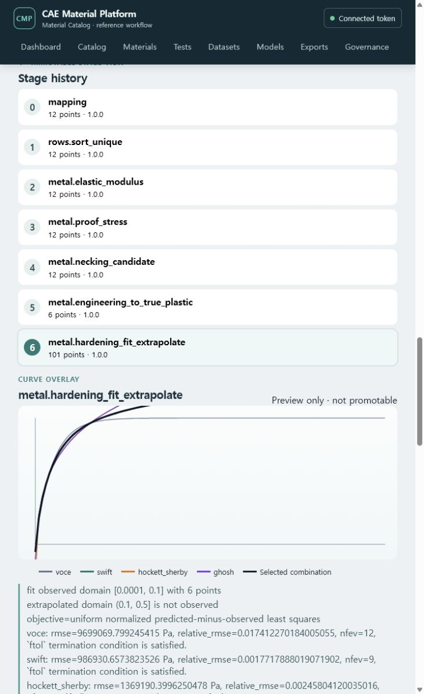
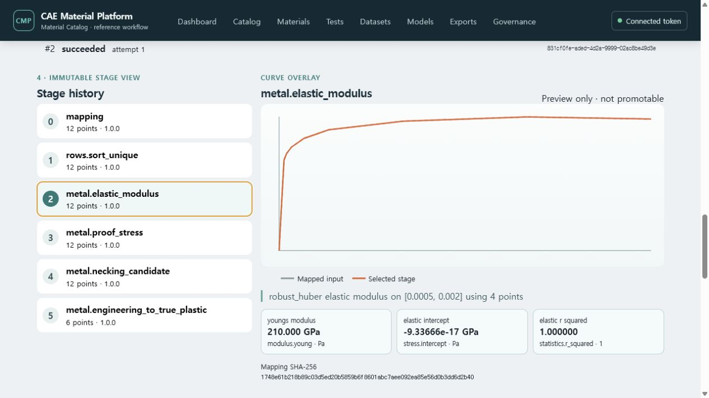
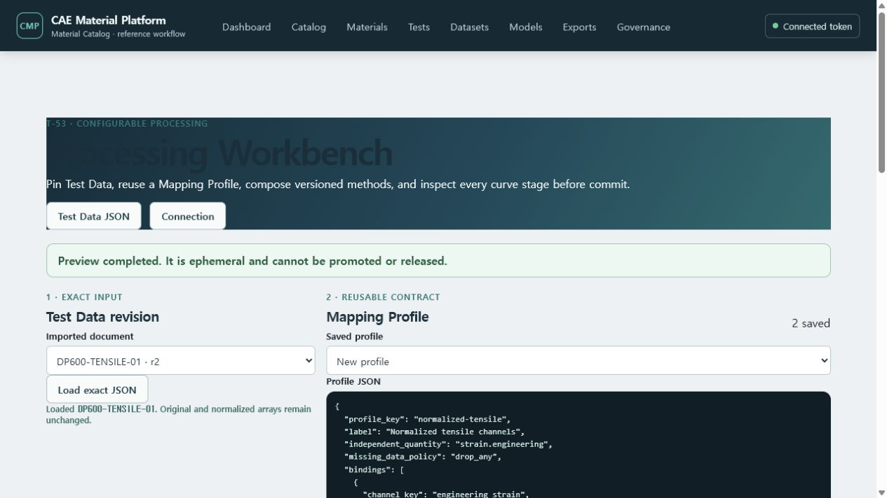
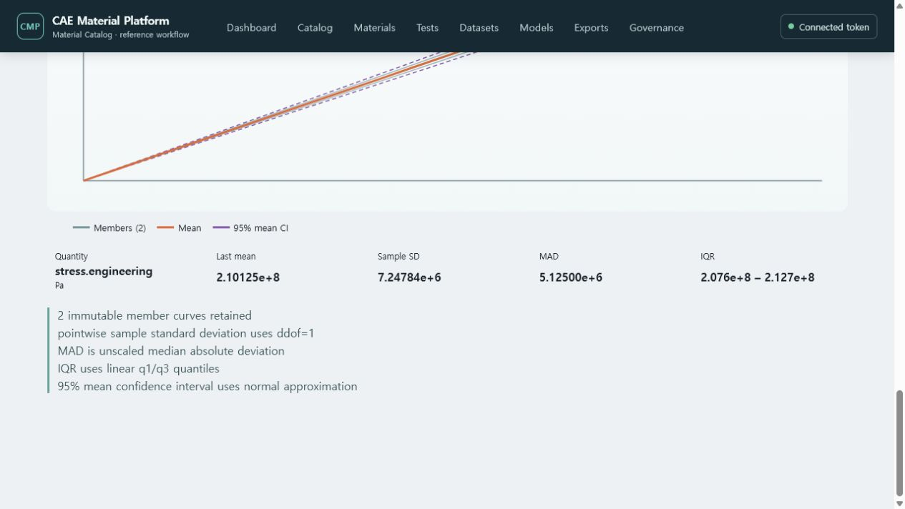
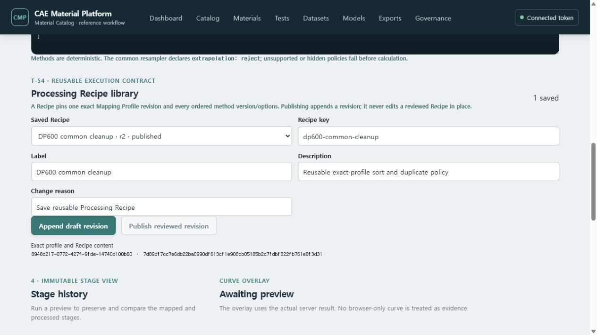
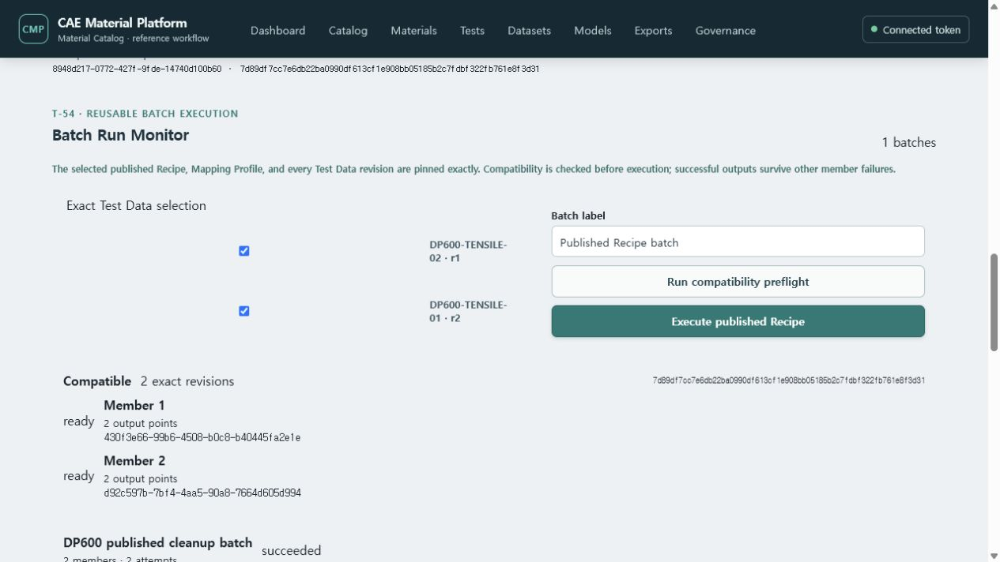

# Mapping Profile과 공통 Processing Workbench 사용하기

이 화면은 특정 시험·재료모델·solver에 종속되지 않은 채널 매핑과 커브 전처리를 제공합니다.
입력은 저장된 `cmp.test-data`의 정확한 revision이며, 브라우저에서 계산한 임시 값이 아니라
서버가 반환한 각 처리 단계의 수치와 진단을 비교합니다.

## 처리 미리보기

1. `Datasets` → `Processing Workbench`를 엽니다.
2. **Exact Test Data input**에서 문서와 revision을 선택하고 **Load exact JSON**을 누릅니다.
3. 저장된 Mapping Profile을 선택하거나 JSON editor에서 다음 항목을 확인합니다.
   - `independent_quantity`
   - source `channel_key`와 계산용 `target_quantity`
   - 허용 normalized unit
   - required 여부와 명시적 scale/offset
   - `reject` 또는 `drop_any` missing-data 정책
4. 재사용할 매핑이면 **Create profile**을 누릅니다. 기존 profile을 변경할 때는 변경 사유를
   입력하고 **Append revision**을 눌러 새 revision을 만듭니다. 기존 revision은 덮어쓰지 않습니다.
5. **Ordered processing steps**에서 method ID, version과 option을 순서대로 편집합니다.
6. **Preview with server**를 누릅니다.
7. Stage 목록에서 `mapping` 또는 각 method를 선택해 동일한 축의 원본/처리 curve overlay와
   row 수, warning, SHA-256을 확인합니다.

현재 등록된 공통 method는 다음과 같습니다.

- 정렬과 duplicate 정책: `rows.sort_unique`
- 범위 선택: `curve.crop`
- 수치 변환: `curve.scale_shift`
- 선형 resampling: `curve.resample_linear`
- moving average: `curve.moving_average`
- Savitzky–Golay: `curve.savitzky_golay`
- smoothing spline: `curve.smoothing_spline`

금속 단축 인장 데이터에는 다음 family method도 같은 ordered pipeline에서 사용할 수 있습니다.

- 탄성계수: `metal.elastic_modulus` — `linear_regression`, `robust_huber`, `chord`, `secant`, `manual`
- offset proof stress: `metal.proof_stress`
- 자동 necking 후보: `metal.necking_candidate`
- engineering → true/true-plastic 변환: `metal.engineering_to_true_plastic`
- hardening 후보 비교·조합·제한 외삽: `metal.hardening_fit_extrapolate`

탄성계수, proof stress와 necking 위치는 선택한 stage의 **Scalar results**에 값과 단위로 나타납니다.
자동 necking 단계는 후보 index만 보고하며 curve를 자르거나 확정하지 않습니다. 변환 단계에서
`manual_index`를 명시해야 후보를 실제 경계로 사용합니다. `observed_full_domain`은 post-necking을
포함할 수 있다는 경고를 남깁니다. 금속 method는 normalized strain `1`, stress `Pa`만 받으며,
다른 단위를 Pa로 가장하거나 묵시적으로 변환하지 않습니다.

Hardening 단계는 Voce, Swift, Hockett–Sherby, Ghosh 중 2~4개를 같은 목적함수로 fitting합니다.
`fit_minimum_strain`, `fit_maximum_strain`은 관측값을 사용하는 구간이고
`extrapolation_maximum_strain`은 관측되지 않은 출력 한계입니다. `primary_family`,
`secondary_family`, `primary_weight`가 선택 조합을 완전히 정의합니다. 결과의 **Scalar results**에는
후보별 RMSE와 parameter lower/initial/fitted/upper가 표시되므로 숨은 초기값이나 경계가 없습니다.

각 method의 option 계약은 서버의 versioned registry에서 읽습니다. 알 수 없는 option, 호환되지
않는 quantity/unit, 범위 밖 extrapolation, 비유한 수치, 허용되지 않은 결측값은 묵시적으로
보정하지 않고 실패시킵니다.

## 불변 Processing Output 저장

1. preview 결과와 저장된 Mapping Profile revision이 일치하는지 확인합니다.
2. Output label과 변경 사유를 입력합니다.
3. **Commit immutable output**을 누릅니다.
4. 서버는 화면의 preview 배열을 저장하지 않고 exact Test Data revision과 exact Mapping Profile
   revision을 다시 읽어 동일한 ordered steps를 재실행합니다.
5. 저장된 목록에서 revision 1, stage/point 수, Output SHA-256을 확인합니다.
6. **Download JSON**으로 `cmp.processing-output` Artifact의 정확한 바이트를 받습니다.

## 반복시험 정렬과 pointwise 통계

1. 동일 조건에서 얻은 각 반복시험을 별도 Test Data identity로 등록합니다. 한 문서의 평균값으로
   합치거나 원본 curve를 삭제하지 않습니다.
2. **Exact Test Data members**에서 비교할 현재 exact revision을 두 개 이상 선택합니다.
3. 공통 grid point 수를 입력하고 **Align and calculate**를 누릅니다.
4. 서버는 각 문서에 같은 Mapping Profile과 ordered preprocessing steps를 적용합니다.
5. 모든 curve에서 실제로 관측된 x-domain의 교집합만 사용해 선형 보간합니다. 교집합 밖
   extrapolation은 허용하지 않습니다.
6. member curve, 평균, 95% 평균 신뢰구간을 함께 확인하고, 마지막 grid point의 표본 표준편차,
   MAD와 IQR을 검토합니다.

통계 계약은 표본 표준편차 `ddof=1`, unscaled MAD, linear q1/q3 quantile, normal-approximation
95% mean CI를 명시합니다. 이 결과는 T-53 preview이며, T-54에서 exact Selection과 versioned
Recipe/Batch 실행 결과로 저장됩니다.

## Processing Recipe 저장과 게시

1. 저장된 exact Mapping Profile을 선택하고 ordered step JSON을 검토합니다.
2. **Processing Recipe library**에서 Recipe key, label, 설명과 변경 사유를 입력합니다.
3. **Save new Recipe**를 눌러 stable identity와 draft revision 1을 만듭니다.
4. 옵션이나 순서를 변경할 때는 저장된 Recipe를 선택하고 **Append draft revision**을 누릅니다.
5. 검토가 끝난 draft는 **Publish reviewed revision**으로 게시합니다. published revision을 직접
   수정하지 않으며, 후속 변경은 새 draft revision으로 추가합니다.

Recipe는 Mapping Profile의 stable identity뿐 아니라 exact revision UUID와 SHA-256을 고정하고,
각 step의 method ID, version, options와 options digest를 순서대로 보존합니다. Batch preflight와
실행은 이 exact published Recipe revision을 입력으로 사용합니다.

## Batch preflight와 실행

1. **Saved Processing Recipe**에서 `published` revision을 선택합니다. draft Recipe는 실행할 수 없습니다.
2. **Batch Run Monitor**의 **Exact Test Data selection**에서 처리할 revision을 선택합니다. 화면의 각
   항목은 current head를 표시하지만 실행 요청과 저장된 Member는 그 시점의 exact revision UUID를 고정합니다.
3. **Run compatibility preflight**를 누릅니다. 모든 member의 채널 quantity, 단위, Mapping Profile과
   ordered step을 서버에서 실제 실행하여 `ready` 또는 `incompatible`로 표시합니다.
4. 모든 member가 `Compatible`일 때만 **Execute published Recipe**가 활성화됩니다.
5. 실행 후 Monitor에서 member별 Attempt 번호, 성공 Output revision 또는 오류 코드를 확인합니다.
6. 일부 member가 실패해도 성공한 Output은 유지됩니다. **Retry failed members only**는 실패 member에만
   다음 Attempt를 추가하며 이전 Attempt와 Output을 수정하지 않습니다.

## 현재 경계

화면의 stage overlay와 반복시험 통계는 명확히 preview로 표시됩니다. 별도의 single-curve commit은
서버 재계산 결과를 exact input/profile FK와 canonical JSON Artifact로 영속화하지만, 아직 일반
Modeling 입력으로 자동 승격되지는 않습니다. Recipe 저장/게시와 exact-input batch 실행은 지원하며,
처리 후보를 Neutral Material JSON/IR로 승격하는 계약은 T-56에서 구현합니다.
