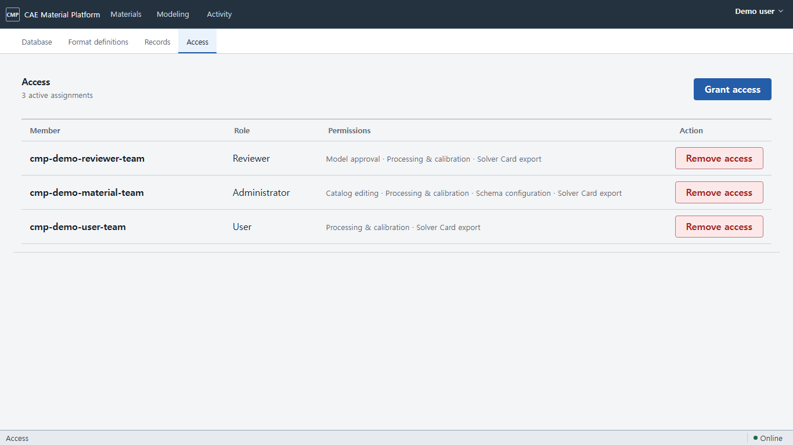
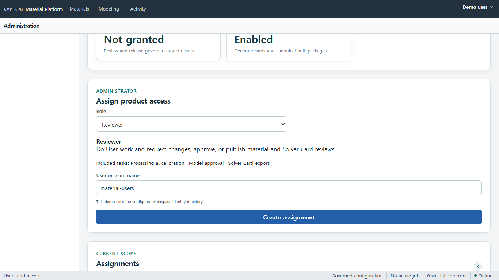
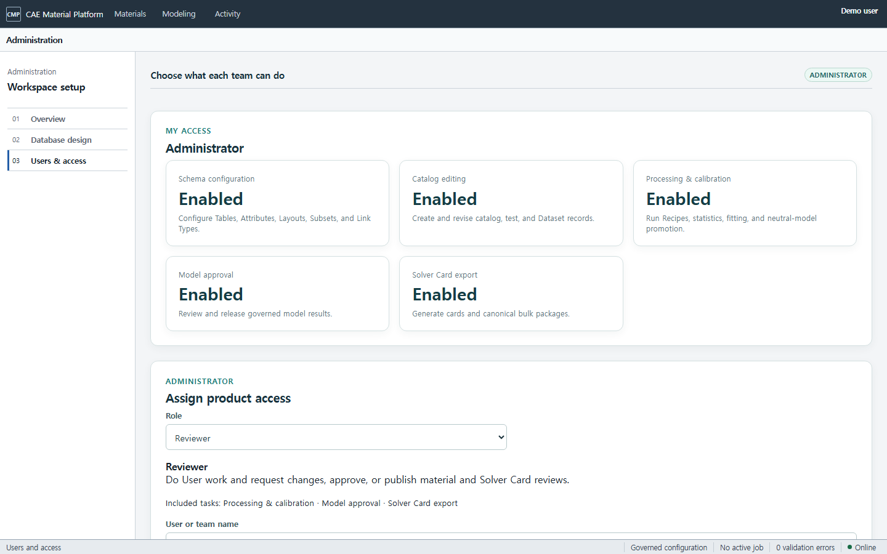

# 제품 역할 및 접근 상태

제품 역할은 `User`, `Reviewer`, `Administrator` 세 가지입니다. 화면은 내부 권한 이름이나 다섯 개의
기술 설정을 요구하지 않고, 역할에 맞는 작업을 한 번에 부여합니다.

| 역할 | 할 수 있는 일 |
| --- | --- |
| User | 재료 검색·조회·다운로드, 업로드/검토 요청, 처리·fitting, Solver Card 요청 |
| Reviewer | User 작업 + 재료·Solver Card 변경 요청, 승인, publish |
| Administrator | 모든 접근·편집·구성·검토·승인과 역할 관리 |

## 내 권한 확인

1. Docker demo를 실행하고 [Administration → Users & access](http://127.0.0.1:5173/administration/access)를 엽니다.
2. demo에서는 workspace가 자동으로 준비됩니다. 일반 배포에서는 관리자 계정으로 로그인합니다.
3. **My access**에서 현재 역할과 포함된 작업을 확인합니다.

| 기능 권한 | 허용되는 제품 작업 |
| --- | --- |
| Schema configuration | Table, Attribute, Layout, Subset, Link Type 구성 |
| Catalog editing | Catalog, Test, Dataset 레코드 생성과 새 revision 작성 |
| Processing & calibration | Recipe, batch, 통계, fitting, Neutral IR 승격 |
| Model approval | review 결정과 release 발행 |
| Solver Card export | mapping preflight, native card, bulk package 생성 |

제품에서 부여된 역할과 기능에 따라 사용할 수 있는 화면과 동작이 달라집니다. 사용할 수 없는
기능은 표시되지 않거나, 검토 요청 또는 관리자 문의 방법을 안내합니다.

## 역할 부여

이 작업은 Administrator만 할 수 있습니다.

1. **Assign product access**에서 사용자 또는 팀 이름을 입력합니다.
2. `User`, `Reviewer`, `Administrator` 중 업무에 맞는 역할을 선택합니다.
3. 역할 설명에서 포함되는 작업을 확인합니다. 일반 화면에서는 개별 기술 권한을 조합하지 않습니다.
4. **Create assignment**를 누릅니다. 새 역할에서 허용된 작업만 사용할 수 있습니다.

**Create assignment**는 파란색 주요 동작이며 저장 중에는 **Saving…**으로 바뀌어 중복 실행을
막습니다. 기존 assignment의 **Revoke**는 삭제·회수 의미를 분명히 하도록 빨간색 위험 동작으로
표시됩니다. 녹색 상태 표시는 일반 실행 버튼과 구분됩니다.

권한이 없는 동작은 화면에서 실행할 수 없으며, 필요한 경우 검토 요청 또는 관리자 문의 방법을
안내합니다. 기존 작업 문맥은 유지됩니다.

## Administrator와 권한 회수

역할은 고정된 작업 묶음입니다. `Reviewer`는 처리·보정, 모델 검토, Solver Card export를 함께
가지며 schema 구성이나 catalog 편집 권한은 받지 않습니다. `Administrator`는 모든 작업과 access
administration 권한을 받습니다. 권한을 변경하려면 기존 assignment의 **Revoke**를 누른 뒤 새
assignment를 생성합니다. 기존 행은 덮어쓰지 않습니다.

현재 demo group은 다음 값으로 미리 등록됩니다.

- issuer: `urn:cmp:demo-identity`
- group: `cmp-demo-material-team`
- role: `Administrator`

화면 캡처는 Codex 내장 브라우저의 좁은 viewport 증거입니다. 데스크톱에서는 같은 카드와
assignment form이 여러 열로 배치됩니다.

넓은 화면의 assignment 생성과 권한 회수 동작은
[1920×1080](images/current/administration-access-1920x1080.png),
[2560×1440](images/current/administration-access-2560x1440.png),
[3840×2160](images/current/administration-access-3840x2160.png)에서도 확인할 수 있습니다.
