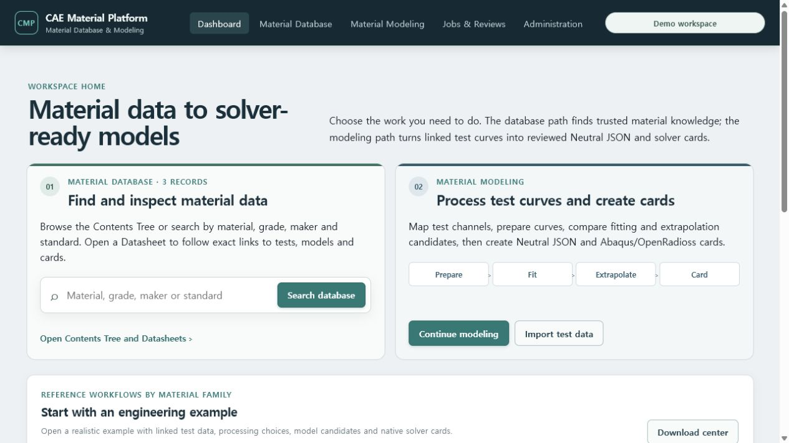
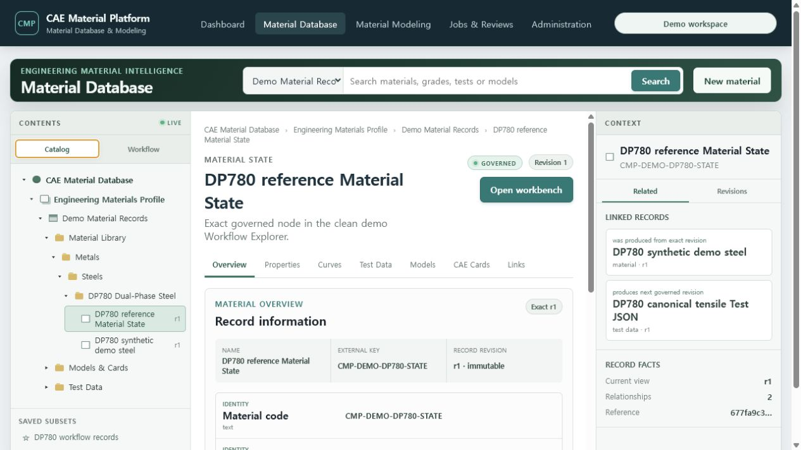
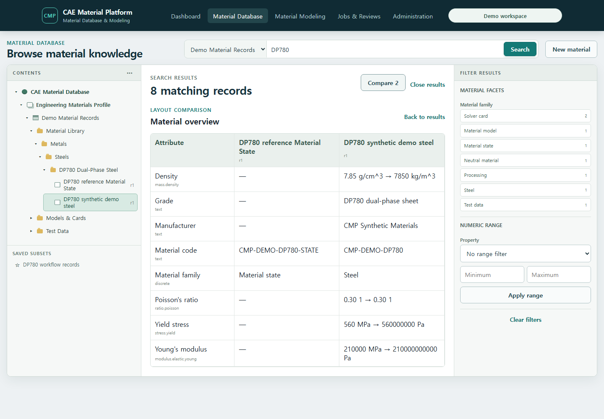

# 세 재료 계열 통합 데모 따라하기

이 문서는 처음 접속한 사용자가 합성 시험 데이터에서 모델과 solver card까지 이동하는 가장 짧은
경로를 설명합니다. 모든 값과 결과는 `reference/non-production`이며 실제 설계 승인값이 아닙니다.

## 1. 깨끗하게 실행하고 확인하기

Docker Desktop을 실행한 뒤 저장소 루트에서 다음을 실행합니다.

```powershell
make demo
```

백그라운드 실행을 선호하면 다음 명령을 사용해도 됩니다.

```powershell
docker compose -f deploy/compose/docker-compose.demo.yml up -d --build
docker compose -f deploy/compose/docker-compose.demo.yml logs seed
docker compose -f deploy/compose/docker-compose.demo.yml run --rm --no-deps seed python scripts/verify_full_demo.py --api-base-url http://api:8000/api/v1
npx playwright install chromium
npm run test:e2e --workspace @cmp/web
```

`seed`는 금속·폴리머·엘라스토머 합성 데이터와 reference 모델, Abaqus/OpenRadioss 카드를 보호된
API를 통해 생성합니다. 위 검증 명령(또는 Make가 설치된 환경의 `make demo-verify`)이 세 Material과
필요한 card를 출력하면 준비가 끝난 것입니다. `npm run test:e2e --workspace @cmp/web`(또는
`make demo-e2e`)는 실제 브라우저에서 세 안내 버튼이 각각의 Material Models 화면으로 이동하고
Bulk Export Center가 열리는지 확인합니다. 첫 실행에는 Chromium 설치가 포함될 수 있습니다.

기존 합성 데모를 완전히 지우고 처음부터 재현해야 할 때만 다음 명령을 사용합니다.

```powershell
make demo-down
docker compose -f deploy/compose/docker-compose.demo.yml up -d --build
```

`make demo-down`은 `cmp-local-demo`의 PostgreSQL과 object-store 볼륨을 삭제합니다. 회사 데이터나
다른 Docker 프로젝트에 이 명령을 복사하지 마십시오.

## 2. 서비스에 연결하기

1. [Dashboard](http://127.0.0.1:5173/)를 엽니다.
2. **Demo workspace**가 자동으로 표시되는지 확인합니다.
3. **Visible materials**가 `3`이고 금속·폴리머·엘라스토머 안내 카드가 보이는지 확인합니다.



## 3. Material Database에서 계층과 연결 확인하기

1. 전역 **Material Database**를 엽니다.
2. 첫 진입에서 **CAE Material Database → Engineering Materials Profile → Demo Material Records →
   Material Library → Metals → Steels → DP780 Dual-Phase Steel**이 자동 전개되고 유용한 demo
   Record의 **Overview**가 바로 표시되는지 확인합니다.
3. 왼쪽 **Workflow**를 누르면 Material, Material State, Test Data, Processing Output, Material
   Model IR, Neutral Material과 두 Solver Card의 exact revision graph로 바뀝니다.
4. 오른쪽 **Related**에서 현재 revision의 양방향 링크를, **Revisions**에서 immutable history를
   확인합니다. 링크를 누르면 해당 Datasheet 또는 실제 workbench로 이동합니다.
5. 중앙 **Overview**와 **Properties**에서 density, Young's modulus, Poisson's ratio와 yield stress를 확인합니다.
   원본 `g/cm^3`, `MPa` 값과 normalized `kg/m^3`, `Pa` 값이 함께 보여야 합니다.
6. 상단에서 `DP780`을 검색하고 Material과 Material State의 **Compare**를 선택한 뒤 Layout
   비교를 엽니다. 오른쪽 facet과 normalized numeric range도 같은 typed Record 검색에 적용됩니다.
7. Test Data 노드를 눌러 workbench를 연 뒤 브라우저의 뒤로 가기로 같은 Material Database
   탐색 문맥에 돌아옵니다.






## 4. 금속 탄소성 경로

1. **Open metal journey**를 선택합니다.
2. Material/State/Property revision을 확인합니다.
3. **Tests**에서 네 개의 독립 인장시험과 raw/normalized curve를 확인합니다.
4. **Datasets → Processing**에서 탄성 구간, proof stress, true plastic strain, necking과 hardening
   후보를 확인합니다. 처리 방법을 바꾸면 기존 결과를 덮어쓰지 않고 Recipe revision을 만듭니다.
5. **Models**에서 exact Processing Output을 참조하는 tabulated-plasticity IR을 엽니다.
6. Abaqus와 OpenRadioss mapping 상태를 확인한 뒤 `.inp`와 `.rad`를 내려받습니다.

상세 조작은 [Steel 탄소성 가이드](02-steel-elastoplastic.md)를 따릅니다.

## 5. 폴리머 점탄성 경로

1. Dashboard에서 **Open polymer journey**를 선택합니다.
2. **Tests**에서 273.15/293.15/313.15 K, 온도별 두 반복 curve를 확인합니다.
3. **Viscoelastic master curve**에서 log-time 정렬, 온도별 통계와 수동 shift factor를 확인합니다.
4. **Models**에서 exact common Processing Output, automatic BIC로 선택된 3항, RMSE와 catalog G₀
   mismatch를 확인합니다. 이 자료는 public synthetic reference fixture입니다.
5. **Create Neutral JSON and solver mapping**으로 같은 evidence의 Neutral 문서를 열고 mapping
   report에서 bulk relaxation이 `not_applicable` 또는 명시된 상태인지 확인한 뒤 Abaqus
   `*VISCOELASTIC` `.inp` 파일을 내려받습니다. 이어 OpenRadioss 2025를 선택하고
   `solid_property_total_strain`과 `deviatoric_only_formulation` 근사를 확인한 뒤
   `/VISC/LPRONY` `.rad` reference fragment를 내려받습니다.

상세 조작은 [Polymer 점탄성 가이드](03-polymer-viscoelastic.md)를 따릅니다.

## 6. 엘라스토머 초탄성·초점탄성 경로

1. Dashboard에서 **Open elastomer journey**를 선택합니다.
2. uniaxial, planar, biaxial calibration curve와 별도 holdout curve를 확인합니다.
3. family 비교와 fitted/residual 결과에서 선택 근거와 경고를 검토합니다.
4. selected Candidate가 같은 stable Model identity의 IR revision 2로 승격됐는지 확인합니다.
5. Abaqus와 OpenRadioss preflight를 각각 열어 `approximated` 항목을 포함한 여섯 상태를 확인한
   뒤 `.inp`와 `.rad`를 내려받습니다.

상세 조작은 [Elastomer Ogden-Prony 가이드](04-elastomer-ogden-prony.md)를 따릅니다.

## 7. JSON과 카드 묶음 내려받기

1. Dashboard의 **Open bulk downloads** 또는 전역 **Exports** 메뉴를 엽니다.
2. exact Test Data JSON, Mapping Profile, Processing Recipe, Neutral Material JSON, mapping report와
   native card revision을 선택합니다.
3. Bundle Job을 실행하고 완료 상태를 확인합니다.
4. ZIP을 내려받아 `manifest.json`과 `checksums.sha256`을 먼저 확인합니다.

ZIP 안의 solver card는 JSON 문자열이 아니라 solver-native ASCII 파일입니다. 자세한 설명은
[Bulk Export 가이드](09-bulk-export.md)를 참고하십시오.

## 문제가 생겼을 때

- Material이 3개보다 적으면 `docker compose ... logs seed`에서 첫 실패를 확인합니다.
- 로그인 화면이 계속되면 Docker 서비스 상태를 확인한 뒤 **Try again**을 누릅니다.
- `make demo-verify`가 card 누락을 보고하면 mapping report와 Material Model revision을 확인합니다.
- 포트 충돌, migration 또는 worker 문제는 [탐색·문제 해결 가이드](10-navigation-and-troubleshooting.md)를
  참고합니다.

깨끗한 DB에서 Catalog binding, canonical Test JSON, published Recipe/Batch, fitted Neutral JSON,
두 native card와 ZIP의 digest까지 검증하려면
[전체 제품 흐름 검증 가이드](17-clean-demo-download-validation.md)를 이어서 실행합니다.
