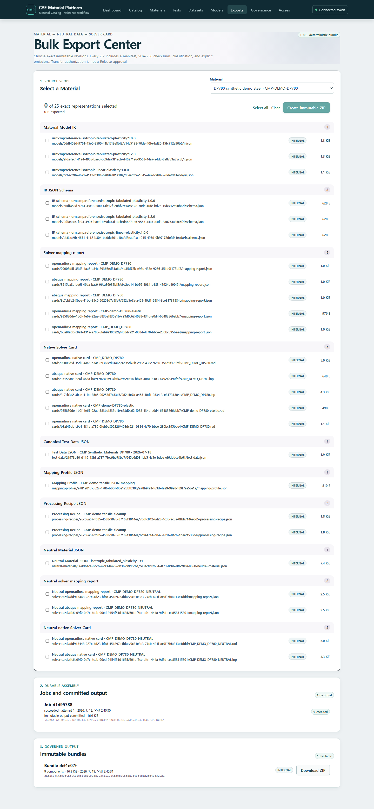

# 깨끗한 전체 제품 흐름 검증

`make demo`의 공개 합성 시드는 다음 exact-revision 흐름을 실제 PostgreSQL과 보호된 API로
생성합니다. 모든 수치는 제품 작동 확인용이며 승인된 설계 물성값이 아닙니다.

1. configurable Catalog Record를 DP780 Material revision에 연결합니다.
2. `cmp.test-data` JSON에 제작사, lot, 시험일, 작업자, 단위와 12점 인장 curve를 저장합니다.
3. 채널을 quantity semantics에 연결하는 Mapping Profile을 저장합니다.
4. engineering-to-true/plastic 변환과 공개 hardening 식 fitting/외삽 단계를 Recipe로
   draft한 뒤 published revision으로 고정합니다.
5. Recipe Batch를 실행하고 선택된 Processing Output을 tabulated-plasticity IR과 Neutral
   Material JSON으로 승격합니다.
6. 같은 Neutral revision에서 Abaqus `.inp`와 OpenRadioss `.rad`를 생성합니다.
7. Test JSON, Mapping Profile, Recipe, Neutral JSON, 두 mapping report와 두 native card를
   checksum이 있는 ZIP으로 묶습니다.

## 실행과 자동 검증

```powershell
make demo
make demo-verify
make demo-e2e
```

`make demo-verify`는 JSON, 두 ASCII card와 ZIP을 다시 내려받아 저장된 SHA-256과 비교하고,
ZIP 안의 `manifest.json`, `checksums.sha256`, `README.txt`를 검사합니다. `make demo-e2e`는
브라우저에서 두 card를 내려받고 Exports 화면의 **Download ZIP**을 실행해 같은 digest를
확인합니다.

## 화면에서 내려받기

1. [Dashboard](http://127.0.0.1:5173/)에서 **Open bulk downloads**를 누릅니다.
2. Material에서 `CMP-DEMO-DP780`을 선택합니다.
3. Test Data JSON, Mapping Profile, published Processing Recipe, Neutral Material JSON,
   Neutral mapping report와 native Solver Card의 exact revision을 확인합니다.
4. 이미 시드된 **Immutable bundles**의 **Download ZIP**을 누르거나 필요한 항목을 다시
   선택해 새 Bundle을 만듭니다.
5. 압축을 푼 뒤 `checksums.sha256`의 각 digest를 확인합니다.



실제 Abaqus/OpenRadioss 실행과 결과 비교는 이 검증 범위에 포함되지 않습니다.
