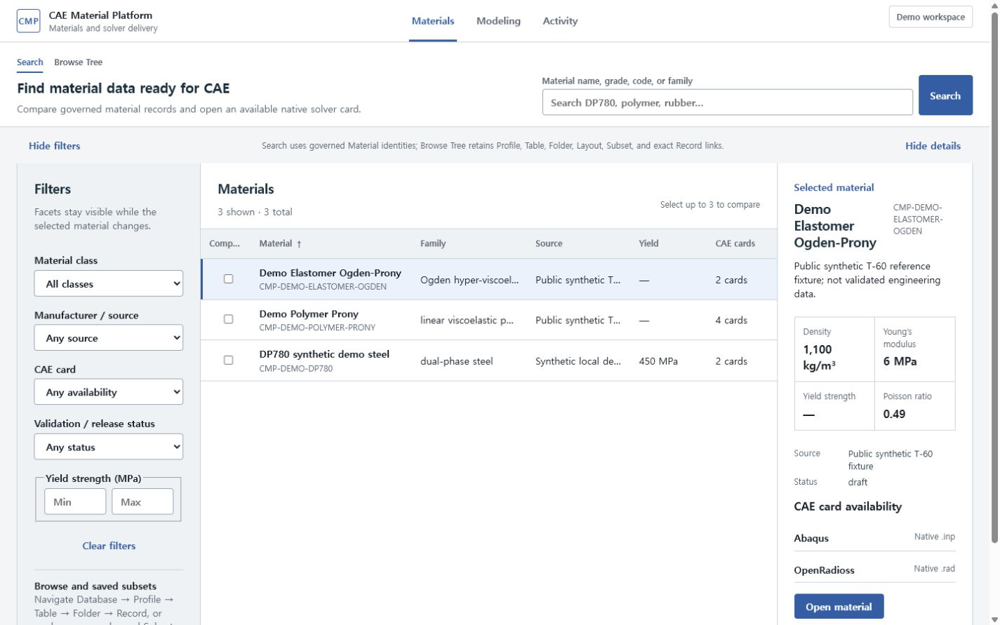
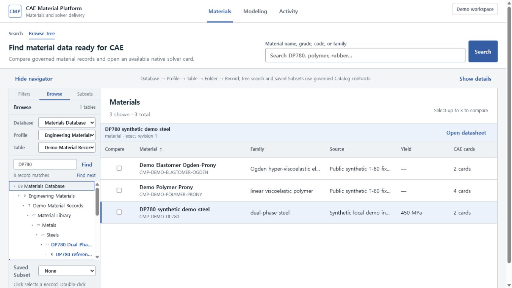

# Search-first Materials와 Modeling

일반 사용자의 전역 메뉴는 `Materials | Modeling | Activity`입니다. Administration은 권한이
있는 사용자의 메뉴에서 열며, `/database`와 기존 deep link는 호환 경로로 유지됩니다.

## 기존 Material과 CAE card 찾기

1. `/materials`에서 이름, grade, code 또는 family를 검색합니다.
2. family, source, normalized property 범위, solver availability 또는 release 상태를 좁힙니다.
3. 결과 행을 선택해 핵심 물성과 사용 가능한 solver card를 확인합니다.
4. Material을 열어 `Overview | Properties | Curves | CAE Cards | Evidence`를 검토합니다.
5. native `.inp` 또는 `.rad`를 미리 보고 다운로드합니다.

Browse Tree는 검색의 대체 수단으로 Database, Profile, Table, Folder, Record 계층을 유지합니다.
Table, Attribute, Layout, Subset, Link Type과 exact revision은 삭제되지 않으며 Browse, Evidence
또는 Administration에서 접근합니다.

### Browse Tree에서 Record 찾기

1. Materials 상단의 `Browse Tree`를 선택합니다.
2. 왼쪽의 `Filters | Browse | Subsets`에서 `Browse`를 선택하고 Database, Profile, Table을
   확인합니다.
3. Folder 앞의 disclosure를 열거나 고정된 `Find in tree`에 이름을 입력합니다. 검색 결과는
   상위 Folder 경로를 유지합니다.
4. 방향키와 Home/End로 이동하고, Left/Right로 접거나 펼치며, Enter로 Record를 선택합니다.
5. Record를 한 번 선택하면 중앙 Material 결과와 exact revision 문맥이 연결됩니다. 두 번
   누르면 Layout datasheet를 엽니다.
6. `Subsets`에서는 관리자가 저장한 typed 검색 조건을 같은 Tree에 적용합니다.

Tree는 자체 스크롤을 사용하므로 깊은 계층에서도 Database/Profile과 검색 동작을 다시 찾을
수 있습니다. 긴 이름은 한 줄로 유지되고 hover/focus의 전체 이름으로 확인합니다.

## 시험 데이터에서 새 card 만들기

1. Modeling의 Data에서 canonical Test Data JSON, CSV 또는 XLSX를 선택합니다.
2. JSON schema/channel/quantity semantics/original+normalized unit 또는 CSV/XLSX의 worksheet,
   column/channel/unit mapping을 확인합니다.
3. Process에서 원본을 보존한 채 crop, smoothing, resample과 반복시험 통계를 검토합니다.
4. Fit에서 candidate, response, residual과 extrapolation을 비교합니다.
5. Export에서 Material Model IR, Neutral Material과 solver mapping을 확인하고 native card를
   생성한 뒤 Material Library에 저장합니다.

Mapping Profile, Recipe/Batch, full revision, hash와 JSON evidence는 Advanced/Evidence에 남습니다.
Unsupported mapping은 차단되고 approximation은 명시적 확인이 필요합니다.

