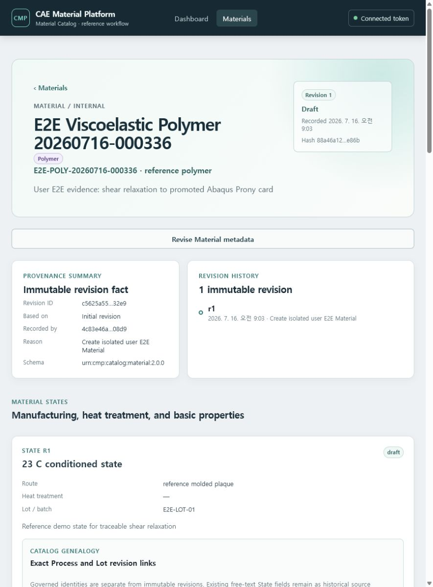
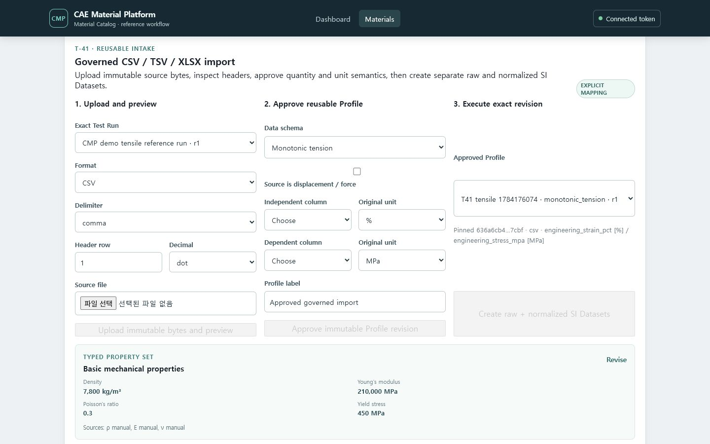
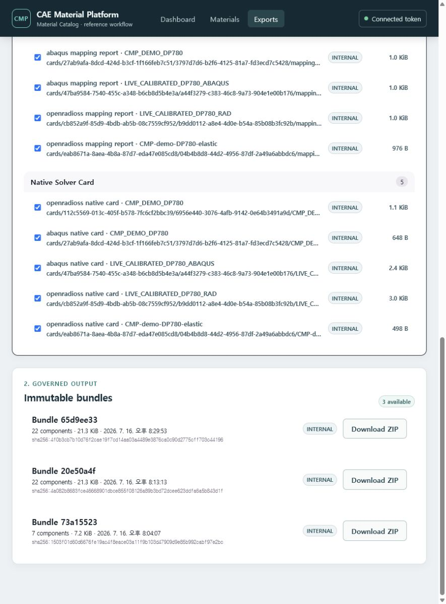
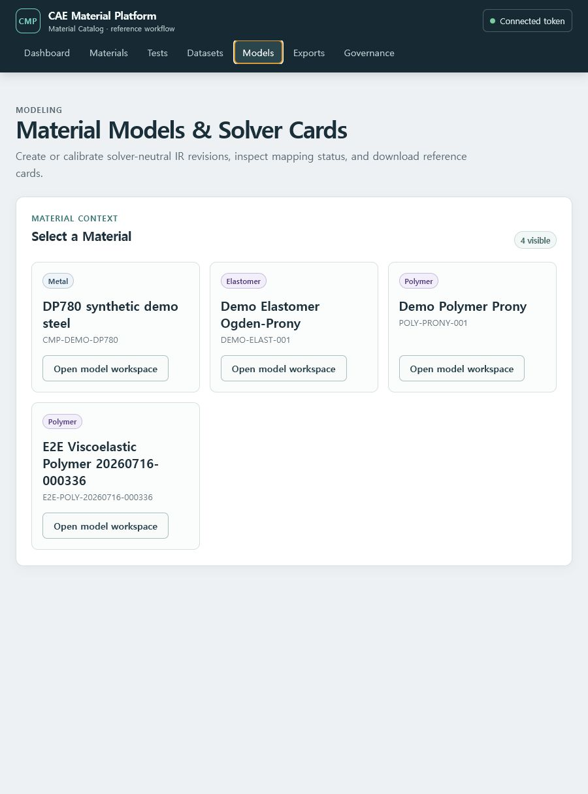
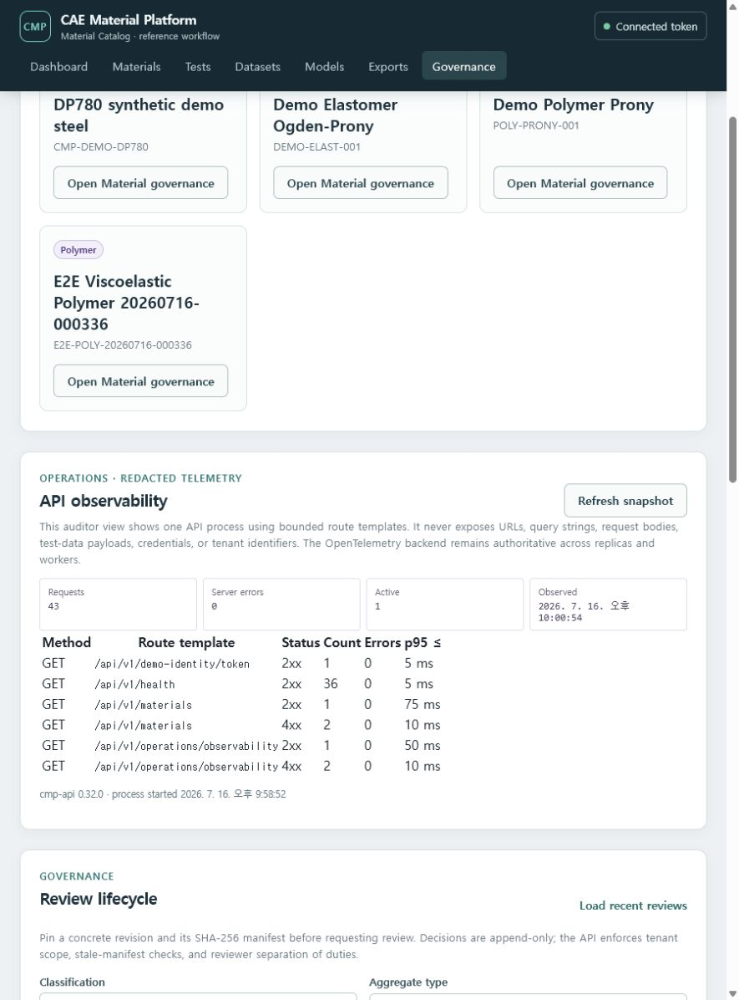
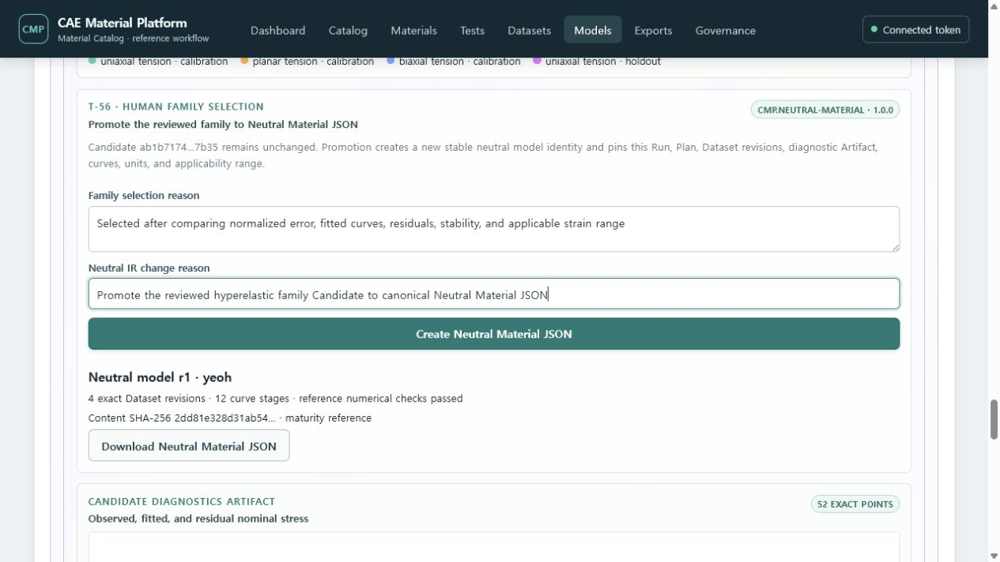

# CAE Material Platform 사용자 가이드

이 가이드는 개발자가 아니라 재료시험·재료모델·CAE 사용자가 demo에서 실제로 Material과
시험 데이터를 등록하고 material card를 내려받는 절차를 설명합니다. 현재 결과는
`reference/non-production`이며 회사의 승인된 재료값이나 solver qualification을 대신하지
않습니다.

## 빠른 경로

1. [서비스 실행과 연결](01-getting-started.md)
2. [Steel 시험 데이터에서 탄소성 카드까지](02-steel-elastoplastic.md)
3. [Polymer 완화시험에서 Abaqus 점탄성 카드까지](03-polymer-viscoelastic.md)
4. [Elastomer Ogden--Prony 카드](04-elastomer-ogden-prony.md)
5. [Revision, provenance와 다운로드 이해](05-revisions-downloads.md)
6. [Process Run과 Specimen source Lot 연결](06-process-run-genealogy.md)
7. [시험 Campaign·장비 교정·실행 조건 고정](07-test-execution-context.md)
8. [CSV/TSV/XLSX 시험 데이터 승인과 Dataset 생성](08-governed-tabular-import.md)
9. [시험 데이터·중립 IR·Solver Card를 ZIP으로 받기](09-bulk-export.md)
10. [메뉴와 Material 작업공간 사용법](10-navigation-and-troubleshooting.md)
11. [운영 상태 확인과 격리 복구 드릴](11-operations-and-recovery.md)
12. [Configurable Catalog와 Material Modeling 목표 흐름](12-configurable-catalog-and-modeling.md)
13. [Canonical Test Data JSON 검증·등록·정확한 revision 다운로드](13-canonical-test-data-json.md)
14. [Mapping Profile 저장과 공통 Processing Workbench](14-common-processing-workbench.md)
15. [Administrator/User와 기능 권한](15-product-access.md)
16. [세 재료 계열 통합 데모 따라하기](16-guided-demo.md)
17. [깨끗한 Test JSON→Recipe→Neutral→두 솔버 카드→ZIP 검증](17-clean-demo-download-validation.md)

## 현재 할 수 있는 일

- Material, Material State, 기본 물성과 immutable revision 등록·조회
- Process Definition, Lot/Batch와 State genealogy 연결
- Process Run의 consumed/produced Lot split·merge와 Specimen source Lot exact-pin
- Test Campaign, 표준 적합성, Instrument 교정과 typed 실행 조건의 exact Test Run Context
- CSV/TSV/XLSX 원본 등록, 안전 preview, reusable Profile 승인과 명시적 column/unit mapping
- raw, normalized, processed Dataset과 curve 확인
- 다온도 relaxation 반복시험의 common-domain 통계, 수동/WLF shift와 master curve 확인
- 반복 인장 curve의 alignment/statistics/outlier assessment
- reference Voce 또는 two-term Prony automatic fitting과 수동 IR 입력
- 사람의 Candidate 선택과 새 IR revision 승격
- Abaqus/OpenRadioss mapping report, card preview와 개별 download
- one-term Ogden--Prony IR의 Abaqus/OpenRadioss LAW62 card 생성
- 선택한 raw/Parquet/CSV/IR/schema/mapping report/card revision을 하나의 검증 가능한 ZIP으로 다운로드
- Governance에서 민감정보가 제거된 API 관측성 snapshot 확인

## 아직 제한된 일

- 관리자가 정의하는 Table/Attribute/Layout/Subset과 Catalog Explorer
- 임의 record 사이의 typed revision-pinned link와 Workflow Explorer
- canonical Neutral JSON에서 추가 금속·점탄성 family를 직접 승격하는 경로
- Neutral JSON에서 모든 초탄성 family의 Abaqus/OpenRadioss 카드를 생성하는 확장 mapping
- proprietary laboratory vendor format과 임의 channel schema
- promoted IR을 다시 보정하는 iterative promotion
- 실제 Abaqus/OpenRadioss solver 실행과 qualification

위 항목의 구현 순서는 [production-pilot 실행 계획](../13-delivery/production-pilot-execution-plan.md)에
기록합니다. 기능이 추가될 때 이 가이드와 화면 이미지를 함께 갱신합니다.

## 화면 예시

문제가 생기면 먼저 브라우저의 Connection 상태, Material class, exact State/Property revision,
CSV column/unit, mapping report의 `unsupported` 또는 `approximated` 항목을 확인하십시오.
